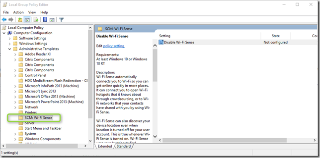

Wi-FI Sense is a new feature in Windows 10 that automatically connects you to suggested open hotspots or networks shared by your skype or outlook.com contacts or facebook friends. Sounds like a nice feature, but I’m sure Enterprise Security won’t be to keen about it. 

 Microsoft has published a KB - [How to configure Wi-Fi Sense on Windows 10 in an enterprise](https://support.microsoft.com/en-us/kb/3085719) that describes the registry settings to configure for disabling Wi-FI sense. The recently publsihed Security Compliance Baseline for Windows 10 “ DRAFT”  now also provides a custom Group Policy template for Wi-FI Sense. 

 

  

 *Wi-Fi Sense automatically connects you to Wi-Fi so you can get online quickly in more places. It can connect you to open Wi-Fi hotspots that it knows about through crowdsourcing, or to Wi-Fi networks that your contacts have shared with you by using Wi-Fi Sense.*

 *Wi-Fi Sense can also discover your device location even when location is turned off for your user account. This is true whenever Wi-Fi Sense is turned on. Wi-Fi Sense uses your location to find suggested open Wi-Fi hotspots.
      
You need to be signed in with your Microsoft account to use Wi Fi Sense.*

 *If this setting is Enabled, Wi-Fi Sense will be disabled and result in the disabling of all related features of Wi-Fi Sense to include connecting automatically to open hotspots, connect automatically to networks shared by my contacts, and allow users to share networks with their contacts.*

 *If this setting is Disabled or Not Configured, Wi-Fi Sense will function as described above.*

 *Note: This registry setting is not stored in a policy key and thus is considered a preference.  Therefore, if the Group Policy Object that implements this setting is ever removed, this registry setting will remain.*
      

 The “DRAFT Baseline for Windows 10 can be downloaded from here: [http://blogs.technet.com/b/secguide/archive/2015/10/08/security-baseline-for-windows-10-draft.aspx](http://blogs.technet.com/b/secguide/archive/2015/10/08/security-baseline-for-windows-10-draft.aspx)

  

 Additional Information:

 [Wi‑Fi Sense FAQ](http://windows.microsoft.com/en-us/windows-10/wi-fi-sense-faq)

