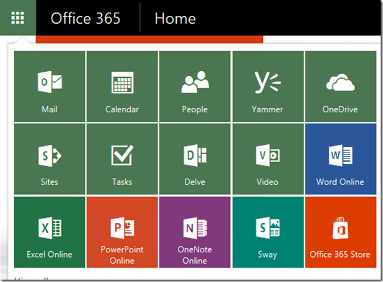
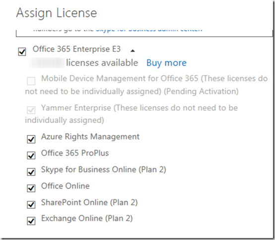
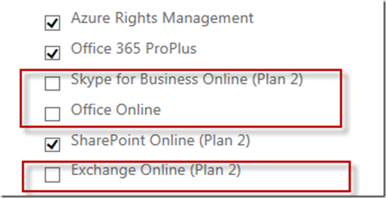

When assigning an Office 365 license to a user, by default several service plans are enabled. When assigning an Office 365 **E3** license to a user, the following service plans are enabled by default:

  
- Azure Rights Management  
- Office 365 Pro Plus  
- Skype for Business Online (Plan 2)  
- Office Online  
- SharePoint Online (Plan 2)  
- Exchange Online (Plan 2) 
- 

 From an end user perspective the user will see the following options when logging on to Office 365. 

 [

](https://www.verboon.info/wp-content/uploads/2015/12/image.png)

 When looking at the users settings within the Office 365 Admin portal , things look as following:

 [

](https://www.verboon.info/wp-content/uploads/2015/12/image-1.png)

 The below PowerShell function allows an Office 365 user administrator to disable individual services for a registered Office 365 user. 

 The following command disables the Skype for Business Service

 Disable-MsolUserServicePlan [alextest@contoso.onmicrosoft.com](mailto:alextest@contoso.onmicrosoft.com) -ServicePlan SkypeforBusiness

 [

](https://www.verboon.info/wp-content/uploads/2015/12/image-2.png)

 Now doing the same for Exchange and the Office web apps. 

 Disable-MsolUserServicePlan [alextest@contoso.onmicrosoft.com](mailto:alextest@contoso.onmicrosoft.com) -ServicePlan OfficeWebApps -Verbose

 Disable-MsolUserServicePlan [alextest@contoso.onmicrosoft.com](mailto:alextest@contoso.onmicrosoft.com) -ServicePlan Exchange -Verbose

 [

](https://www.verboon.info/wp-content/uploads/2015/12/image-3.png)

 Note, before running the below command, you must connect to Azure Directory using the connect-msolservice cmdlet.

 The script can be downloaded from [here](https://gallery.technet.microsoft.com/PowerShell-Script-to-7d0920ad)

 **More information:
**[Working with Office 365 User Licenses](https://msdn.microsoft.com/en-us/library/dn568014.aspx)
[Use Office 365 PowerShell to disable access to services](https://technet.microsoft.com/library/dn771769.aspx)

```
function Disable-MsolUserServicePlan
{
<#
.Synopsis
   Disables an Office 365 Service Plan for a user
.DESCRIPTION
   The Disable-MsolUserServicePlan cmdlet disables an Office 365 Service Plan for the specified user. 

   When assigning an Office 365 E3 license to a user, by default the following Service plans are enabled
   
   RMS_S_ENTERPRISE, OFFICESUBSCRIPTION,MCOSTANDARD,SHAREPOINTWAC,SHAREPOINTENTERPRISE,EXCHANGE_S_ENTERPRISE  

   Azure Rights Management, Office Pro Plus, Skype for Business, Office Web Apps, Sharepoint, Exchange
   
   Use the Disable-MsolUserServicePlan to disable an individual Service Plan. 

   This cmdlet requires the Azure Directory PowerShell module
   https://technet.microsoft.com/library/jj151815.aspx#bkmk_installmodule

   Connect to Azure Directory first before using this cmdlet
   Connect-MsolService

   
.PARAMETER UserPrincipalName
  The user ID of the user to retrieve.

.PARMAETER ServicePlan 
 The Service Plan to disable

.EXAMPLE
    Disable-MsolUserServicePlan -UserPrincipalName john.doe@contoso.onmicrosoft.com -ServicePlan SkypeforBusiness

    This command disables Skype for Business for user John Doe
.EXAMPLE
    Disable-MsolUserServicePlan -UserPrincipalName john.doe@contoso.onmicrosoft.com -ServicePlan Exchange

    This command disables Exchange for user John Doe
.NOTES
    Created by Alex Verboon, 13. Dec. 2015

    https://msdn.microsoft.com/en-us/library/dn568014.aspx
    https://technet.microsoft.com/en-us/library/dn771769.aspx
#>

[CmdletBinding(SupportsShouldProcess=$true)]
    Param
    (
         
        [Parameter(Mandatory=$true,
            ValueFromPipelineByPropertyName=$true,HelpMessage="The users office 365 principalname",
            Position=0)]
        [string]$UserPrincipalName,

        [Parameter(Mandatory=$true,
            ParameterSetName = "ServicePlan",
            ValueFromPipelineByPropertyName=$true,
            Position=1)]
            [ValidateSet("SkypeforBusiness","OfficeWebApps","SharePoint","Exchange","OfficeProfessionalPlus","AzureRightsManagement")] 
        [string]$ServicePlan
    )

    Begin
    {
       $AccountSkuID = (Get-MsolAccountSku | Where {$_.SkuPartNumber -eq "ENTERPRISEPACK"}).AccountSkuId
        
            switch($ServicePlan)
            {
                "SkypeforBusiness" {$planname = "MCOSTANDARD"}
                "OfficeWebApps" { $planname = "SHAREPOINTWAC"}
                "SharePoint" {$planname = "SHAREPOINTENTERPRISE"}
                "Exchange" {$planname = "EXCHANGE_S_ENTERPRISE"}
                "OfficeProfessionalPlus" {$planname = "OFFICESUBSCRIPTION"}
                "AzureRightsManagement" {$planname = "RMS_S_ENTERPRISE"}
              }
             Write-Verbose "Selected plan to disable: $planname"

             $ouser = Get-MsolUser -UserPrincipalName $UserPrincipalName -ErrorAction SilentlyContinue

            if ($ouser -ne $null)
            { 
                $ouserlicense = $ouser.Licenses | Select-Object -ExpandProperty ServiceStatus
                $DisabledServices = ($ouserlicense | Where-Object -Property ProvisioningStatus -EQ "Disabled").ServicePlan.ServiceName 
                Write-verbose "Current Disabled Service Plans: $DisabledServices"
                $EnabledServices = ($ouserlicense | Where-Object -Property ProvisioningStatus -EQ "Success").ServicePlan.ServiceName 
                Write-verbose "Current Enabled Service Plans: $EnabledServices"
            }
            Else
            {
                Write-Error "User $UserPrincipalName does not exist"
                break
            }
    }

    Process
    {
           If ($DisabledServices -contains $planname -eq $true)
            {
                Write-output "The Service plan DisableServicePlan is already disabled for user $UserPrincipalName"
            }
            Else
            {
                
                If ($DisabledServices.Count -eq 0)
                {
                    $DisabledServicesNew = $planname
                }
                Else
                {
                    $DisabledServicesNew = {$DisabledServices}.Invoke()
                    $DisabledServicesNew.Add("$planname")
                }
                
                $LicenseOptions = New-MsolLicenseOptions -AccountSkuId "$AccountSkuID" -DisabledPlans $DisabledServicesNew
                Write-Verbose "New Disabled Service Plans: $($LicenseOptions.DisabledServicePlans)"
                       
                If ($PScmdlet.ShouldProcess("Disabling Service Plan $planname for user$UserPrincipalName"))
                {
                    Set-MsolUserLicense -UserPrincipalName "$UserPrincipalName" -LicenseOptions $LicenseOptions
                }
            }
        }
     End{}
}

```

