A few weeks ago I wondered why in the Azure Portal some of the resources where flagged as “classic”. The article [Understanding Resource Manager deployment and classic deployment](https://azure.microsoft.com/en-us/documentation/articles/resource-manager-deployment-model/) provided the answer I was looking for and was the start of an interesting journey into Azure Resource Manager.

  If you haven’t heard of Azure Resource Manager yet, I highly recommend reading the [Azure Resource Manager overview](https://azure.microsoft.com/en-us/documentation/articles/resource-group-overview/) or watch the I[ntroduction to Azure Resource Manager](https://channel9.msdn.com/Series/Building-Infrastructure-in-Azure-using-Azure-Resource-Manager/Introduction-to-Azure-Resource-Manager) video available on Channel9 or [Deep Dive into Azure Resource Manager Scenarios and Patterns](https://mva.microsoft.com/en-US/training-courses/deep-dive-into-azure-resource-manager-scenarios-and-patterns-13793?) on MVA.

  Before I start with my tutorial, let’s make sure you have all the required tools available. Here’s what you need beside an Azure Subscription that allows you to deploy resources.

-      Azure PowerShell 1.0 or great, download and installation details can be found [here](https://azure.microsoft.com/en-us/documentation/articles/powershell-install-configure/)
-      Microsoft Visual Studio Community edition (FREE), unless you prefer to create / edit JSON files in notepad. You can download VS2015 Community edition from [here](https://www.visualstudio.com/en-us/downloads/download-visual-studio-vs.aspx)
-      Microsoft Azure SDK for .NET. You can download this from [here](https://azure.microsoft.com/en-us/downloads/) (select VS2015).

  Open Visual Studio 2015 and select New Project. then select VisualC# / Cloud / **Azure Resource Group**

  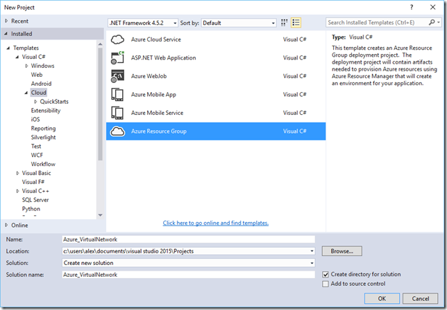

  Next Select “**Blank Template**”

  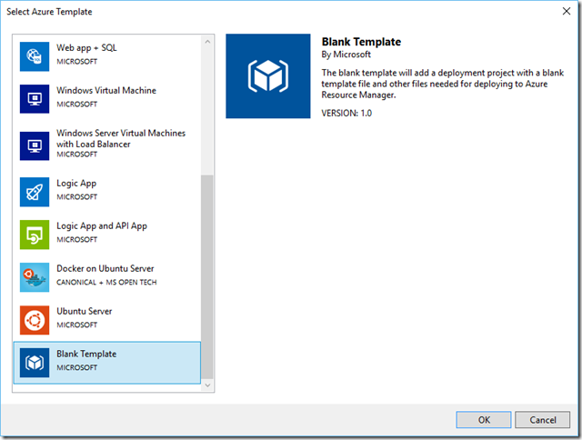

  Next select the **azuredeploy.json** file.

  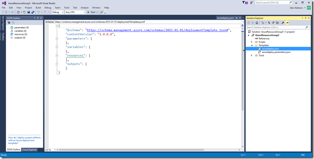

  Select Resources, Add New Resource.

  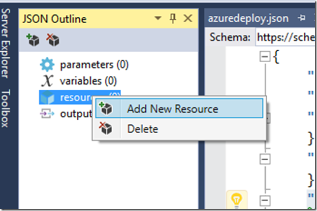

  Enter a name for the virtual network

  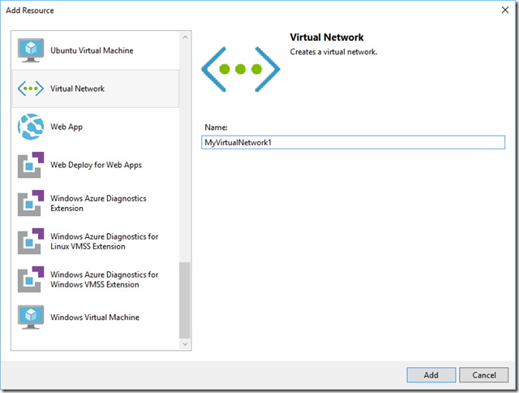

  We now have a template file to deploy a virtual network using Azure Resource Manager.

  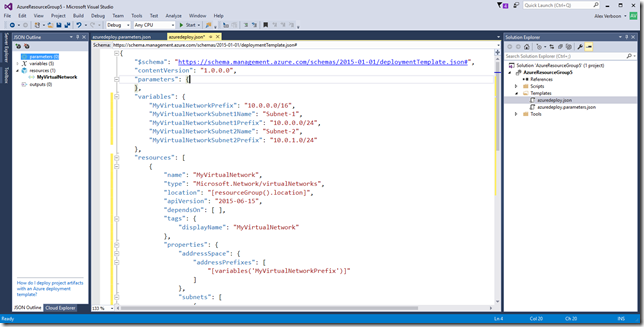

  Next we add the following content into the parameters section

  "vnetName": {
    "type": "string",
    "defaultValue": "VNet1",
    "metadata": {
      "description": "VNet name"
    }
  }

  So now it should look as shown below.

  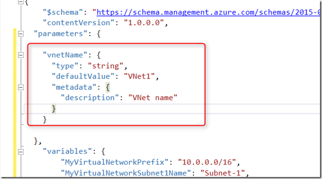

  and we replace the hardcoded names shown below with

  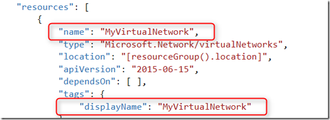

  with

  "[parameters('vnetName')]"

  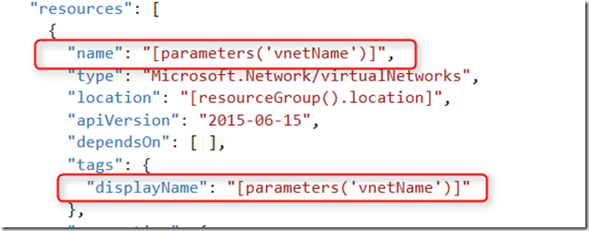

  Now let’s deploy the Virtual network we just created using Visual Studio. From the Project Menu, select Deploy, New Deployment.

  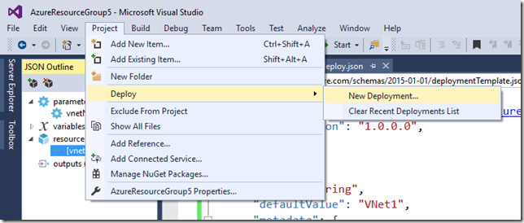

  Select an existing Resource Group or create a new one. Optionally you can select “Edit parameters” , so that you can overwrite the default parameter value that is defined in the template file. For this demo, I edited the parameter and entered “**vnetdemo**” as the vnetname.

  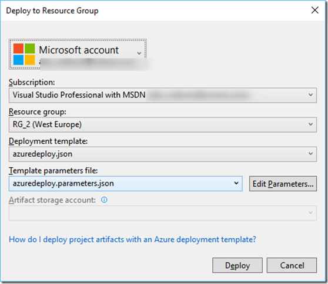

  Next select “**Deploy**”  and wait for the deployment to complete.

  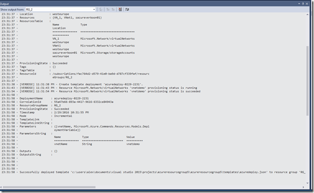

  Now let’s head over to the Azure Portal and see how things are there.

  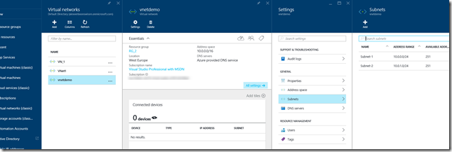

  That’s it for today, In Part 2, we’ll take a closer look at using the parameter input file and how to run things directly with PowerShell.

