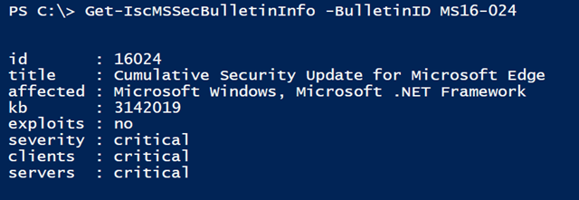

Hey there, the [Internet Storm Center](https://isc.sans.edu/about.html) recently extended their Rest API with some [features for Microsoft Patch Data](https://isc.sans.edu/forums/diary/New+Features+for+Microsoft+Patch+Data/20911/). So where there is a REST API, there’s an opportunity for a PowerShell Script.  The Get-IscMSSecBulletinInfo can be found here: [https://github.com/alexverboon/posh/blob/master/Security/Get-IscMSSecBulletinInfo.ps1](https://github.com/alexverboon/posh/blob/master/Security/Get-IscMSSecBulletinInfo.ps1)

 

 Cheers

 /Alex

