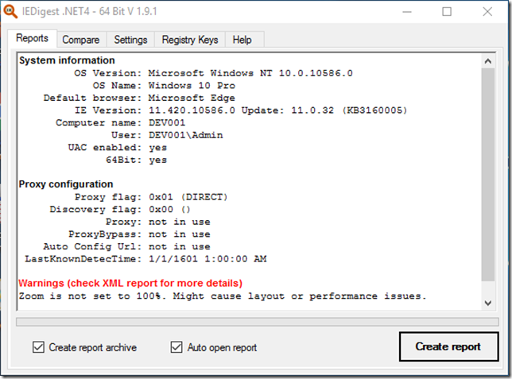

IEDigest is collecting all relevant Internet Explorer settings and generates a well formated HTML report. In addition to this there is an XML output as well which can be taken for comparing reports coming from different environments. This is helpfull for troubleshooting purposes when having working and non-working machines. 

 IEDigest can also be executd in commandline mode. 

 IEDigest can be downloaded from the Microsoft download center [here](https://www.microsoft.com/en-us/download/details.aspx?id=51694). Although not fully up to date, documentation can be downloaded from [here](http://www.regente.de/IEDigest/download/docs/iedigest.pdf)

 

