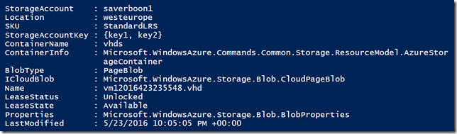
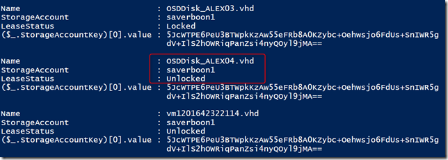
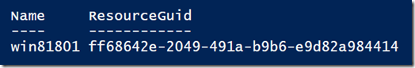
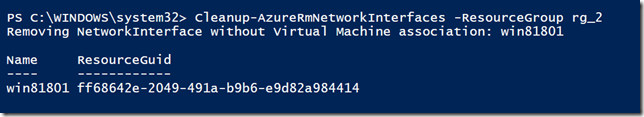

Today when I opened my Azure portal I had a little surprise. The monthly MSDN subscription credit was much lower as I expected it to be. Did I eventually forget to turn off a virtual machine? Curious to find out where the cost had come from, I drilled into the subscription details and noticed that the higher costs had come from the Premium storage that I had used recently to deploy a virtual machine using an SSD disk  instead of a HDD disk. But still it wasn’t clear why just that one virtual machine would be that expensive, so i drilled into the premier storage account and noticed that there were several orphaned VHD disks there. A clean up was required.

To get an overview of all disks, I wrote the following script called Get-AzureBlobInfo. The script queries all or the specified storage account name and lists all blob objects stored within the containers.



Since I am only interested in VHD files, I use the following command:

```powershell
Get-AzureBlobInfo | Where-Object {($_.name).split(".")[-1] -like "vhd" } | Select-Object Name,STorageaccount,LeaseStatus,{($_.StorageAccountKey)[0].value} | fl
```


To delete the vhd file, we first must set the Azure storage context.

```powershell
$ctx = New-AzureStorageContext -StorageAccountName saverboon1 -StorageAccountKey 5JcWTPE6PeU3BTWpkKzAw55eFRb8A0KZybc+OV+IlS2hOWRiqPanZsi4nyQOyl9jMA==
```

```powershell
Remove-AzureStorageBlob -Blob OSDDisk_ALEX04.vhd -Container vhds -Context $ctx
```

Okay, that’s how we get rid of unused VHDs. Now while I am at it anyway, I thought I take this a step further since I’m aware that I have more orphaned azure resources like Network Interfaces, Public IP Addresses and Network security groups. So I wrote three additional functions

 	
- Cleanup-AzureRmNetworkInterfaces
 	
- Cleanup-AzureRmPublicIPAddress
 	
- Cleanup-RmNetworkSecurityGroup

The scripts basically all work the same, just provide the name of the resource group and use the ListOnly switch first to list resources that do not have an association with a virtual machine.

```
Cleanup-AzureRmNetworkInterfaces -ResourceGroup rg_2 –ListOnly
```



When running the command without the listonly parameter, network interfaces without an association are deleted. Note that I on purpose did not include the confirm switch, so you will be prompted to confirm the deletion.



All mentioned functions are listed below and can also be found in my GitHub repository here:https://github.com/alexverboon/posh