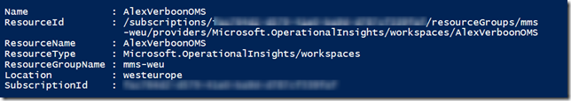
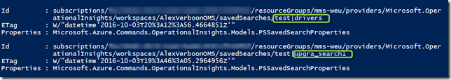
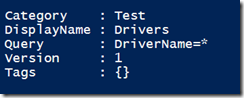
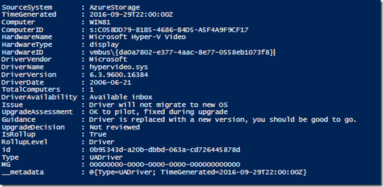

I am considering using the Windows 10 upgrade analytics for our Windows 10 project that we’ve just started just recently. Below you find some random notes and references I have gathered during my exploration journey.

**The Upgrade Analytics Blog**

Here is where you find the latest information from the Upgrade Analytics team: [https://blogs.technet.microsoft.com/upgradeanalytics/](https://blogs.technet.microsoft.com/upgradeanalytics/)

**Upgrade Analytics on TechNet**

Information about the Architecture, deployment techniques, prerequisites and more can be found here: [https://technet.microsoft.com/en-us/itpro/windows/deploy/manage-windows-upgrades-with-upgrade-analytics](https://technet.microsoft.com/en-us/itpro/windows/deploy/manage-windows-upgrades-with-upgrade-analytics)

If you have concerns about data privacy, this document describes in detail what data is being collected and send to Microsoft [Windows 7, Windows 8, and Windows 8.1 appraiser telemetry events and fields](https://go.microsoft.com/fwlink/?LinkID=822965)

**The Ignite 2016 presentations**

Too lazy to read all the documentation? (at some point you will have to anyway) here are the presentations from the Microsoft Ignite Conference 2016

[https://www.youtube.com/watch?v=WpyNi87rO-8&feature=youtu.be](https://www.youtube.com/watch?v=WpyNi87rO-8&feature=youtu.be) (Level 100)

[https://www.youtube.com/watch?v=aMnp-mRE0cg&feature=youtu.be](https://www.youtube.com/watch?v=aMnp-mRE0cg&feature=youtu.be) (Level 200)

**Getting Started**

Easy to follow step by step instructions can be found here:

[https://technet.microsoft.com/itpro/windows/deploy/upgrade-analytics-get-started](https://technet.microsoft.com/itpro/windows/deploy/upgrade-analytics-get-started)

[https://blogs.technet.microsoft.com/upgradeanalytics/2016/07/22/upgrade-analytics-public-preview-is-now-available/](https://blogs.technet.microsoft.com/upgradeanalytics/2016/07/22/upgrade-analytics-public-preview-is-now-available/)

**The Upgrade Analytics Deployment Script**

A description of the script and its error codes is documented here: [https://blogs.technet.microsoft.com/upgradeanalytics/2016/09/20/new-version-of-the-upgrade-analytics-deployment-script-available/](https://blogs.technet.microsoft.com/upgradeanalytics/2016/09/20/new-version-of-the-upgrade-analytics-deployment-script-available/)

**Be patient!**

So once you have setup the OMS Workspace and you ran the deployment scrip on the client, patience is required, because at present, it can take up to 48 hours until you actually see the data within the console. Within one of the videos they explain why in more detail.

**PowerShell !!**

As always, the big question, can we PowerShell this thing? Yes!!! I got the initial hints from this article: [https://blogs.technet.microsoft.com/privatecloud/2016/04/05/using-the-oms-search-api-with-native-powershell-cmdlets/](https://blogs.technet.microsoft.com/privatecloud/2016/04/05/using-the-oms-search-api-with-native-powershell-cmdlets/)

You will need the Azure OperationalInsights module for this, here’s how to install it:

```
Find-Module AzureRM.OperationalInsights | Install-Module
```

and check if it installed correctly:

```
Get-Module AzureRm.OperationalInsights
```

Most of the Azure OperationalInsights cmdlets require the Resource Group and Workspace parameter, here’s how you get the information for your Worksapces

```
Find-AzureRmResource -ResourceType "Microsoft.OperationalInsights/workspaces"
```

[

](https://www.verboon.info/wp-content/uploads/2016/10/image-4.png)

So for my further code snippets I define the the following variables:

```
$ResourceGroupName = "mms-weu"
$WorkSpaceName = "AlexVerboonOMS"
```

Okay, now let’s take a look if we have any saved searches (we have because i created two of them)

```
# Get Saved Searches
$query = Get-AzureRmOperationalInsightsSavedSearch -ResourceGroupName $ResourceGroupName -WorkspaceName $WorkSpaceName
$query.value |FL
```

 

[

](https://www.verboon.info/wp-content/uploads/2016/10/image-5.png)

To see the definition of the saved search  we’ll use the following code, note the **SavedSearchId** value

```
$query = Get-AzureRmOperationalInsightsSavedSearch  -ResourceGroupName $ResourceGroupName -WorkspaceName $WorkSpaceName -SavedSearchId "test|Drivers"
$query.properties | FL
```

 

[

](https://www.verboon.info/wp-content/uploads/2016/10/image-6.png)

Now let’s get the data.

```
$result = Get-AzureRmOperationalInsightsSavedSearchResults -ResourceGroupName $ResourceGroupName -WorkspaceName $WorkSpaceName -SavedSearchId "test|Drivers"
$Drivers = $result.value | ConvertFrom-Json
```

 

[

](https://www.verboon.info/wp-content/uploads/2016/10/image-7.png)

Run a query directly without using a saved search? Here you go:

```
$dynamicQuery = "Manufacturer=*"
$result = Get-AzureRmOperationalInsightsSearchResults -ResourceGroupName $ResourceGroupName -WorkspaceName $WorkSpaceName -Query $dynamicQuery -Top 10$result.Value | ConvertFrom-Json
```

And last but not least, let’s have a look at all the classes that are in OMS, by exploring the Schema.

```
$schema = Get-AzureRmOperationalInsightsSchema -ResourceGroupName $ResourceGroupName -WorkspaceName $WorkSpaceName
$schemas = $schema.Value | Select-Object Name| Sort-Object Name
```

and here a quick and dirty script that outputs all the classes that actually hold data.

```
$datainfo = @()
ForEach($s in $schemas)
{
    $dynamicQuery = "$($s.name)=*"
    $result = Get-AzureRmOperationalInsightsSearchResults -ResourceGroupName $ResourceGroupName -WorkspaceName $WorkSpaceName -Query $dynamicQuery -Top 10
    $hasdata = $result.Value | ConvertFrom-Json
    If ($hasdata -eq $null)
        {
            write-host "class $($s.name) has no log data" -ForegroundColor DarkGreen
        }
    Else
        {
            write-host "class $($s.name) contains log data" -ForegroundColor Green
            $datainfo += "$($s.Name)"
        }
}
$datainfo
```

 

That’s it for today, waiting for more data to come into my workspace 


