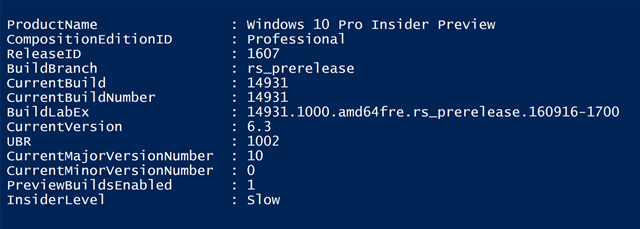

Here’s a script I wrote that retrieves all the Windows 10 build information, including Insider level when enabled. 

 [

](https://www.verboon.info/wp-content/uploads/2016/11/ss1.png)

  

```

```

And here’s a list of sites that provide information about the builds, releases, version numbers etc. 

[http://changewindows.org/platform/desktop](http://changewindows.org/platform/desktop)

[https://buildfeed.net/](https://buildfeed.net/)

[https://technet.microsoft.com/en-us/windows/release-info.aspx](https://technet.microsoft.com/en-us/windows/release-info.aspx)

[https://support.microsoft.com/en-us/help/12387/windows-10-update-history?ocid=client_wu](https://support.microsoft.com/en-us/help/12387/windows-10-update-history?ocid=client_wu)

