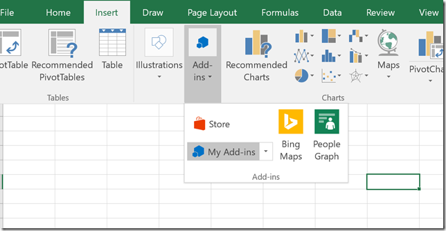
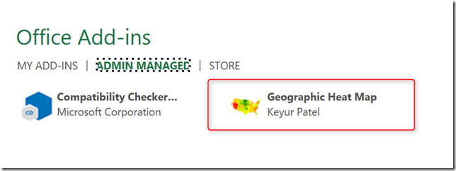

Just recently Microsoft announced the general availability of the Office 365 centralized deployment service. I have tested it and it really makes deploying Office Add-ins super easy. The add-in configuration and deployment can be managed through the Office 365 portal or using PowerShell.

For a quick overview watch the video “[How to Deploy Office Add-ins within Your Organization](https://channel9.msdn.com/Events/Build/2016/P574)”.

Now since I like using PowerShell, here’s a quick example how to enable and deploy an Office Add-in.

First [download](https://www.microsoft.com/en-us/download/details.aspx?id=55267) and install the Office 365 Centralized Deployment PowerShell module. Get-Command -Module OrganizationAddInService shows you all the available cmdlets

Within the Office Store I have found an add-in that i want to deploy called the “Geographic Heat Map”

[https://store.office.com/en-us/app.aspx?assetid=WA103304320&sourcecorrid=cdbeb6de-e8c1-4e8c-98d4-de57419a0f3d&searchapppos=1&ui=en-US&rs=en-US&ad=US&appredirect=false](https://store.office.com/en-us/app.aspx?assetid=WA103304320&sourcecorrid=cdbeb6de-e8c1-4e8c-98d4-de57419a0f3d&searchapppos=1&ui=en-US&rs=en-US&ad=US&appredirect=false)


From the URL extract the Office store asset id of the add-in

```
New-OrganizationAddIn -AssetId WA103304320 -Locale en-US -ContentMarket en-US -Members "johndoe@contoso.com" –Disabled
```

Let’s take a look at the add-in details

```
Get-OrganizationAddIn -ProductId e69e87c3-de20-491e-b891-0d75e1e1c6bf | fl

AssetId                  : WA103304320
AppId                    : 
Capabilities             : {ReadWrite Document, Send Data}
Description              : This app will help you visualize data across 
                           geographic locations. It's simply formatting on a 
                           map.
LicenseTermsUrl          : https://go.microsoft.com/fwlink/?LinkID=521715&omkt=d
                           e-CH
LimitedAvailability      : True
Locale                   : 
LocalizedDescriptions    : 
LocalizedIconUrls        : 
LocalizedNames           : 
OfficeProducts           : {Excel}
PrivacyPolicyUrl         : https://go.microsoft.com/fwlink/?LinkID=521712&omkt=d
                           e-CH
ProviderName             : Keyur Patel
Scopes                   : {}
StatusCode               : Removed
StoreStatusCode          : Ok
Type                     : PrivateCatalogStoreAddIn
AssignedGroups           : {}
AssignedUsers            : {1eac8e26-62fa-47b9-b501-8027da8ca88b;GA_S082AQ@swiss
                           redev.onmicrosoft.com;GA_Alex Verboon}
DisplayName              : Geographic Heat Map
IconUrl                  : https://az158878.vo.msecnd.net/marketing/product/4294
                           9673611/06947854-eb87-4a89-870d-e726cc49e859/Geograph
                           icHeatMapLogo.png
ProductId                : e69e87c3-de20-491e-b891-0d75e1e1c6bf
ServicePrincipalObjectId : 
Version                  : 1.1
```

The add-in is still not enabled, so let’s do that now.

```
Set-OrganizationAddIn -ProductId e69e87c3-de20-491e-b891-0d75e1e1c6bf -Enabled $true
ProductId                            DisplayName         OfficeProducts StatusCode
---------                            -----------         -------------- ----------
e69e87c3-de20-491e-b891-0d75e1e1c6bf Geographic Heat Map {Excel}        Ok
```

 

Now lets open Excel, and see if the add-in is available.



and there we go.



I told you, it’s super easy.

More information here:

[https://channel9.msdn.com/Events/Build/2016/P574](https://channel9.msdn.com/Events/Build/2016/P574)

[https://blogs.office.com/2017/05/31/announcing-general-availability-of-the-office-365-centralized-deployment-service/](https://blogs.office.com/2017/05/31/announcing-general-availability-of-the-office-365-centralized-deployment-service/)

[https://techcommunity.microsoft.com/t5/Office-365-Blog/Deploy-custom-business-applications-with-ease-with-the-Office/ba-p/73430](https://techcommunity.microsoft.com/t5/Office-365-Blog/Deploy-custom-business-applications-with-ease-with-the-Office/ba-p/73430)

[https://www.microsoft.com/en-us/download/details.aspx?id=55267](https://www.microsoft.com/en-us/download/details.aspx?id=55267)

[https://support.office.com/en-us/article/Use-the-Centralized-Deployment-PowerShell-cmdlets-to-manage-add-ins-94f4e86d-b8e5-42dd-b558-e6092f830ec9](https://support.office.com/en-us/article/Use-the-Centralized-Deployment-PowerShell-cmdlets-to-manage-add-ins-94f4e86d-b8e5-42dd-b558-e6092f830ec9)

