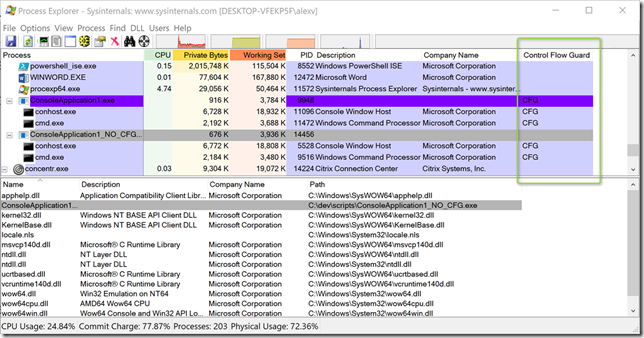
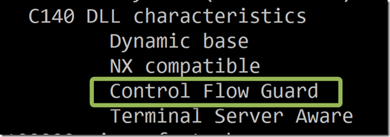
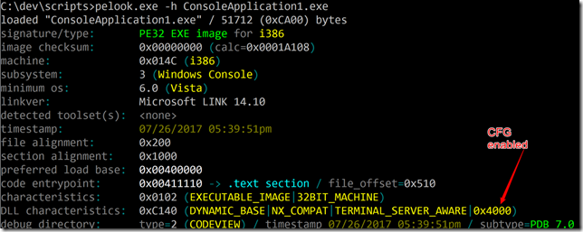
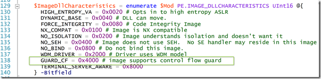
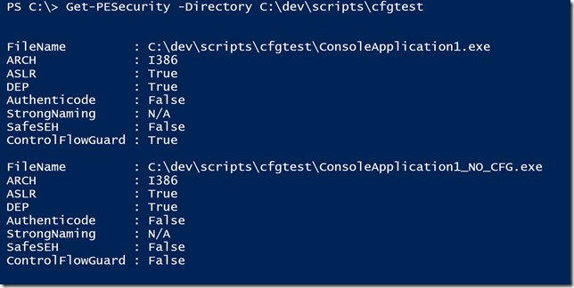
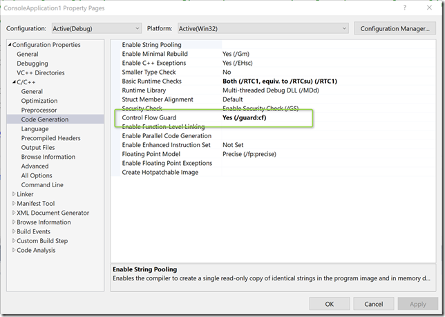

How to check if Control Flow Guard is enabledControl Flow Guard helps mitigate exploits that are based on flow between code locations in memory. Control Flow Guard (CFG) is a mitigation that requires no configuration within the operating system, but instead is built into software when it’s compiled. So how to check if an Application is Control Flow Guard is enabled? For my own testing purposes I created two executables one called ConsoleApplication1.exe that has CFG enabled and ConsoleApplication1_NO_CFG.exe. One way to find out whether a running application has CFG enabled is to use the sysinternals process explorer utility. If you have Visual Studio installed, the you can use dumpbin.exe with the /HEADERS flag, then look for the DLL characteristics section.Another nice utility I found is [PELook](http://bytepointer.com/tools/index.htm#pelook) from bytepointer.com Now while the above described methods are fine to look at an individual application, what if we wanted to scan an entire system with software installed? Use PowerShell!Luckily, I didn’t have to do all the work from scratch. I found the Get-PESecurity module from Eric Gruber on GitHub [here](https://github.com/NetSPI/PESecurity/blob/master/Get-PESecurity.psm1). The Get-PESecurity module checks if a Windows binary has been compiled with ASLR, DEP, SafeSEH, StrongNaming and Authenticode. But it didn’t show the Control Flow Guard information. After I familiarized myself a little bit with the [PE format specification](https://msdn.microsoft.com/en-us/library/windows/desktop/ms680547(v=vs.85).aspx#the_load_configuration_structure__image_only_) on MSDN I learned that the information whether an image supports Control Flow Guard is stored in the DLLCharacteristics constant “GUARD_CF” with a value of 0x4000. So I extended the Get-PESecurity module here and there to add support for CFG. You can find my forked version of the Get-PESecurity PowerShell module which includes support for CFG here: [https://github.com/alexverboon/PESecurity](https://github.com/alexverboon/PESecurity)If your company has in-house software developers encourage them to compile their applications with Control Flow Guard enabled. Additional resources I found while exploring CFG[https://msdn.microsoft.com/en-us/library/windows/desktop/mt637065(v=vs.85).aspx](https://msdn.microsoft.com/en-us/library/windows/desktop/mt637065(v=vs.85).aspx)[http://sjc1-te-ftp.trendmicro.com/assets/wp/exploring-control-flow-guard-in-windows10.pdf](http://sjc1-te-ftp.trendmicro.com/assets/wp/exploring-control-flow-guard-in-windows10.pdf)[https://docs.microsoft.com/en-us/windows/threat-protection/overview-of-threat-mitigations-in-windows-10](https://docs.microsoft.com/en-us/windows/threat-protection/overview-of-threat-mitigations-in-windows-10)[https://lucasg.github.io/2017/02/05/Control-Flow-Guard](https://lucasg.github.io/2017/02/05/Control-Flow-Guard)[https://github.com/NetSPI/PESecurity](https://github.com/NetSPI/PESecurity)[https://blog.trailofbits.com/2016/12/27/lets-talk-about-cfi-microsoft-edition](https://blog.trailofbits.com/2016/12/27/lets-talk-about-cfi-microsoft-edition)[https://blogs.technet.microsoft.com/askpfeplat/2017/04/24/windows-10-memory-protection-features](https://blogs.technet.microsoft.com/askpfeplat/2017/04/24/windows-10-memory-protection-features)

