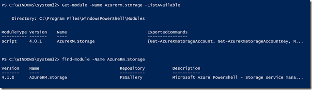
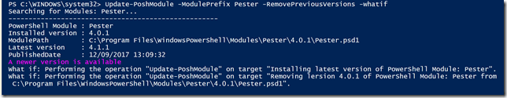
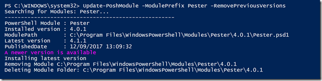
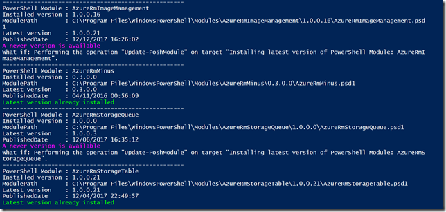

With nowadays rapid development and release cycles it’s a good practice to regularly check whether you have the latest available module versions installed. Using native PowerShell cmdlets you would first list the module installed locally and then search for the latest module online.



When you have several modules installed, this becomes a laborious task. So I wrote a cmdlet that does all this work for me and you if you like.

The Update-PoshModule cmdlet can check for an individual module or multiple modules that start with the same prefix.

To check the local version of Pester and whether there is a newer version available online I simply run the following command

```
Update-PoshModule -ModulePrefix Pester -RemovePreviousVersions –whatif
```



Note that I use the **–whatif** parameter, since I only want to check whether there is a newer version. Next we remove the –whatif parameter to run the update.



Now I’m interested what the status is of my Azure Resource Manager modules. Instead of an exact module name, I just enter the Module prefix “AzureRm”

```
Update-PoshModule -ModulePrefix AzureRM –WhatIf
```




- The –Scope parameter let’s you define whether you want to install the module for AllUsers or just the CurrentUser.

- with the  –RemovePreviousVersions parameter enabled the script tries to remove older versions provided the user has access

- The ReturnOutput parameter, best used in combination with –what if returns an object with all the local and remote module informatin.

Note that the Update-PoshModule cmdlet only looks for PowerShell modules installed in Allusers scope i.e. "C:\Program Files\WindowsPowerShell\Modules" and CurrentUserr i.e. "C:\Users\alexv\Documents\WindowsPowerShell"

When using the **-RemovePreviousVersions** option I recommend to first run the command with the **-wahtif** command so you're sure about what gets removed.

```
```

And as always, feedback is welcome.


