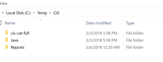
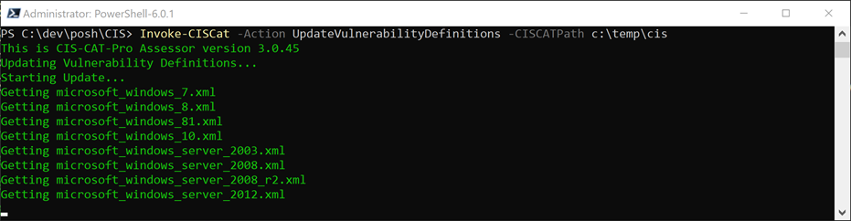
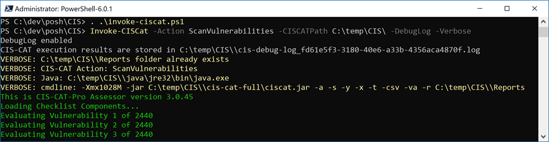
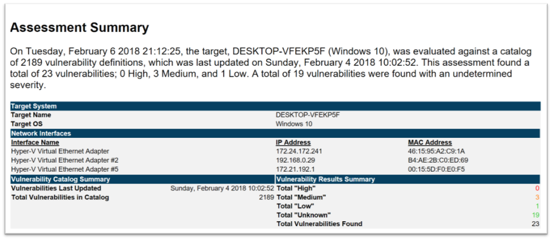
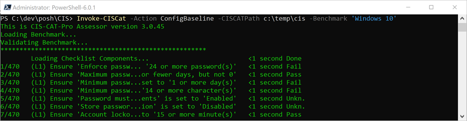
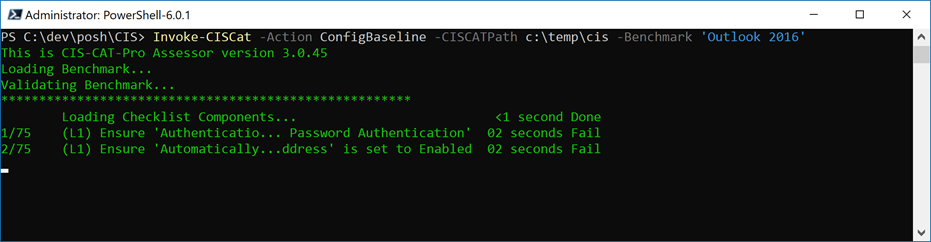
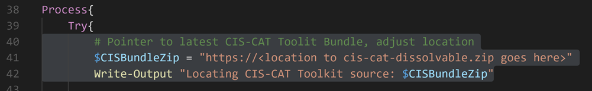

CIS-CAT stands for Center for internet Security Configuration Assessment Tool. The CIS-CAT tool is used to perform configuration and vulnerability assessments. The Pro version is only available to CIS members, however if you want to try out the software, you can download the CIS-CAT Lite version from here: [https://www.cisecurity.org/introducing-cis-cat-lite/](https://www.cisecurity.org/introducing-cis-cat-lite/) Note that the Lite version does not include the command line interface, so you won't be able to use the automation described in this blog post. But you're still welcome to continue reading this blog post. An overview of the CIS-CAT Pro can be found here: [https://www.cisecurity.org/cybersecurity-tools/cis-cat-pro/](https://www.cisecurity.org/cybersecurity-tools/cis-cat-pro/)

Okay so what are these Configuration and Vulnerability assessments anyway. CIS provides so-called Benchmarks for various operating systems and applications such as Windows 10, Office 2016, Linux, Google Chrome, Firefox, Windows Server 2016 etc. In simple words, a CIS benchmark contains guidance for as to how to securely configure an operating system or application. A complete overview of available benchmarks can be found here: [https://www.cisecurity.org/cis-benchmarks/](https://www.cisecurity.org/cis-benchmarks/) When you have implemented these configurations you can use the CIS-CAT Pro toolkit and compare your systems against the appropriate Benchmark. Upon completion of the assessment you get a nice report telling you whether your system configuration is in line with the recommendations or not.

Furthermore CIS-CAT Pro can be used to conduct vulnerability scans based on up to date vulnerability definitions available from the vulnerability repository [https://oval.cisecurity.org/repository/download/5.11.2/vulnerability](https://oval.cisecurity.org/repository/download/5.11.2/vulnerability)

The CIS-CAT tool can be operated in GUI or CLI mode. The GUI mode is great when you start to explore the capabilities of the tool, however when using the tool on a regular basis, you probably want to automate things. The CIS-CAT tool is a Java based application and requires JRE v1.6 or later. The default installation includes a few Windows batch script examples that can be used to run CIS-CAT silently, but … yes … "Windows (cmd) batch scripts". It's 2018 and I love PowerShell. So, I made a little effort and wrote a PowerShell based wrapper for CIS-CAT Pro and called it "Invoke-CisCat". You find the code here: [https://github.com/alexverboon/posh/blob/master/CIS/invoke-ciscat.ps1](https://github.com/alexverboon/posh/blob/master/CIS/invoke-ciscat.ps1)

The current version of Invoke-CISCat provides the following functions:

 	
- Run a Benchmark Assessment
 	
- Run a vulnerability Assessment
 	
- Download latest Vulnerability Assessment definitions from the OVAL repository

Prerequisites: As mentioned previously only the Pro version has a command line interface, if you're a CIS member, download the latest version of the CIS-CAT Pro toolkit and store the content to C:\TEMP\CIS



Copy paste the invoke-ciscat below into a file called invoke-ciscat.ps1 and load the function either in PowerShell ISE or PowerShell. (I have tested the script with PowerShell v5.1 and PowerShell Core 6.0.1).

To ensure that we have the latest vulnerability assessment definitions available, let's start with downloading these.

```
Invoke-CISCat -Action UpdateVulnerabilityDefinitions -CISCATPath c:\temp\cis
```

 



Now let's start the vulnerability assessment.

```
Invoke-CISCat -Action ScanVulnerabilities -CISCATPath C:\temp\CIS\ -DebugLog -Verbose
```

 



The vulnerability assessment report can be found in the C:\TEMP\CIS\Reports folder.



And finally let's run a Benchmark Assessment for Windows 10 and Office Outlook 2016

```
Invoke-CISCat -Action ConfigBaseline -CISCATPath c:\temp\cis -Benchmark 'Windows 10'
```

 



```
Invoke-CISCat -Action ConfigBaseline -CISCATPath c:\temp\cis -Benchmark 'Outlook 2016'
```

 



Again, the results are stored within the C:\TEMP\CIS\Reports folder, there you find the reports in HTML, CSV, TXT and XML format. If you don't need these formats, just change the 
$cis_options Variable within the code.

I have had some issues downloading the vulnerability definitions for Windows when running the script behind a proxy, I have not been able yet to find out why, but as a workaround created a second cmdlet called Update-CISVulnDefinitions that downloads the Windows 7 and Windows 10 definitions directly from the OVAL repository. The code for that cmdlet can be found here: [https://github.com/alexverboon/posh/blob/master/CIS/Update-CISVulnDefinitions.ps1](https://github.com/alexverboon/posh/blob/master/CIS/Update-CISVulnDefinitions.ps1)

And finally, since you don't want to install CIS-CAT manually on target systems, here's a cmdlet called install-CISCATToolkit that retrieves the CIS-CAT ZIP file from an internally hosted web server or GIT repository and extracts the content locally.

[https://github.com/alexverboon/posh/blob/master/CIS/Install-CISCATToolkit.ps1](https://github.com/alexverboon/posh/blob/master/CIS/Install-CISCATToolkit.ps1)

Please note that before using this cmdlet, you will need to set the $CISBundleZip variable accordingly.



That's it for today, hope you enjoyed this post, and for those that use CIS-CAT Pro, happy automation!

Cheers

Alex

