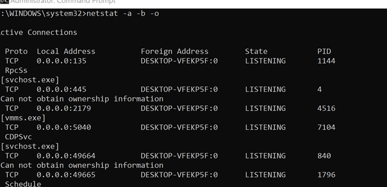
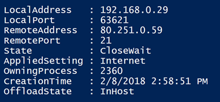
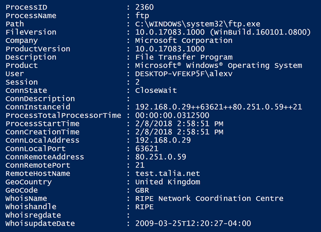

if you need information on active TCP connections, you probably start with the [netstat](https://docs.microsoft.com/en-us/windows-server/administration/windows-commands/netstat) command When using the -b or -o parameter netstat will also list the executable involved in creating the process respectively the owing Process ID.

The output then looks as following.



In PowerShell we can use [Get-NetTCPConnection](https://docs.microsoft.com/en-us/powershell/module/nettcpip/get-nettcpconnection?view=win10-ps) to retrieve TCP connection information.



When suspecting that something malicious is running on a device, I look at the TCP connections and want to know more about the executable that owns the process. I am also interested in who's owning the domain and where it's geographically located. And so another cmdlet was born. **Get-NetConnectionDetails**

The Get-NetConnectionDetails retrieves all TCP connections and then collects additional information about the owning process such as the executable name, version, the user that runs the process, the geolocation and some domain registration data from the whois database.

Here's an example of the output.

Get-NetConnectionDetails -Process ftp      



Below is the complete Code is also stored on [GitHub](https://github.com/alexverboon/posh/blob/master/Security/get-netconnectiondetails.ps1)

`powershell
Function Get-NetConnectionDetails{
<#
.SYNOPSIS
    Get-NetConnectionDetails
.DESCRIPTION
    Get-NetConnectionDetails retrieves all network connections and then
    retrieves process information and IP information. 

    Use this script to find detailed information about processes and their
    TCP connections. 

.PARAMETER State

    Specifies an array of TCP states. The cmdlet gets connections that 
    match the states that you specify. The acceptable values for this 
    parameter are:
        
        -- Closed
        -- CloseWait
        -- Closing
        -- DeleteTCB
        -- Established
        -- FinWait1
        -- FinWait2
        -- LastAck
        -- Listen
        -- SynReceived
        -- SynSent
        -- TimeWait

.PARAMETER Process
    Process Name

    When using the Process Name parameter with a valid Process name, the results
    are filtered to just contains netconnections for the process. 

.PARAMETER NoLookup

    When enabled no Geoloocation, whois and host name lookups are performed.

.EXAMPLE
    Get-NetConnectionDetails

    Lists all NetTCP Connections and related process details. 

.EXAMPLE
    Get-NetConnectionDetails -Process TOTALCMD64 -Verbose

    The above command will return only NetTCPConnection and process
    information for processes related to TOTALCMD64

.NOTES
    v1.0, 08.02.2018, alex verboon
#>

[CmdletBinding()]
Param(

    [Parameter()]
    [ValidateSet("Closed","CloseWait","Closing","DeleteTCB","Established","FinWait1","FinWait2","LastAck","Listen","SynReceived","SynSent","TimeWait")]
    [string]$State,

    [parameter()]
    [switch]$NoLookup
)

 DynamicParam {
            # Set the dynamic parameters' name
            $ParameterName = 'Process'
            
            # Create the dictionary 
            $RuntimeParameterDictionary = New-Object System.Management.Automation.RuntimeDefinedParameterDictionary

            # Create the collection of attributes
            $AttributeCollection = New-Object System.Collections.ObjectModel.Collection[System.Attribute]
            
            # Create and set the parameters' attributes
            $ParameterAttribute = New-Object System.Management.Automation.ParameterAttribute
            $ParameterAttribute.Mandatory = $false
            $ParameterAttribute.Position = 1

            # Add the attributes to the attributes collection
            $AttributeCollection.Add($ParameterAttribute)

            # Generate and set the ValidateSet 
            $arrSet = (Get-Process).ProcessName
            $ValidateSetAttribute = New-Object System.Management.Automation.ValidateSetAttribute($arrSet)

            # Add the ValidateSet to the attributes collection
            $AttributeCollection.Add($ValidateSetAttribute)

            # Create and return the dynamic parameter
            $RuntimeParameter = New-Object System.Management.Automation.RuntimeDefinedParameter($ParameterName, [string], $AttributeCollection)
            $RuntimeParameterDictionary.Add($ParameterName, $RuntimeParameter)
            return $RuntimeParameterDictionary
    }
 

Begin{

    If (-not ($PSBoundParameters.Keys -contains "NoLookup"))
    {
        Try{
            
            Write-Verbose "Registering geo location lookup"
            $geo = New-WebServiceProxy "http://www.webservicex.net/geoipservice.asmx"
            $Lookup = $true
        }
        Catch{
            $Lookup = $false
            Write-Warning "Unable to query for Geo data"
       }
   }
   Else
   {
        $Lookup = $false
        write-verbose "IP lookup option is disabled"
   }

    If (-not ($PSBoundParameters.Keys -contains "State"))
    {
        write-verbose "Querying all connection states"
        $ConnState = "Closed","CloseWait","Closing","DeleteTCB","Established","FinWait1","FinWait2","LastAck","Listen","SynReceived","SynSent","TimeWait"
        $regex_state = $ConnState.ForEach({ [RegEx]::Escape($_) }) -join '|'
    }
    Else
    {
        write-verbose "Querying connections with state:  $($PSBoundParameters["State"])"
        $ConnState = "$($PSBoundParameters["State"])"
        $regex_state = $ConnState.ForEach({ [RegEx]::Escape($_) }) -join '|'
    }

    Try{

        If (-not ($PSBoundParameters.Keys -contains "Process"))
        {
            Write-Verbose "Retrieving NetTCPConnection data for all processes"
            $allconnecctions = Get-NetTCPConnection | Select-Object *  #| Where-Object  {$_.state -match "$regex_state"}
        } 
        Else
        {
            Write-Verbose "Retrieving NetTCPConnection data for Process $($PSBoundParameters["Process"])"
            $PIDlist = (Get-Process -Name "$($PSBoundParameters["Process"])").id 
            $regex_pid = $PIDlist.ForEach({ [RegEx]::Escape($_) }) -join '|'
            $allconnecctions = Get-NetTCPConnection | Select-Object * | Where-Object  {$_.OwningProcess -match $regex_pid -and $_.state -match "$regex_state"}
        }
    }
    Catch
    {
        Write-Warning "Unable to retrieve NetTCP Connection data"
        Throw
    }
}

Process{

$Result = @()
ForEach ($con in $allconnecctions)
{
    write-output "Processing $($ProcessIinfo.Name) -- $($con.LocalAddress) - $($con.RemoteAddress)"
    If (-not($con.RemoteAddress -eq "0.0.0.0" -or $con.RemoteAddress -eq "::"))
    {
        If ($Lookup -eq $true)
        {
            Try{ 
            Write-verbose "Retrieving Geo Data for $($con.RemoteAddress)"
            $geodata =  $geo.GetGeoIP("$($con.RemoteAddress)")
            }
            Catch{
                $geodata = $null
            }

      
            Try{
                Write-verbose "Retrieving Whois Data for $($con.RemoteAddress)"
                $whois = Invoke-RestMethod -uri "http://whois.arin.net/rest/ip/$($con.RemoteAddress)" 
            }
            Catch{
                $whois = $null
            }

            Try{
                Write-verbose "Retrieving Remote Host name for $($con.RemoteAddress)"
                $hostname =  [system.net.dns]::GetHostByAddress("$($con.RemoteAddress)").hostname
            }
            Catch{
                $hostname = $null
            }
        }
        Else
        {
            $geodata = $null
            $whois = $null
            $hostname = $null
        }
    }

    $ProcessID = $con.OwningProcess
    $ProcessIinfo = Get-Process -Id $ProcessID -IncludeUserName 
    $object = [ordered]@{
    ProcessID = $ProcessID
    ProcessName = $ProcessIinfo.Name
    Path = $ProcessIinfo.Path
    FileVersion = $ProcessIinfo.FileVersion
    Company = $ProcessIinfo.Company
    ProductVersion = $ProcessIinfo.ProductVersion
    Description = $ProcessIinfo.Description
    Product = $ProcessIinfo.Product
    User = $ProcessIinfo.UserName
    Session = $ProcessIinfo.SessionId
    ConnState = $con.State
    ConnDescription = $con.Description
    ConnInstanceid = $con.InstanceID
    ProcessTotalProcessorTime = $ProcessIinfo.TotalProcessorTime
    ProcessStartTime = $ProcessIinfo.StartTime
    ConnCreationTime = $con.CreationTime
    ConnLocalAddress = $con.LocalAddress
    ConnLocalPort = $con.LocalPort
    ConnRemoteAddress = $con.RemoteAddress
    ConnRemotePort = $con.RemotePort
    RemoteHostName = $hostname
    GeoCountry = $geodata.CountryName
    GeoCode = $geodata.CountryCode
    WhoisName = $whois.net.orgRef.name
    Whoishandle = $whois.net.orgref.Handle
    Whoisregdate = $whois.net.registrationDate
    WhoisupdateDate = $whois.net.updateDate
    }
    $Result += (New-Object -TypeName PSObject -Property $object)
}

}
End{
    $Result
}
}

```
