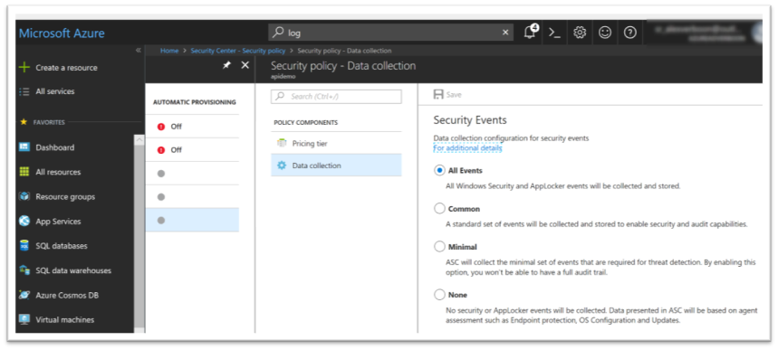
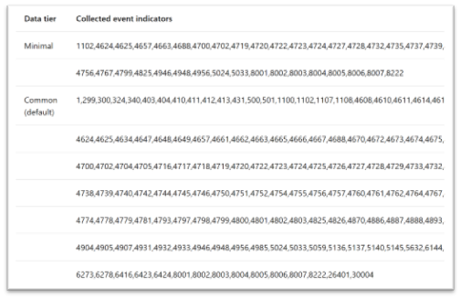

Within the Azure Security Center, Security Policy node, you can select a workspace and there define the data collection configuration for security events.


- All Events

- Common

- Minimal

- None



More details about the Azure Data Collection and the data collection tier can be found [here](https://docs.microsoft.com/en-us/azure/security-center/security-center-enable-data-collection). The page also has a list of all the Event IDs that are being collected within each tier.



To better understand the exact meaning of each Event ID, I've created the below lists containing the Event ID, Description, Event Provider and Event Level information.

**Event IDs included in "Minimum" Tier
**


**ID**
**Description**
**Provider**
**Level**

**1102**
The audit log was cleared.
Microsoft-Windows-eventlog
Information

**1102**
The computer will be rebooted because the user has exceeded the maximum number of failed logon attempts allowed on this computer.
Microsoft-Windows-WinLogon
Warning

**4624**
An account was successfully logged on.
Microsoft-Windows-Security-Auditing
Information

**4625**
An account failed to log on.
Microsoft-Windows-Security-Auditing
Information

**4657**
A registry value was modified.
Microsoft-Windows-Security-Auditing
Information

**4663**
An attempt was made to access an object.
Microsoft-Windows-Security-Auditing
Information

**4688**
A new process has been created.
Microsoft-Windows-Security-Auditing
Information

**4688**
A new process has been created.
Microsoft-Windows-Security-Auditing
Information

**4700**
A scheduled task was enabled.
Microsoft-Windows-Security-Auditing
Information

**4702**
A scheduled task was updated.
Microsoft-Windows-Security-Auditing
Information

**4719**
System audit policy was changed.
Microsoft-Windows-Security-Auditing
Information

**4720**
A user account was created.
Microsoft-Windows-Security-Auditing
Information

**4722**
A user account was enabled.
Microsoft-Windows-Security-Auditing
Information

**4723**
An attempt was made to change an account's password.
Microsoft-Windows-Security-Auditing
Information

**4724**
An attempt was made to reset an account's password.
Microsoft-Windows-Security-Auditing
Information

**4727**
A security-enabled global group was created.
Microsoft-Windows-Security-Auditing
Information

**4728**
A member was added to a security-enabled global group.
Microsoft-Windows-Security-Auditing
Information

**4732**
A member was added to a security-enabled local group.
Microsoft-Windows-Security-Auditing
Information

**4732**
A member was added to a security-enabled local group.
Microsoft-Windows-Security-Auditing
Information

**4735**
A security-enabled local group was changed.
Microsoft-Windows-Security-Auditing
Information

**4737**
A security-enabled global group was changed.
Microsoft-Windows-Security-Auditing
Information

**4739**
Domain Policy was changed.
Microsoft-Windows-Security-Auditing
Information

**4740**
A user account was locked out.
Microsoft-Windows-Security-Auditing
Information

**4754**
A security-enabled universal group was created.
Microsoft-Windows-Security-Auditing
Information

**4755**
A security-enabled universal group was changed.
Microsoft-Windows-Security-Auditing
Information

**4756**
A member was added to a security-enabled universal group.
Microsoft-Windows-Security-Auditing
Information

**4756**
A member was added to a security-enabled universal group.
Microsoft-Windows-Security-Auditing
Information

**4767**
A user account was unlocked.
Microsoft-Windows-Security-Auditing
Information

**4799**
A security-enabled local group membership was enumerated.
Microsoft-Windows-Security-Auditing
Information

**4825**
A user was denied the access to Remote Desktop. By default, users are allowed to connect only if they are members of the Remote Desktop Users group or Administrators group.
Microsoft-Windows-Security-Auditing
Information

**4946**
A change was made to the Windows Firewall exception list. A rule was added.
Microsoft-Windows-Security-Auditing
Information

**4948**
A change was made to the Windows Firewall exception list. A rule was deleted.
Microsoft-Windows-Security-Auditing
Information

**4956**
Windows Firewall changed the active profile.
Microsoft-Windows-Security-Auditing
Information

**5024**
The Windows Firewall service started successfully.
Microsoft-Windows-Security-Auditing
Information

**5033**
The Windows Firewall Driver started successfully.
Microsoft-Windows-Security-Auditing
Information

**8001**
The AppLocker policy was applied successfully to this computer.
Microsoft-Windows-AppLocker
Information

**8002**
%11 was allowed to run.
Microsoft-Windows-AppLocker
Information

**8003**
%11 was allowed to run but would have been prevented from running if the AppLocker policy were enforced.
Microsoft-Windows-AppLocker
Warning

**8004**
%11 was prevented from running.
Microsoft-Windows-AppLocker
Error

**8005**
%11 was allowed to run.
Microsoft-Windows-AppLocker
Information

**8006**
%11 was allowed to run but would have been prevented from running if the AppLocker policy were enforced.
Microsoft-Windows-AppLocker
Warning

**8007**
%11 was prevented from running.
Microsoft-Windows-AppLocker
Error

**8007**
%11 was prevented from running.
Microsoft-Windows-AppLocker
Error

**8222**

???

**Event IDs included in "Common" Tier
**


**ID**
**Description**
**Provider**
**Level**

**1**
Authentication started.
Microsoft-Windows-WinLogon
Information

**299**

AD-FS?

**300**
The Kerberos client discovered domain controller %1 for the domain %2.
Microsoft-Windows-Security-Kerberos
Information

**300**
Task Scheduler started Task Engine "%1" with process ID %2.
Microsoft-Windows-TaskScheduler
Information

**324**
Task Scheduler queued instance "%2" of task "%1" and will launch it as soon as instance "%3" completes.
Microsoft-Windows-TaskScheduler
Warning

**324**
Closing WSMan %1 operation completed successfully
Microsoft-Windows-WinRM
Information

**340**

???

**403**
Task Scheduler service has encountered an error in "%1" . Additional Data: Error Value: %2.
Microsoft-Windows-TaskScheduler
Error

**404**
Task Scheduler service has encountered RPC initialization error in "%1". Additional Data: Error Value: %2.
Microsoft-Windows-TaskScheduler
Warning

**410**
Task Scheduler service failed to set a wakeup timer. As a result, some scheduled tasks may not run while the system is suspended. Additional Data: Error Value: %1.
Microsoft-Windows-TaskScheduler
Error

**411**
Task Scheduler service received a time system change notification.
Microsoft-Windows-TaskScheduler
Information

**412**
Task Scheduler service failed to launch tasks triggered by computer startup. Additional Data: Error Value: %1.
Microsoft-Windows-TaskScheduler
Error

**413**
Task Scheduler service failed to load tasks at service startup. Additional Data: Error Value: %1.
Microsoft-Windows-TaskScheduler
Error

**431**

???

**500**
Process ID %2 has registered idle task ID %1.
Microsoft-Windows-TaskScheduler
Information

**501**
Process ID %2 has completed idle task ID %1.
Microsoft-Windows-TaskScheduler
Information

**501**

Microsoft-Windows-WinLogon
Information

**1100**
The event logging service has shut down.
Microsoft-Windows-eventlog
Information

**1102**
The audit log was cleared.
Microsoft-Windows-eventlog
Information

**1102**
The computer will be rebooted because the user has exceeded the maximum number of failed logon attempts allowed on this computer.
Microsoft-Windows-WinLogon
Warning

**1107**
The event logging service encountered an error while processing an incoming event from publisher %3 and trying to process the metadata for it.
Microsoft-Windows-eventlog
Error

**1108**
The event logging service encountered an error while processing an incoming event published from %3.
Microsoft-Windows-eventlog
Error

**4608**
Windows is starting up.
Microsoft-Windows-Security-Auditing
Information

**4610**
An authentication package has been loaded by the Local Security Authority.
Microsoft-Windows-Security-Auditing
Information

**4611**
A trusted logon process has been registered with the Local Security Authority.
Microsoft-Windows-Security-Auditing
Information

**4614**
A notification package has been loaded by the Security Account Manager.
Microsoft-Windows-Security-Auditing
Information

**461**

**4622**
A security package has been loaded by the Local Security Authority.
Microsoft-Windows-Security-Auditing
Information

**4624**
An account was successfully logged on.
Microsoft-Windows-Security-Auditing
Information

**4624**
An account was successfully logged on.
Microsoft-Windows-Security-Auditing
Information

**4625**
An account failed to log on.
Microsoft-Windows-Security-Auditing
Information

**4634**
An account was logged off.
Microsoft-Windows-Security-Auditing
Information

**4647**
User initiated logoff:
Microsoft-Windows-Security-Auditing
Information

**4648**
A logon was attempted using explicit credentials.
Microsoft-Windows-Security-Auditing
Information

**4649**
A replay attack was detected.
Microsoft-Windows-Security-Auditing
Information

**4657**
A registry value was modified.
Microsoft-Windows-Security-Auditing
Information

**4661**
A handle to an object was requested.
Microsoft-Windows-Security-Auditing
Information

**4662**
An operation was performed on an object.
Microsoft-Windows-Security-Auditing
Information

**4663**
An attempt was made to access an object.
Microsoft-Windows-Security-Auditing
Information

**4663**
An attempt was made to access an object.
Microsoft-Windows-Security-Auditing
Information

**4665**
An attempt was made to create an application client context.
Microsoft-Windows-Security-Auditing
Information

**4666**
An application attempted an operation:
Microsoft-Windows-Security-Auditing
Information

**4667**
An application client context was deleted.
Microsoft-Windows-Security-Auditing
Information

**4688**
A new process has been created.
Microsoft-Windows-Security-Auditing
Information

**4670**
Permissions on an object were changed.
Microsoft-Windows-Security-Auditing
Information

**4672**
Special privileges assigned to new logon.
Microsoft-Windows-Security-Auditing
Information

**4673**
A privileged service was called.
Microsoft-Windows-Security-Auditing
Information

**4674**
An operation was attempted on a privileged object.
Microsoft-Windows-Security-Auditing
Information

**4675**
SIDs were filtered.
Microsoft-Windows-Security-Auditing
Information

**4689**
A process has exited.
Microsoft-Windows-Security-Auditing
Information

**4697**
A service was installed in the system.
Microsoft-Windows-Security-Auditing
Information

**4700**
A scheduled task was enabled.
Microsoft-Windows-Security-Auditing
Information

**4702**
A scheduled task was updated.
Microsoft-Windows-Security-Auditing
Information

**4704**
A user right was assigned.
Microsoft-Windows-Security-Auditing
Information

**4705**
A user right was removed.
Microsoft-Windows-Security-Auditing
Information

**4716**
Trusted domain information was modified.
Microsoft-Windows-Security-Auditing
Information

**4717**
System security access was granted to an account.
Microsoft-Windows-Security-Auditing
Information

**4718**
System security access was removed from an account.
Microsoft-Windows-Security-Auditing
Information

**4719**
System audit policy was changed.
Microsoft-Windows-Security-Auditing
Information

**4720**
A user account was created.
Microsoft-Windows-Security-Auditing
Information

**4722**
A user account was enabled.
Microsoft-Windows-Security-Auditing
Information

**4723**
An attempt was made to change an account's password.
Microsoft-Windows-Security-Auditing
Information

**4724**
An attempt was made to reset an account's password.
Microsoft-Windows-Security-Auditing
Information

**4725**
A user account was disabled.
Microsoft-Windows-Security-Auditing
Information

**4726**
A user account was deleted.
Microsoft-Windows-Security-Auditing
Information

**4727**
A security-enabled global group was created.
Microsoft-Windows-Security-Auditing
Information

**4728**
A member was added to a security-enabled global group.
Microsoft-Windows-Security-Auditing
Information

**4729**
A member was removed from a security-enabled global group.
Microsoft-Windows-Security-Auditing
Information

**4733**
A member was removed from a security-enabled local group.
Microsoft-Windows-Security-Auditing
Information

**4732**
A member was added to a security-enabled local group.
Microsoft-Windows-Security-Auditing
Information

**4735**
A security-enabled local group was changed.
Microsoft-Windows-Security-Auditing
Information

**4737**
A security-enabled global group was changed.
Microsoft-Windows-Security-Auditing
Information

**4738**
A user account was changed.
Microsoft-Windows-Security-Auditing
Information

**4739**
Domain Policy was changed.
Microsoft-Windows-Security-Auditing
Information

**4740**
A user account was locked out.
Microsoft-Windows-Security-Auditing
Information

**4742**
A computer account was changed.
Microsoft-Windows-Security-Auditing
Information

**4744**
A security-disabled local group was created.
Microsoft-Windows-Security-Auditing
Information

**4745**
A security-disabled local group was changed.
Microsoft-Windows-Security-Auditing
Information

**4746**
A member was added to a security-disabled local group.
Microsoft-Windows-Security-Auditing
Information

**4750**
A security-disabled global group was changed.
Microsoft-Windows-Security-Auditing
Information

**4751**
A member was added to a security-disabled global group.
Microsoft-Windows-Security-Auditing
Information

**4752**
A member was removed from a security-disabled global group.
Microsoft-Windows-Security-Auditing
Information

**4754**
A security-enabled universal group was created.
Microsoft-Windows-Security-Auditing
Information

**4755**
A security-enabled universal group was changed.
Microsoft-Windows-Security-Auditing
Information

**4756**
A member was added to a security-enabled universal group.
Microsoft-Windows-Security-Auditing
Information

**4756**
A member was added to a security-enabled universal group.
Microsoft-Windows-Security-Auditing
Information

**4757**
A member was removed from a security-enabled universal group.
Microsoft-Windows-Security-Auditing
Information

**4760**
A security-disabled universal group was changed.
Microsoft-Windows-Security-Auditing
Information

**4761**
A member was added to a security-disabled universal group.
Microsoft-Windows-Security-Auditing
Information

**4762**
A member was removed from a security-disabled universal group.
Microsoft-Windows-Security-Auditing
Information

**4764**
A group's type was changed.
Microsoft-Windows-Security-Auditing
Information

**4767**
A user account was unlocked.
Microsoft-Windows-Security-Auditing
Information

**4768**
A Kerberos authentication ticket (TGT) was requested.
Microsoft-Windows-Security-Auditing
Information

**4771**
Kerberos pre-authentication failed.
Microsoft-Windows-Security-Auditing
Information

**4774**
An account was mapped for logon.
Microsoft-Windows-Security-Auditing
Information

**4778**
A session was reconnected to a Window Station.
Microsoft-Windows-Security-Auditing
Information

**4779**
A session was disconnected from a Window Station.
Microsoft-Windows-Security-Auditing
Information

**4781**
The name of an account was changed:
Microsoft-Windows-Security-Auditing
Information

**4793**
The Password Policy Checking API was called.
Microsoft-Windows-Security-Auditing
Information

**4797**
An attempt was made to query the existence of a blank password for an account.
Microsoft-Windows-Security-Auditing
Information

**4798**
A user's local group membership was enumerated.
Microsoft-Windows-Security-Auditing
Information

**4799**
A security-enabled local group membership was enumerated.
Microsoft-Windows-Security-Auditing
Information

**4800**
The workstation was locked.
Microsoft-Windows-Security-Auditing
Information

**4801**
The workstation was unlocked.
Microsoft-Windows-Security-Auditing
Information

**4802**
The screen saver was invoked.
Microsoft-Windows-Security-Auditing
Information

**4803**
The screen saver was dismissed.
Microsoft-Windows-Security-Auditing
Information

**4825**
A user was denied the access to Remote Desktop. By default, users are allowed to connect only if they are members of the Remote Desktop Users group or Administrators group.
Microsoft-Windows-Security-Auditing
Information

**4826**
Boot Configuration Data loaded.
Microsoft-Windows-Security-Auditing
Information

**4870**
Certificate Services revoked a certificate.
Microsoft-Windows-Security-Auditing
Information

**4886**
Certificate Services received a certificate request.
Microsoft-Windows-Security-Auditing
Information

**4887**
Certificate Services approved a certificate request and issued a certificate.
Microsoft-Windows-Security-Auditing
Information

**4888**
Certificate Services denied a certificate request.
Microsoft-Windows-Security-Auditing
Information

**4893**
Certificate Services archived a key.
Microsoft-Windows-Security-Auditing
Information

**4898**
Certificate Services loaded a template.
Microsoft-Windows-Security-Auditing
Information

**4902**
The Per-user audit policy table was created.
Microsoft-Windows-Security-Auditing
Information

**4904**
An attempt was made to register a security event source.
Microsoft-Windows-Security-Auditing
Information

**4905**
An attempt was made to unregister a security event source.
Microsoft-Windows-Security-Auditing
Information

**4907**
Auditing settings on object were changed.
Microsoft-Windows-Security-Auditing
Information

**4931**
An Active Directory replica destination naming context was modified.
Microsoft-Windows-Security-Auditing
Information

**4932**
Synchronization of a replica of an Active Directory naming context has begun.
Microsoft-Windows-Security-Auditing
Information

**4933**
Synchronization of a replica of an Active Directory naming context has ended.
Microsoft-Windows-Security-Auditing
Information

**4946**
A change was made to the Windows Firewall exception list. A rule was added.
Microsoft-Windows-Security-Auditing
Information

**4948**
A change was made to the Windows Firewall exception list. A rule was deleted.
Microsoft-Windows-Security-Auditing
Information

**4956**
Windows Firewall changed the active profile.
Microsoft-Windows-Security-Auditing
Information

**4985**
The state of a transaction has changed.
Microsoft-Windows-Security-Auditing
Information

**5024**
The Windows Firewall service started successfully.
Microsoft-Windows-Security-Auditing
Information

**5033**
The Windows Firewall Driver started successfully.
Microsoft-Windows-Security-Auditing
Information

**5059**
Key migration operation.
Microsoft-Windows-Security-Auditing
Information

**5059**
Key migration operation.
Microsoft-Windows-Security-Auditing
Information

**5136**
A directory service object was modified.
Microsoft-Windows-Security-Auditing
Information

**5137**
A directory service object was created.
Microsoft-Windows-Security-Auditing
Information

**5140**
A network share object was accessed.
Microsoft-Windows-Security-Auditing
Information

**5140**
A network share object was accessed.
Microsoft-Windows-Security-Auditing
Information

**5145**
A network share object was checked to see whether client can be granted desired access.
Microsoft-Windows-Security-Auditing
Information

**5632**
A request was made to authenticate to a wireless network.
Microsoft-Windows-Security-Auditing
Information

**5632**
A request was made to authenticate to a wireless network.
Microsoft-Windows-Security-Auditing
Information

**6144**
Security policy in the group policy objects has been applied successfully.
Microsoft-Windows-Security-Auditing
Information

**6145**
One or more errors occured while processing security policy in the group policy objects.
Microsoft-Windows-Security-Auditing
Information

**6272**
Network Policy Server granted access to a user.
Microsoft-Windows-Security-Auditing
Information

**6272**
Network Policy Server granted access to a user.
Microsoft-Windows-Security-Auditing
Information

**6272**
Network Policy Server granted access to a user.
Microsoft-Windows-Security-Auditing
Information

**6273**
Network Policy Server denied access to a user.
Microsoft-Windows-Security-Auditing
Information

**6273**
Network Policy Server denied access to a user.
Microsoft-Windows-Security-Auditing
Information

**6273**
Network Policy Server denied access to a user.
Microsoft-Windows-Security-Auditing
Information

**6278**
Network Policy Server granted full access to a user because the host met the defined health policy.
Microsoft-Windows-Security-Auditing
Information

**6416**
A new external device was recognized by the system.
Microsoft-Windows-Security-Auditing
Information

**6416**
A new external device was recognized by the system.
Microsoft-Windows-Security-Auditing
Information

**6423**
The installation of this device is forbidden by system policy.
Microsoft-Windows-Security-Auditing
Information

**6424**
The installation of this device was allowed, after having previously been forbidden by policy.
Microsoft-Windows-Security-Auditing
Information

**8001**
The AppLocker policy was applied successfully to this computer.
Microsoft-Windows-AppLocker
Information

**8002**
%11 was allowed to run.
Microsoft-Windows-AppLocker
Information

**8003**
%11 was allowed to run but would have been prevented from running if the AppLocker policy were enforced.
Microsoft-Windows-AppLocker
Warning

**8004**
%11 was prevented from running.
Microsoft-Windows-AppLocker
Error

**8005**
%11 was allowed to run.
Microsoft-Windows-AppLocker
Information

**8006**
%11 was allowed to run but would have been prevented from running if the AppLocker policy were enforced.
Microsoft-Windows-AppLocker
Warning

**8007**
%11 was prevented from running.
Microsoft-Windows-AppLocker
Error

**8222**

???

**26401**

???

**30004**

???

Unfortunately, I was not able to find information for all the Event IDs but hope to find out soon.

I used the following PowerShell Code to prepare the data for the above lists.

```
<br>
```


