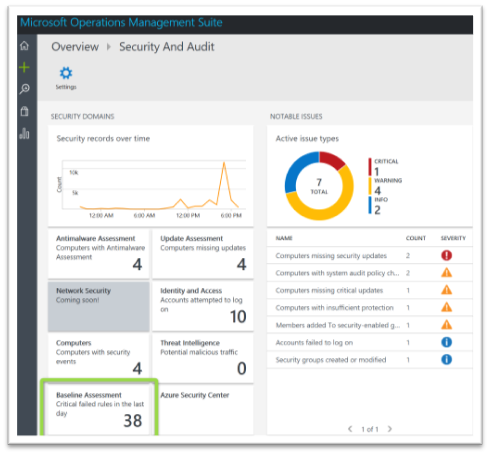
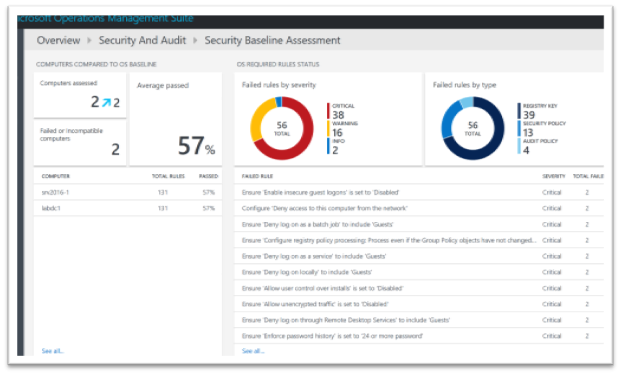
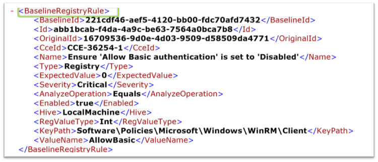
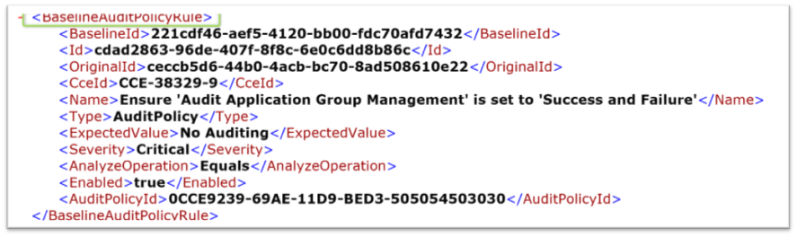
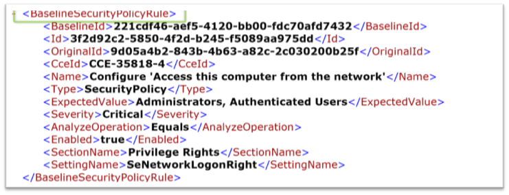
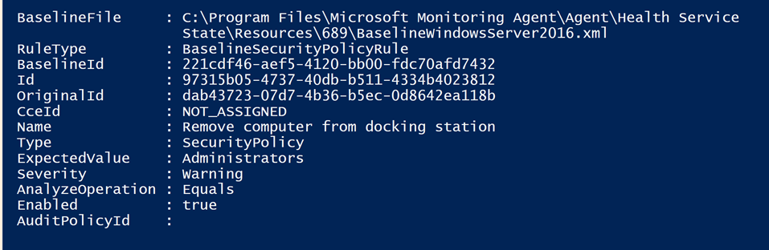
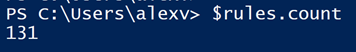
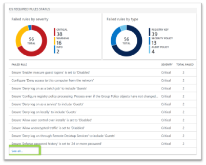
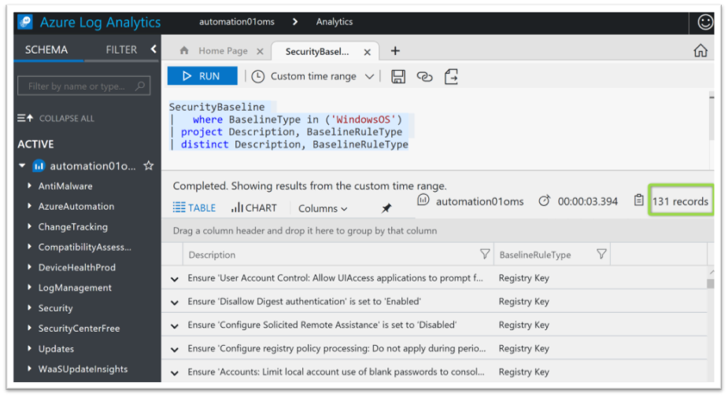
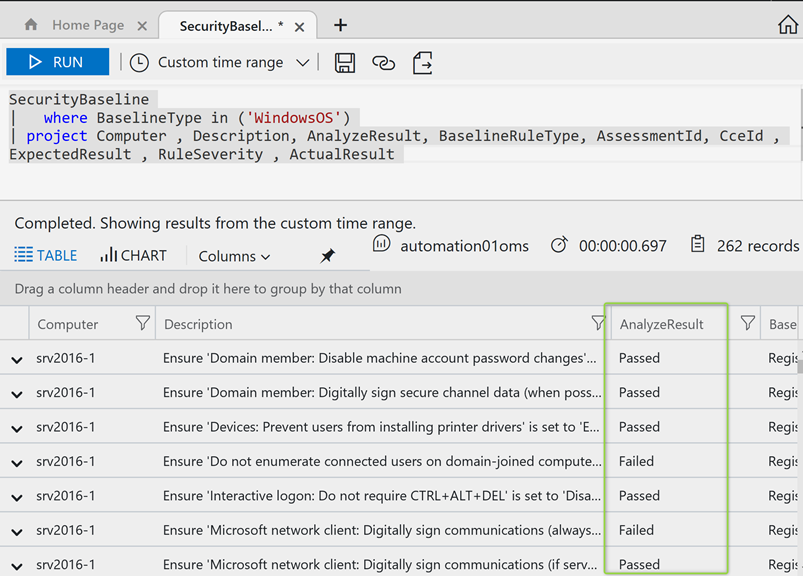

The Microsoft Operations and Management Suite, Security and Audit Solution includes a Baseline Assessment component. The Baseline configuration definition includes a set of Registry, audit policy and security policy settings rules that are recommended to configure to achieve a secure operating environment.





Within the Console we get an overview of "Rules" that have failed, because the servers don't have the recommended configuration applied. While looking at this, I wondered where I can find the complete set of rules that are used when performing the baseline assessment.

Since I'm a bit familiar with how things work between Azure OMS and the OMS Agent, I started searching within the OMS Agent installation folder, where found the following files.

 	
- "C:\Program Files\Microsoft Monitoring Agent\Agent\Health Service State\Management Packs\Microsoft.IntelligencePacks.SecurityBaselineCommon.674.xml"

 	
- "C:\Program Files\Microsoft Monitoring Agent\Agent\Health Service State\Management Packs\Microsoft.IntelligencePacks.SecurityBaselineDirectAgent.620.xml"

 	
- "C:\Program Files\Microsoft Monitoring Agent\Agent\Health Service State\Management Packs\Microsoft.IntelligencePacks.SecurityBaselineDirectAgent.Configuration.644.xml"

 	
- "C:\Program Files\Microsoft Monitoring Agent\Agent\Health Service State\Resources\683\WebBaselineRules.xml"

 	
- "C:\Program Files\Microsoft Monitoring Agent\Agent\Health Service State\Resources\685\BaselineWindowsServer2008R2.xml"

 	
- "C:\Program Files\Microsoft Monitoring Agent\Agent\Health Service State\Resources\686\BaselineWindowsServer2008.xml"

 	
- "C:\Program Files\Microsoft Monitoring Agent\Agent\Health Service State\Resources\687\BaselineWindowsServer2012.xml"

 	
- "C:\Program Files\Microsoft Monitoring Agent\Agent\Health Service State\Resources\688\BaselineWindowsServer2012R2.xml"

 	
- "C:\Program Files\Microsoft Monitoring Agent\Agent\Health Service State\Resources\689\BaselineWindowsServer2016.xml"

As mentioned previously, there are three types of rules:

 	
- Registry rules: check that registry keys are set correctly.
 	
- Audit policy rules: rules regarding your audit policy.
 	
- Security policy rules: rules regarding the user's permissions on the machine.

The existing Audit Policy and Security Policy settings are collected using the following scripts:

 	
- "C:\Program Files\Microsoft Monitoring Agent\Agent\Health Service State\Resources\690\SecurityPolicyScript.ps1"

 	
- "C:\Program Files\Microsoft Monitoring Agent\Agent\Health Service State\Resources\691\AuditPolicyScript.ps1"

When Looking inside one of the server baseline definition files "BaselineWindowsServer2016.xml" we get a better understanding of how things are being processed. The XML file contains Rules for Registry, Audit Policy and Security Policy settings.







Now that we understand the structure of the XML file, we can use PowerShell to extract the content and create a list of the Baseline Rules. I created a cmdlet to parse the baseline configuration files. [**Get-OMSOSBaselineDefinitions**](https://github.com/alexverboon/posh/blob/master/Azure/OMS/Get-OMSOSBaselineDefinitions.ps1).

```powershell
$Rules = Get-OMSOSBaselineDefinitions -Baseline 'C:\Program Files\Microsoft Monitoring Agent\Agent\Health Service State\Resources\689\BaselineWindowsServer2016.xml' -verbose
```



Now run the following command to get a list of all the Rules included in the Server 2016 baseline.

```
$rules | select Name
```

 	
- Ensure 'Accounts: Limit local account use of blank passwords to console logon only' is set to 'Enabled'
 	
- Ensure 'Allow Basic authentication' is set to 'Disabled'
 	
- Ensure 'Allow indexing of encrypted files' is set to 'Disabled'
 	
- Ensure 'Allow Input Personalization' is set to 'Disabled'
 	
- Ensure 'Allow Telemetry' is set to 'Enabled: 0 - Security [Enterprise Only]'
 	
- Ensure 'Allow unencrypted traffic' is set to 'Disabled'
 	
- Ensure 'Allow user control over installs' is set to 'Disabled'
 	
- Ensure 'Always install with elevated privileges' is set to 'Disabled'
 	
- Ensure 'Audit: Shut down system immediately if unable to log security audits' is set to 'Disabled'
 	
- Ensure 'Configure Offer Remote Assistance' is set to 'Disabled'
 	
- Ensure 'Configure registry policy processing: Do not apply during periodic background processing' is...
 	
- Ensure 'Configure registry policy processing: Process even if the Group Policy objects have not chan...
 	
- Ensure 'Configure Solicited Remote Assistance' is set to 'Disabled'
 	
- Ensure 'Continue experiences on this device' is set to 'Disabled'
 	
- Ensure 'Devices: Prevent users from installing printer drivers' is set to 'Enabled'
 	
- Ensure 'Disallow Digest authentication' is set to 'Enabled'
 	
- Ensure 'Do not enumerate connected users on domain-joined computers' is set to 'Enabled'
 	
- Ensure 'Domain member: Digitally encrypt or sign secure channel data ' is set to 'Enabled'
 	
- Ensure 'Domain member: Digitally encrypt secure channel data ' is set to 'Enabled'
 	
- Ensure 'Domain member: Digitally sign secure channel data (when possible)' is set to 'Enabled'
 	
- Ensure 'Domain member: Disable machine account password changes' is set to 'Disabled'
 	
- Ensure 'Domain member: Maximum machine account password age' is set to '30 or fewer days, but not 0'
 	
- Ensure 'Domain member: Require strong session key' is set to 'Enabled'
 	
- Ensure 'Enable insecure guest logons' is set to 'Disabled'
 	
- Ensure 'Enumerate administrator accounts on elevation' is set to 'Disabled'
 	
- Ensure 'Enumerate local users on domain-joined computers' is set to 'Disabled'
 	
- Ensure 'Interactive logon: Do not display last user name' is set to 'Enabled'
 	
- Ensure 'Interactive logon: Do not require CTRL+ALT+DEL' is set to 'Disabled'
 	
- Ensure 'Microsoft network client: Digitally sign communications (always)' is set to 'Enabled'
 	
- Ensure 'Microsoft network client: Digitally sign communications (if server agrees)' is set to 'Enabled'
 	
- Ensure 'Microsoft network client: Send unencrypted password to third-party SMB servers' is set to 'D...
 	
- Ensure 'Microsoft network server: Amount of idle time required before suspending session' is set to ...
 	
- Ensure 'Microsoft network server: Digitally sign communications (always)' is set to 'Enabled'
 	
- Ensure 'Microsoft network server: Digitally sign communications (if client agrees)' is set to 'Enabled'
 	
- Ensure 'Microsoft network server: Disconnect clients when logon hours expire' is set to 'Enabled'
 	
- Ensure 'Network access: Do not allow anonymous enumeration of SAM accounts and shares' is set to 'En...
 	
- Ensure 'Network access: Do not allow anonymous enumeration of SAM accounts' is set to 'Enabled'
 	
- Ensure 'Network access: Let Everyone permissions apply to anonymous users' is set to 'Disabled'
 	
- Ensure 'Network access: Restrict anonymous access to Named Pipes and Shares' is set to 'Enabled'
 	
- Ensure 'Network access: Sharing and security model for local accounts' is set to 'Classic - local us...
 	
- Ensure 'Network security: Allow LocalSystem NULL session fallback' is set to 'Disabled'
 	
- Ensure 'Network Security: Allow PKU2U authentication requests to this computer to use online identit...
 	
- Ensure 'Network security: Do not store LAN Manager hash value on next password change' is set to 'En...
 	
- Ensure 'Network security: LDAP client signing requirements' is set to 'Negotiate signing' or higher
 	
- Ensure 'Network security: Minimum session security for NTLM SSP based clients' is set to 'Require N...
 	
- Ensure 'Network security: Minimum session security for NTLM SSP based servers' is set to 'Require N...
 	
- Ensure 'Prohibit installation and configuration of Network Bridge on your DNS domain network' is set...
 	
- Ensure 'Prohibit use of Internet Connection Sharing on your DNS domain network' is set to 'Enabled'
 	
- Ensure 'Shutdown: Allow system to be shut down without having to log on' is set to 'Disabled'
 	
- Ensure 'Sign-in last interactive user automatically after a system-initiated restart' is set to 'Dis...
 	
- Ensure 'System objects: Require case insensitivity for non-Windows subsystems' is set to 'Enabled'
 	
- Ensure 'System objects: Strengthen default permissions of internal system objects ' is set to 'Enabled'
 	
- Ensure 'Turn off Data Execution Prevention for Explorer' is set to 'Disabled'
 	
- Ensure 'Turn off heap termination on corruption' is set to 'Disabled'
 	
- Ensure 'Turn off shell protocol protected mode' is set to 'Disabled'
 	
- Ensure 'Turn on convenience PIN sign-in' is set to 'Disabled'
 	
- Ensure 'User Account Control: Admin Approval Mode for the Built-in Administrator account' is set to ...
 	
- Ensure 'User Account Control: Allow UIAccess applications to prompt for elevation without using the ...
 	
- Ensure 'User Account Control: Behavior of the elevation prompt for administrators in Admin Approval ...
 	
- Ensure 'User Account Control: Behavior of the elevation prompt for standard users' is set to 'Automa...
 	
- Ensure 'User Account Control: Detect application installations and prompt for elevation' is set to '...
 	
- Ensure 'User Account Control: Only elevate UIAccess applications that are installed in secure locati...
 	
- Ensure 'User Account Control: Run all administrators in Admin Approval Mode' is set to 'Enabled'
 	
- Ensure 'User Account Control: Switch to the secure desktop when prompting for elevation' is set to '...
 	
- Ensure 'User Account Control: Virtualize file and registry write failures to per-user locations' is ...
 	
- Disable 'Configure local setting override for reporting to Microsoft MAPS'
 	
- Disable SMB v1 client
 	
- Disable SMB v1 server
 	
- Disable Windows Search Service
 	
- Enable 'Scan removable drives' by setting DisableRemovableDriveScanning to 0
 	
- Enable 'Turn on behavior monitoring'
 	
- Enable Windows Error Reporting
 	
- Recovery console: Allow floppy copy and access to all drives and all folders
 	
- Shutdown: Clear virtual memory pagefile
 	
- Ensure 'Audit Application Group Management' is set to 'Success and Failure'
 	
- Ensure 'Audit Computer Account Management' is set to 'Success'
 	
- Ensure 'Audit Credential Validation' is set to 'Success and Failure'
 	
- Ensure 'Audit Distribution Group Management' is set to 'No Auditing'
 	
- Ensure 'Audit Logoff' is set to 'Success'
 	
- Ensure 'Audit Logon' is set to 'Success and Failure'
 	
- Ensure 'Audit Other Account Management Events' is set to 'Success and Failure'
 	
- Ensure 'Audit PNP Activity' is set to 'Success'
 	
- Ensure 'Audit Process Creation' is set to 'Success'
 	
- Ensure 'Audit Removable Storage' is set to 'Success and Failure'
 	
- Ensure 'Audit Security Group Management' is set to 'Success'
 	
- Ensure 'Audit Special Logon' is set to 'Success'
 	
- Ensure 'Audit User Account Management' is set to 'Success and Failure'
 	
- Audit Non Sensitive Privilege Use
 	
- Configure 'Access this computer from the network'
 	
- Configure 'Allow log on through Remote Desktop Services'
 	
- Configure 'Create symbolic links'
 	
- Configure 'Deny access to this computer from the network'
 	
- Configure 'Enable computer and user accounts to be trusted for delegation'
 	
- Configure 'Manage auditing and security log'
 	
- Ensure 'Access Credential Manager as a trusted caller' is set to 'No One'
 	
- Ensure 'Accounts: Guest account status' is set to 'Disabled'
 	
- Ensure 'Act as part of the operating system' is set to 'No One'
 	
- Ensure 'Back up files and directories' is set to 'Administrators,Backup Operators'
 	
- Ensure 'Change the system time' is set to 'Administrators, LOCAL SERVICE'
 	
- Ensure 'Change the time zone' is set to 'Administrators, LOCAL SERVICE'
 	
- Ensure 'Create a pagefile' is set to 'Administrators'
 	
- Ensure 'Create a token object' is set to 'No One'
 	
- Ensure 'Create global objects' is set to 'Administrators, LOCAL SERVICE, NETWORK SERVICE, SERVICE'
 	
- Ensure 'Create permanent shared objects' is set to 'No One'
 	
- Ensure 'Deny log on as a batch job' to include 'Guests'
 	
- Ensure 'Deny log on as a service' to include 'Guests'
 	
- Ensure 'Deny log on locally' to include 'Guests'
 	
- Ensure 'Deny log on through Remote Desktop Services' to include 'Guests'
 	
- Ensure 'Enforce password history' is set to '24 or more password'
 	
- Ensure 'Force shutdown from a remote system' is set to 'Administrators'
 	
- Ensure 'Generate security audits' is set to 'LOCAL SERVICE, NETWORK SERVICE'
 	
- Ensure 'Increase scheduling priority' is set to 'Administrators'
 	
- Ensure 'Load and unload device drivers' is set to 'Administrators'
 	
- Ensure 'Lock pages in memory' is set to 'No One'
 	
- Ensure 'Maximum password age' is set to '70 or fewer days, but not 0'
 	
- Ensure 'Minimum password age' is set to '1 or more day'
 	
- Ensure 'Minimum password length' is set to '14 or more character'
 	
- Ensure 'Modify an object label' is set to 'No One'
 	
- Ensure 'Modify firmware environment values' is set to 'Administrators'
 	
- Ensure 'Password must meet complexity requirements' is set to 'Enabled'
 	
- Ensure 'Perform volume maintenance tasks' is set to 'Administrators'
 	
- Ensure 'Profile single process' is set to 'Administrators'
 	
- Ensure 'Profile system performance' is set to 'Administrators, NT SERVICE\WdiServiceHost'
 	
- Ensure 'Replace a process level token' is set to 'LOCAL SERVICE, NETWORK SERVICE'
 	
- Ensure 'Restore files and directories' is set to 'Administrators, Backup Operators'
 	
- Ensure 'Shut down the system' is set to 'Administrators'
 	
- Ensure 'Store passwords using reversible encryption' is set to 'Disabled'
 	
- Ensure 'Take ownership of files or other objects' is set to 'Administrators'
 	
- Bypass traverse checking
 	
- Increase a process working set
 	
- Remove computer from docking station

For later reference, let's count the total number of rules. It's 131.



Now that we have looked at how things work on the client, let's take a look at the Azure Log Analytics portal. Just select "See all" to get into the log Analytics query mode.



When we run the following query, we also get all the available Baseline Rules that were performed against the Windows Server 2016 systems.

```
SecurityBaseline| where BaselineType in ('WindowsOS')| project Description, BaselineRuleType| distinct Description, BaselineRuleType
```

 



Note the total number of rules returned is 131 which is the same as we had found previously.

When running the following query , we get a complete list of all the rules and the results from the Assessment.

```
SecurityBaseline| where BaselineType in ('WindowsOS')| project Computer , Description, AnalyzeResult, BaselineRuleType, AssessmentId, CceId , ExpectedResult , RuleSeverity , ActualResult
```


Conclusion, on the client side, we have a detailed view on what is actually being assessed, whereas in Azure Log Analytics we see the effective assessment results.

I hope you enjoyed this blog post.

Alex

**Cmdlet**: [Get-OMSOSBaselineDefinitions](https://github.com/alexverboon/posh/blob/master/Azure/OMS/Get-OMSOSBaselineDefinitions.ps1)

```powershell
Function Get-OMSOSBaselineDefinitions {
<#
.SYNOPSIS
    Get-OMSOSBaselineDefinitions
.DESCRIPTION
    Get-OMSOSBaselineDefinitions lists Configuration data from the selected
    OMS Security configuration baseline definition file. 

    These files are stored wihtin subfolders under: 
    "C:\Program Files\Microsoft Monitoring Agent\Agent\Health Service State\Resources"

.PARAMETER Baseline
    The filename of the OMS Security Configuration Baseline 

.EXAMPLE
    Get-OMSOSBaselineDefinitions -Baseline 'C:\Program Files\Microsoft Monitoring Agent\Agent\Health Service State\Resources\689\BaselineWindowsServer2016.xml'

    The above command lists all the Security Configuration Baseline definitions for
    the Windows Server 2016 operating system. 

.NOTES
    v1.0, 19.02.2018, alex verboon
#>
[CmdletBinding()]
Param(
 )

 DynamicParam {
        
            # Set the dynamic parameters' name
            $ParameterName = 'Baseline'
            # Create the dictionary 
            $RuntimeParameterDictionary = New-Object System.Management.Automation.RuntimeDefinedParameterDictionary
            # Create the collection of attributes
            $AttributeCollection = New-Object System.Collections.ObjectModel.Collection[System.Attribute]
            # Create and set the parameters' attributes
            $ParameterAttribute = New-Object System.Management.Automation.ParameterAttribute
            $ParameterAttribute.Mandatory = $true
            #$ParameterAttribute.Position = 3
            # Add the attributes to the attributes collection
            $AttributeCollection.Add($ParameterAttribute)
            # Generate and set the ValidateSet 
            $BaseLinePath = "C:\Program Files\Microsoft Monitoring Agent\Agent\Health Service State\Resources"
            $arrSet = Get-ChildItem -Path "$BaseLinePath\*BaseLine*.xml" -Recurse -Depth 2
            #$arrSet = Get-ChildItem -Path "$CISCATPath\CIS-CAT-FULL\Benchmarks" -Filter "*.xml"
            $ValidateSetAttribute = New-Object System.Management.Automation.ValidateSetAttribute($arrSet)

            # Add the ValidateSet to the attributes collection
            $AttributeCollection.Add($ValidateSetAttribute)

            # Create and return the dynamic parameter
            $RuntimeParameter = New-Object System.Management.Automation.RuntimeDefinedParameter($ParameterName, [string], $AttributeCollection)
            $RuntimeParameterDictionary.Add($ParameterName, $RuntimeParameter)
            return $RuntimeParameterDictionary
        }

Begin{
  Write-verbose "Selected Baseline: $($PSBoundParameters["Baseline"])"
}

Process{
    $Result = @()
    $Rules = @("BaselineRegistryRule","BaselineAuditPolicyRule","BaselineSecurityPolicyRule")
    ForEach ($RuleType in $Rules)
    {
                write-verbose "Processing Rule: $RuleType"
                $blfile = "$($PSBoundParameters["Baseline"])"

                write-host "$($blfile.name)"
                If (-not ($blfile.name -eq "WebBaseLineRules.xml"))
                {
                    $Baselines = Select-xml -Path $blfile -XPath "//$RuleType"
                }
                Elseif ($blfile.Name -eq "WebBaseLineRules.xml")
                {
                    $Baselines = Select-xml -Path $blfile -XPath "//WebBaselineRule"
                    $RuleType = "WebBaselineRule"
                }

                ForEach ($BRule in $baselines.node)
                {
                    $object = [ordered] @{
                    BaselineFile = $blfile
                    RuleType = $RuleType
                    BaselineId  = $BRule.BaselineId     
                    Id = $BRule.Id         
                    OriginalId = $BRule.OriginalId   
                    CceId = $BRule.CceId
                    Name = $BRule.Name
                    Type = $BRule.Type
                    ExpectedValue = $BRule.ExpectedValue
                    Severity = $BRule.Severity
                    AnalyzeOperation = $BRule.AnalyzeOperation
                    Enabled = $BRule.Enabled
                    AuditPolicyId = $BRule.AuditPolicyId
                    }
                    $Result += (New-Object -TypeName PSOBJECT -Property $object)
                }
    }
}

End{
    $Result
}
}

```