The Office 365 solution in Operations Management Suite (OMS) allows you to monitor your Office 365 environment in Log Analytics. Like with any solution that you setup in OMS you have to think of the data retention time.

At present the maximum retention time can be set to two years, but this of course will affect your Azure billing. In today's blog post I walk you through a possible solution how to backup just a subset of data into a custom log. The idea is that you can keep the retention period for the large amount of data low and only keep the data that is important for you for a longer period. The solution uses [Azure Log Analytics](https://docs.microsoft.com/en-us/azure/log-analytics/) and [Azure Logic App Services](https://docs.microsoft.com/en-us/azure/logic-apps/logic-apps-overview).

The Logic App will do the following:

 	
- Start the workflow every day at 00:10 AM
 	
- Run a query in log analytics using the office 365 log data , collect Username, IP Address and Event time from the previous day.
 	
- Parses the query result into JSON
 	
- Sends the data to a custom log in Log Analytics.

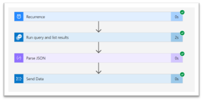

First setup an OMS Workspace and then add and configure the Office 365 solution. Detailed instructions can be found here: [https://docs.microsoft.com/en-us/azure/operations-management-suite/oms-solution-office-365](https://docs.microsoft.com/en-us/azure/operations-management-suite/oms-solution-office-365)

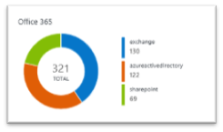

Note that it can take up to a day until you will see data coming in.

Next create an Azure Logic App and wait for the deployment to complete.

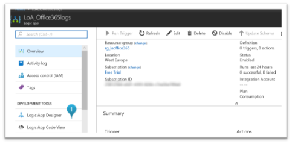

Select "**Logic App Designer**" and select "**Blank Logic App**"

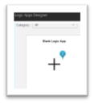

The first step of the workflow is the Schedule.

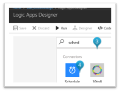

I have defined the Schedule as shown below.

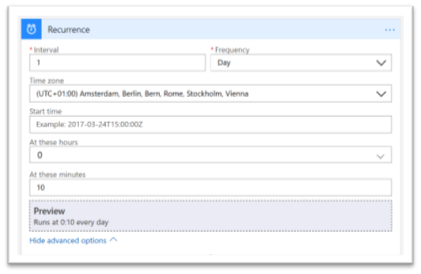

Then add the next step and select "**Add an action**"

We will now define the send step of the workflow which consists of running a query in log analytics.

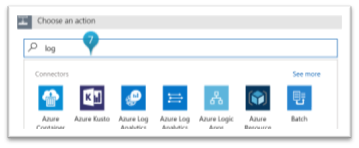

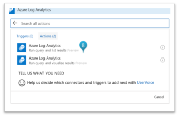

Sign-in to log analytics to create a connection.

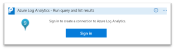

Once connected, select the Subscription, Resource Group and workspace name and finally enter the query.

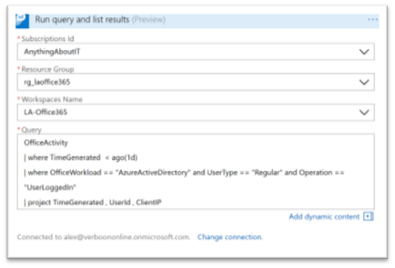

Now press **Save** and then **Run** the workflow. If all goes well, you get the following result.

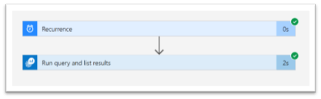

Expand the Run Query and list results and then select "**Show raw outputs**"

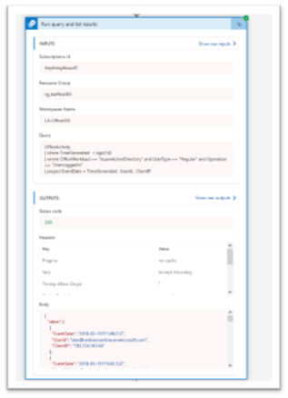

Mark all the "Body" content of the raw content and copy it into a notepad file, we'll use it later.

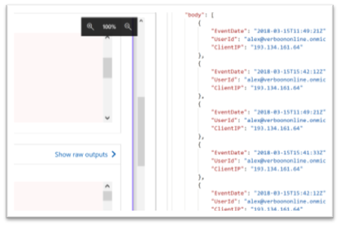

Go back to "**Design**" mode to continue editing the workflow.

Then add the next step and select "**Add an action**"

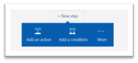

Add "**Data Operations – Parse JSON**"

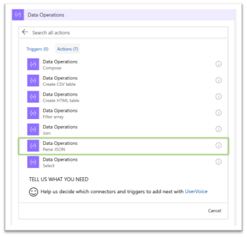

Within the "Content" field add "**value**", which is the output from the run query step.

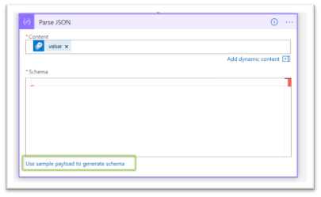

Next select "**use sample payload to generate schema**" and now copy past the raw output that you have saved previously.

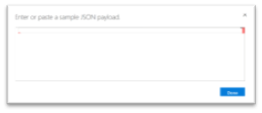

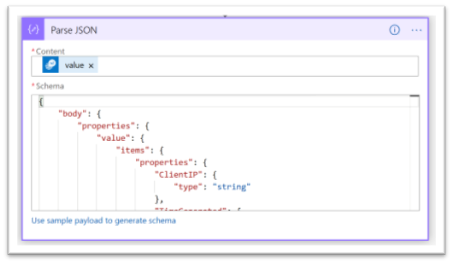

**Save** the logic App again and **Run** it. If all went well you'll get the following result.

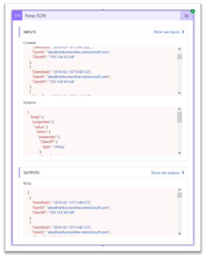

Go back into edit mode and add the final step of the workflow.

Select "**Azure log analytics data collector – send data**"

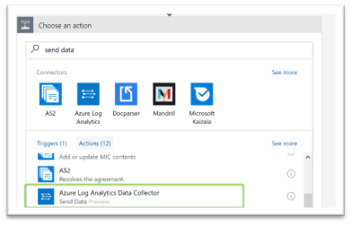

Enter a connection name, the Workspace ID and Workspace key. If you want to use different retention periods for the Office 365 solution and the custom log, use a separate Log Analytics workspace.

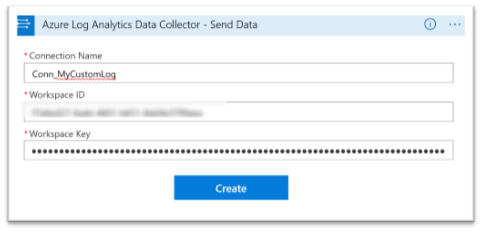

Select "**Body**" which is the output from the previous Parse Jason step.

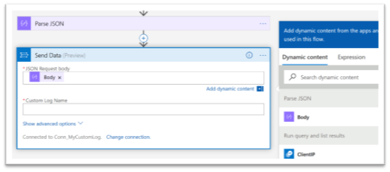

Next enter the Custom Log name and enter "**time**" in the time-generated field.

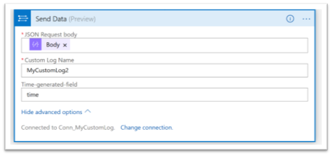

**Save** the workflow and **Run** it.

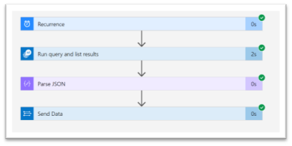

Now let's head over to the Azure Log Analytics portal and see if our data is coming in. Be patient, this can take a few minutes.

**Tip**: Consider opening a new browser session "after" you ran the workflow, I've noticed some issues with query tab completion.

And there we go, the data arrived in my custom log "MyCustomLog2_CL".

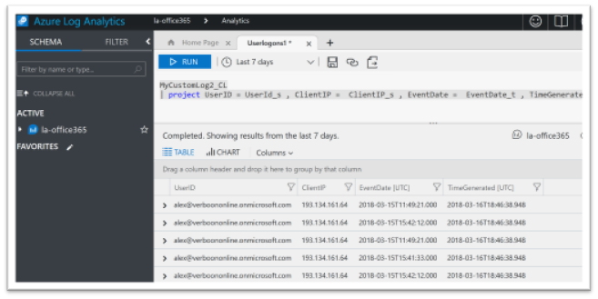

Hope you enjoyed this blog post, as always feedback is welcome.

Cheers

Alex

