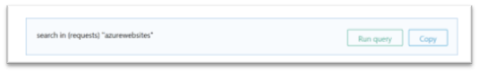
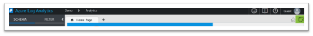
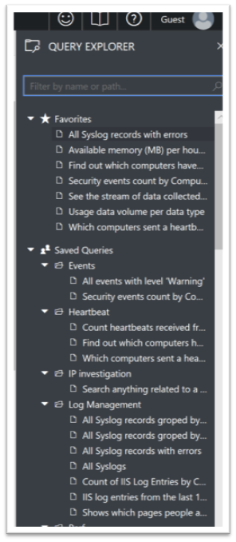
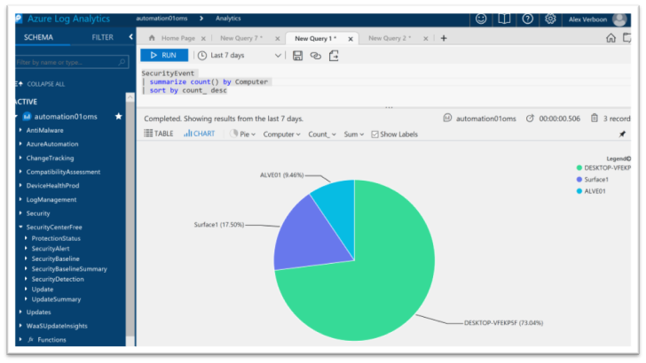

If you're interested in getting your hands dirty with Azure Log Analytics, here's a few resources and tips on how to get started.

**The Video's
**

If you're looking for some imagination of what Azure Log Analytics is all about and what you can do with it, here's a couple of videos I recommend watching.

 	
- Azure Log Analytics (13 minutes)
[https://channel9.msdn.com/Shows/Azure-Friday/Azure-Log-Analytics?ocid=player](https://channel9.msdn.com/Shows/Azure-Friday/Azure-Log-Analytics?ocid=player)
 	
- What's changed in Azure Log Analytics? (5 minutes)
[https://channel9.msdn.com/Blogs/Azure/Whats-changed-in-Azure-Log-Analytics](https://channel9.msdn.com/Blogs/Azure/Whats-changed-in-Azure-Log-Analytics)
 	
- The improved Azure Log Analytics: A powerful query language with machine learning, and more (1 hour)
[https://channel9.msdn.com/Events/Ignite/Microsoft-Ignite-Orlando-2017/BRK3269](https://channel9.msdn.com/Events/Ignite/Microsoft-Ignite-Orlando-2017/BRK3269)

**The Documentation
**

You can of course just go and try things out, but I strongly recommend to read through the documentation, there's lots of useful information in there, furthermore it will most likely also provide you with some ideas how to do things differently.

 	
- Log Analytics Documentation
[https://docs.microsoft.com/en-us/azure/log-analytics/](https://docs.microsoft.com/en-us/azure/log-analytics/)
 	
- Azure Log Analytics Query Language
[https://docs.loganalytics.io/index](https://docs.loganalytics.io/index)
 	
- GitHub – Log Analytics Examples
[https://github.com/MicrosoftDocs/LogAnalyticsExamples](https://github.com/MicrosoftDocs/LogAnalyticsExamples)
 	
- 
OMS Solutions Overview
[https://docs.microsoft.com/en-us/azure/log-analytics/log-analytics-add-solutions#offers-and-pricing-tiers](https://docs.microsoft.com/en-us/azure/log-analytics/log-analytics-add-solutions#offers-and-pricing-tiers)

**Community
**

 	
- You can interact with others using Log Analytics through the Microsoft Tech Community.
[https://techcommunity.microsoft.com/t5/Azure-Log-Analytics/bd-p/AzureLogAnalytics](https://techcommunity.microsoft.com/t5/Azure-Log-Analytics/bd-p/AzureLogAnalytics)

If you're totally new to Log Analytics, I recommend to first watch the videos. Next go to the Log Analytics Query language site and begin with the [Getting Started](https://docs.loganalytics.io/docs/Learn/Getting-Started/Getting-started-with-the-Analytics-portal) tutorial.

What I find especially cool about this tutorial is that you can learn with real data. Microsoft provides access to a demo environment where you can try out all the query statements that then are processed against real data. You can access these workspaces directly using one of the below links.

 	
- Demo Workspace for Application Insights
[https://aka.ms/AzureMonitorLogsDemo/ApplicationInsights](https://analytics.applicationinsights.io/demo#/discover/home)
 	
- Demo Workspace with data from various Solutions such as Security and Audit, Update Management, Upgrade Analytics, Configuration Change, WireData, Performance and many more.
[https://aka.ms/AzureMonitorLogsDemo/LogAnalytics](https://portal.loganalytics.io/demo#/discover/home)

**Update**! November 2020: Ido from the Microsoft Azure Log Analytics team contacted me and told me that the previous demo portals are about to be retired, therefore I have updated the links above. (thanks Ido to bring this up)

Or while going through the tutorial, when selecting "Run Query".

Furthermore, I recommend to take a look at the query explorer, where you find a lot of example queries for the various solutions. If you have your own workspace, you can copy paste the queries from the demo environment and run them against your own data.

As an example, here are the security events from my devices I run at home.

As always, I hope you enjoyed reading, and hopefully this provided you with some ideas on how to get started with learning about Azure Log Analytics.

