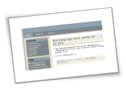
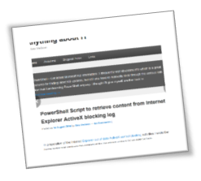
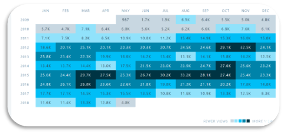

On the 10th of May 2008, I wrote my first blog post here "[Growing WIM files](https://www.verboon.info/2008/05/growing-wim-files/)". I recently read through the archive and thought of all those moments where sometimes I spend just a few minutes, hours and sometimes even days preparing for a new blog post.

By writing this blog I learned a lot about various tools, products and scripting and hope that now and then, one or the other blog post has helped someone else to solve a problem or expand their knowledge. Looking back at the very first blog layout it feels like wen watching movies from the 80's, how on earth could I have chosen such a blog layout?

I am proud to see that over the years; the numbers of visitors have increased. Now getting hits on your blog is one thing, what actually makes me prouder is that in real life, people now and then approach me, telling me they had found my blog and found something useful there.

I am not sure whether my blog started collecting stats from day one, but here are some numbers I found in the WordPress stats overview.

I would herewith also like to especially thank my friend Stevan Bajic who is taking care of hosting my blog throughout all these years. And then of course I would like to thank **YOU** who reads my blog.

Let's see if this blog turns 20.

Greetings

Alex

