Azure Active Directory provides a simple process that provides users with a single sign-on (SSO) experience for accessing cloud-based applications using their AzureAD identity. This is a great capability as it removes the need for users to manage multiple identities while enterprises keep visibility and if needed control over which applications are used by their employees.

By default, all users within Azure Active Directory have the rights to register an application and users can allow consent to apps accessing company data on their behalf.

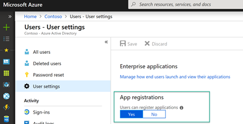

If this option is set to yes, then non-admin users may register custom-developed applications for use within this directory.

If this option is set to no, then only users with an administrator role may register these types of applications.

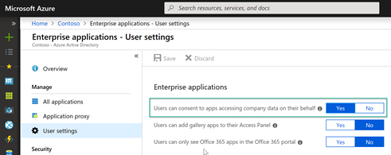

If this option is set to yes, then users may consent to allow third-party multi-tenant applications to access their user profile data in your directory. This also means that the users will see these apps on their access panels.

If this option is set to no, then admins must consent to these applications before users may use them.

Let's look at how this works and what happens within Azure Active Directory. For demonstration purposes I am going to use the Windows Defender Test Ground site that has a number of options that require the user to sign-in.

[https://demo.wd.microsoft.com/](https://demo.wd.microsoft.com/)

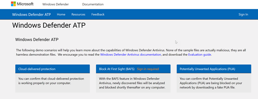

Once the user has successfully signed in with their company Azure AD credentials, a consent page is displayed where the user is requested to accept granting permissions to the application.

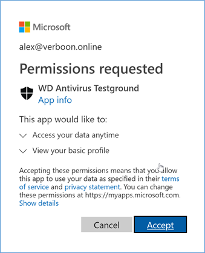

Now let's look what happened in Azure Active Directory. Within the Azure Management portal, Azure Active Directory, Enterprise Applications we see the new Application.

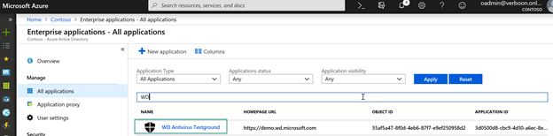

When we open the Application, we see that there is one registered user.

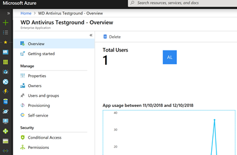

Selecting the Permissions tab, provides us with a detailed overview of the granted permissions.

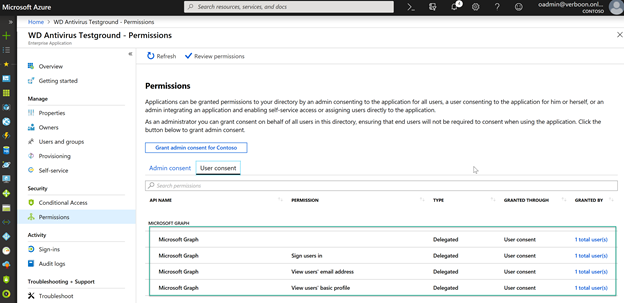

And more details in the audit log.

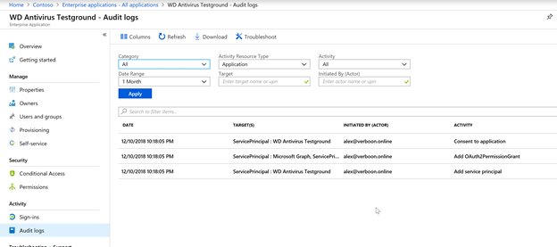

Now I can hear some of you thinking that this looks like something that's not secure and users should not be allowed to register applications themselves as the application might require too much permissions. In that case an admin would disable the ability for users to register apps, however this might add additional workload for admins, and there is also a risk that users might decide to simply use other credentials, not visible to the company, to gain access. The "How and why applications are added to Azure AD" article provides a complete overview of how this all works, but I'd like to highlight some considerations that are described in this article – "[Who has permission to add applications to my Azure AD instance?](https://docs.microsoft.com/en-us/azure/active-directory/develop/active-directory-how-applications-are-added)"

 	
- Applications have been able to leverage Windows Server Active Directory for user authentication for many years without requiring the application to be registered or recorded in the directory. Now the organization will have improved visibility to exactly how many applications are using the directory and for what purpose.
 	
- Delegating these responsibilities to users negates the need for an admin-driven application registration and publishing process.
 	
- Users signing in to applications using their organization accounts for business purposes is a good thing. If they subsequently leave the organization, they will automatically lose access to their account in the application they were using.
 	
- Having a record of what data was shared with which application is a good thing. Data is more transportable than ever and it's useful to have a clear record of who shared what data with which applications.

Okay I see, some of you are still not convinced. Now let's bring in Microsoft Cloud App Security. Within the Cloud App Security portal, we have an overview of OAuth applications being used.

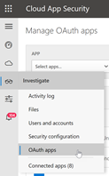

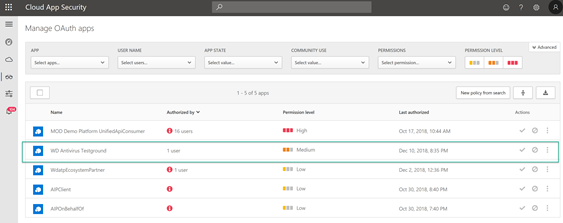

As shown in the screenshot we see that the permission level is set to medium. Cloud App Security automatically assigns a permission level of Low, Medium or High severity depending on the app permissions being granted. All good, but who has the time to constantly go to the portal and check for new apps? No one of course, hence we need an automated process that alerts us when a new application is being discovered and if needed revoke access to tit.

Cloud App Security has a feature called "**Automatic detection and revocation of risky OAuth App permissions**". Let's say that we want to be alerted when there is a new OAuth app being detected that has low/medium permission level.

Within the Cloud App Security Portal, we create a new "OAuth app policy"

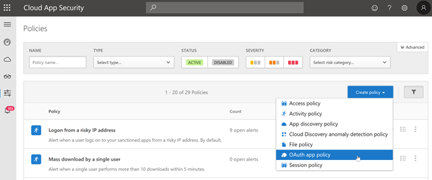

We provide a name, description and define the filters.

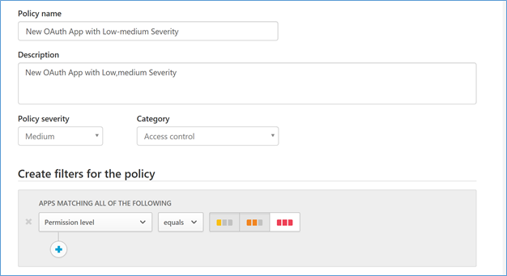

We then define the Alert settings, i.e. send out an e-mail And if we wanted to we could also apply governance that revokes access to the app.

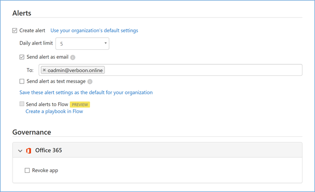

Shortly after the user registered the application, the defined users receive the alert e-mail.

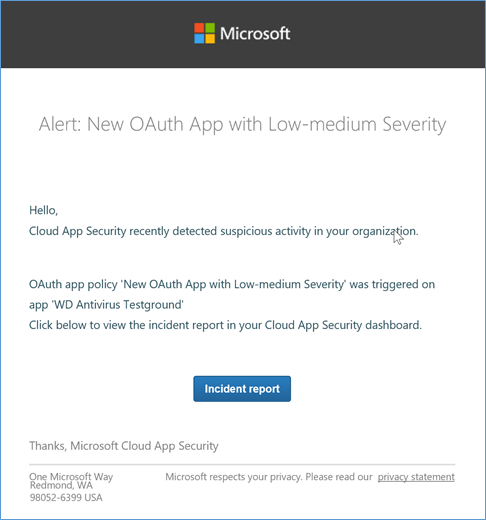

Within the Cloud App Security Console, an alert is created.

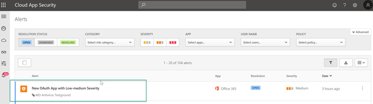

When opening the alert, we get more details.

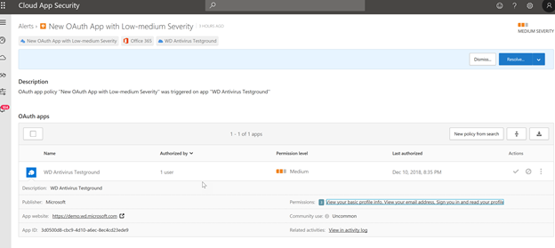

We can review the granted permissions and see which users are using the application.

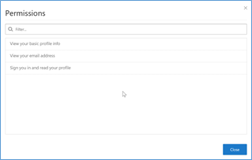

In this example, we did not configure the Policy to automatically apply a governance action, however if after our review we feel that users should not have access to the application, it can be banned manually.

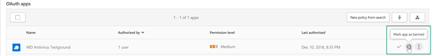

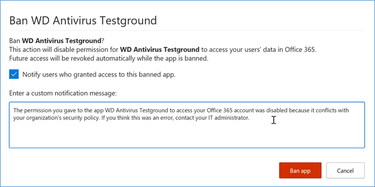

Behind the scenes, Cloud App Security simply disables the Application.

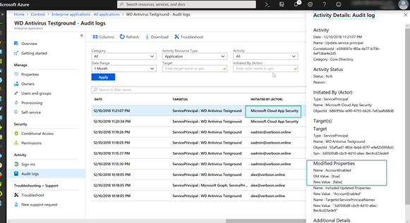

Once the application is banned, the user that registered the application will receive an e-mail and users will no longer have access to the application.

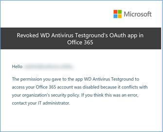

The nest time a user attempts to sign-in, they see this.

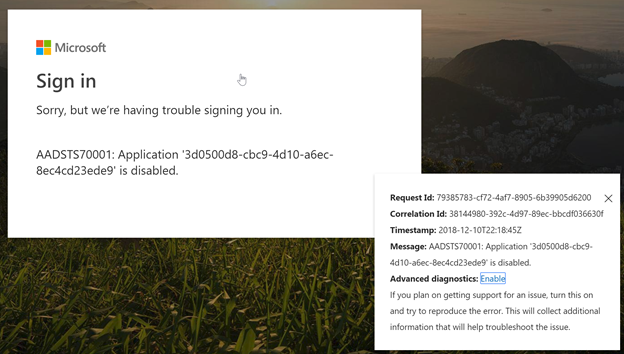

That's it for today, I hoped you enjoyed this blog post and hopefully this helps you to find the right balance between enabling user productivity without lowering security.

Additional References:

 	
- [https://docs.microsoft.com/en-us/cloud-app-security/manage-app-permissions](https://docs.microsoft.com/en-us/cloud-app-security/manage-app-permissions)
 	
- [https://docs.microsoft.com/en-us/azure/active-directory/develop/active-directory-how-applications-are-added](https://docs.microsoft.com/en-us/azure/active-directory/develop/active-directory-how-applications-are-added)
 	
- [https://docs.microsoft.com/en-us/office365/securitycompliance/detect-and-remediate-illicit-consent-grants](https://docs.microsoft.com/en-us/office365/securitycompliance/detect-and-remediate-illicit-consent-grants)
 	
- [https://docs.microsoft.com/en-us/azure/active-directory/develop/consent-framework](https://docs.microsoft.com/en-us/azure/active-directory/develop/consent-framework)

