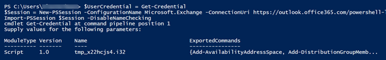
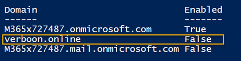
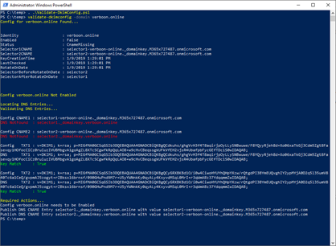
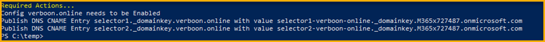
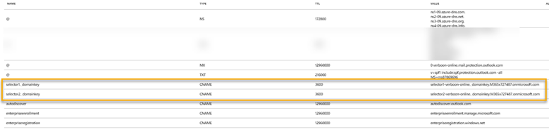
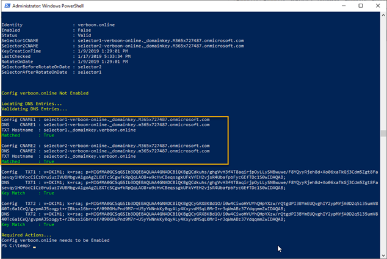
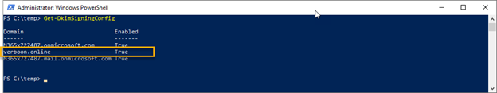
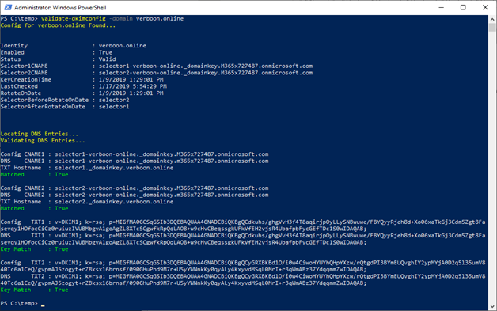

Just in case you are not familiar with what DKIM is all about but still interested, I suggest you first read [Use DKIM to validate outbound email sent from your custom domain in Office 365](https://docs.microsoft.com/en-us/office365/securitycompliance/use-dkim-to-validate-outbound-email) If you're looking for detailed instructions how to enable DKIM in Office 365 continue reading.

# Prerequisites

 	
- Windows PowerShell
 	
- PowerShell Script Validate-DkimConfig.ps1 download from [here](https://github.com/carlnolan/scripting/blob/master/Validate-DkimConfig.ps1)
 	
- Access to Exchange Online through PowerShell
 	
- Access to DNS

**Update** 23.3.2020 The above link to the script is no longer working, so you can get the script from here: https://gist.github.com/alexverboon/cbe8c6964b5af01bfb3f43dd605acee4

# Connect to Exchange Online

First we connect to Exchange Online using PowerShell

 

$UserCredential = Get-Credential

$Session = New-PSSession -ConfigurationName Microsoft.Exchange -ConnectionUri https://outlook.office365.com/powershell-liveid/ -Credential $UserCredential -Authentication Basic -AllowRedirection

Import-PSSession $Session -DisableNameChecking

## MFA Enabled?

If you have Multifactor authentication enabled, make sure you follow [these](https://docs.microsoft.com/en-us/powershell/exchange/exchange-online/connect-to-exchange-online-powershell/mfa-connect-to-exchange-online-powershell?view=exchange-ps) instructions to connect to Exchange Online. Once you have the MFA enabled module installed, you can run the below command and once that has loaded run Connect-EXOPSSession

 

$CreateEXOPSSession = (Get-ChildItem -Path $env:userprofile -Filter CreateExoPSSession.ps1 -Recurse -ErrorAction SilentlyContinue -Force | Select -Last 1).DirectoryName

. "$CreateEXOPSSession\CreateExoPSSession.ps1"

If all went fine, you should see something like this:

# Check current DKIM configuration status

Run the following command to see current DKIM configuration

 

Get-DkimSigningConfig

As we can see, DKIM is not enabled for Verboon.online

# Gather required settings for DNS

To enable DKIM we must add two CNAME records to DNS, we use the Validate-DkimConfig cmdlet to provide us with the detailed information we must set in DNS

Load the functions included in validate-dkimconfig.ps1 and then run validate-dkimconfig as shown below.

 

PS C:\temp> . .\Validate-DkimConfig.ps1

PS C:\temp> validate-dkimconfig -domain verboon.online

You should get an output as shown in the example below.

The important information is displayed at the very end, with pretty clear instructions.

# Registering DKIM in DNS

I host my DNS in Azure, so I am going to add the CNAMES there.

Then run the following command again.

 

PS C:\temp> validate-dkimconfig -domain verboon.online

If the DNS records are active, you should see the following output.

# Enable DKIM

Now that we have the DNS records published, we can enable DKM. This is done by running the following command

 

New-DkimSigningConfig -DomainName Verboon.online -Enabled $true

Get-DkimSigningConfig

And finally, we run the following command again to validate all is configured correctly.

 

PS C:\temp> validate-dkimconfig -domain verboon.online

