I'm currently engaged in multiple customer projects where Windows 10 is already in production, but unfortunately without Windows Credential Guard enabled. For those who think "Credential ….what?"

*Windows Defender Credential Guard uses virtualization-based security to isolate secrets so that only privileged system software can access them. Unauthorized access to these secrets can lead to credential theft attacks, such as Pass-the-Hash or Pass-The-Ticket.* More details can be found [here](https://docs.microsoft.com/en-us/windows/security/identity-protection/credential-guard/credential-guard).

Some of you might think, why wasn't it enabled in the first place when they deployed Windows 10? From speaking to several people, here are some of the reasons.

 	
- We weren't aware of it
 	
- We had no time to test it
 	
- It didn't work, i.e. caused issues, so we had to turn it off again, never picked it up again.
 	
- Hardware issues

With regards to Hardware related issues, I strongly recommend that IT admins use the [Device Guard and Credential Guard hardware readiness tool](https://www.microsoft.com/en-us/download/details.aspx?id=53337) and make sure that they use latest and greatest stable device drives and firmware provided by their hardware vendor. This by the way seems to be another issue in itself, nobody likes the job of maintaining device drivers and firmware updates but believe me it's essential. Device drivers operate at a very low level in the Operating system, hence if they have a vulnerability, the bad guys have an easy way in. Bottom line, do actively maintain device drivers and firmware updates not only for new deployed clients, but also deploy them to those devices already in production.

In one case I came across an issue related to accounts that use Kerberos Unconstrained Delegation. Willem Kasdorp published a good TechNet Blog article how to find accounts with unconstrained delegation in a domain using PowerShell [here](https://blogs.technet.microsoft.com/389thoughts/2017/04/18/get-rid-of-accounts-that-use-kerberos-unconstrained-delegation/). Try run that script, and identify potential show stoppers.

With this blog post I'll try to fill a gap in what has been written about already about enabling Windows Defender Credential Guard, namely, how to do it using ConfigMgr. If you were looking for a Microsoft Intune based approach, I recommend reading Oliver Kieselbach's blog post [Configuring Windows Defender Credential Guard with Intune](https://oliverkieselbach.com/2018/01/11/configuring-windows-defender-credential-guard-with-intune/)

So why use ConfigMgr, I can do it with a GPO setting with just a few clicks? True, however when you want to test / pilot Credential guard in a production environment on just a few dedicated clients using the Group Policy based method, you'll have to setup a dedicated GPO object, filter it's deployment using an AD Group or GPP item level targeting, add computers to that AD group etc. etc. That all in all seemed to be way more work to me than using a ConfigMgr Configuration baseline that is setup fairly quickly and can be easily targeted to select clients.

Okay, let's get started, I prepared this in my virtual lab running ConfigMgr 1810 and a Windows 10 1809 Client.

Looking at the Windows 10 client we can check the configuration status of Windows Defender Credential guard by running MSINFO32.EXE as Administrator.

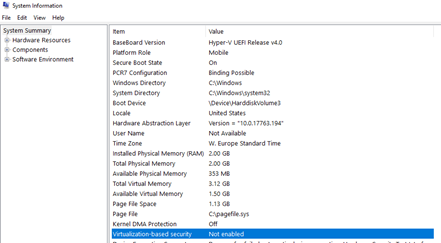

To enable Windows Defender Credential Guard , we must configure following settings

**Setting**
**Description**
**Configuration**

**Select Platform Security Level**
Virtualization Based Security uses the Windows Hypervisor to provide support for security services. Virtualization Based Security requires Secure Boot and can optionally be enabled with the use of DMA Protections. DMA protections require hardware support and will only be enabled on correctly configured devices.
Secure Boot 

**Credential Guard Configuration**
This setting lets users turn on Credential Guard with virtualization-based security to help protect credentials.

The "Enabled with UEFI lock" option ensures that Credential Guard cannot be disabled remotely. In order to disable the feature, you must set the Group Policy to "Disabled" as well as remove the security functionality from each computer, with a physically present user, in order to clear configuration persisted in UEFI.
Enabled **without** UEFI Lock

Note! for testing purposes I on purpose use the "without UEFI lock" option.

Translated into direct Windows settings we must set the following keys:

**Setting**
**Registry Hive**
**Registry Key**
**Value**

**Credential Guard**
HKEY_LOCAL_MACHINE\System\CurrentControlSet\Control\LSA
LsaCfgFlags
2

**Virtualization Based Security **
HKEY_LOCAL_MACHINE\Software\Policies\Microsoft\Windows\DeviceGuard
EnableVirtualizationBasedSecurity
1

**Secure Boot**
HKEY_LOCAL_MACHINE\Software\Policies\Microsoft\Windows\DeviceGuard
RequirePlatformSecurityFeatures
1

Okay, now let's head over to the ConfigMgr Console, here I have configured the following Configuration Baseline.

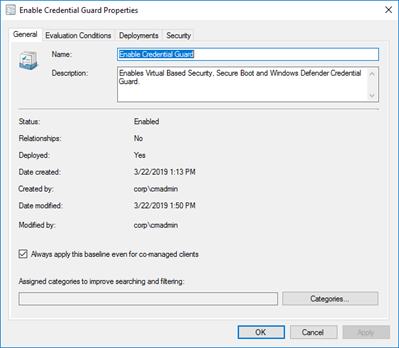

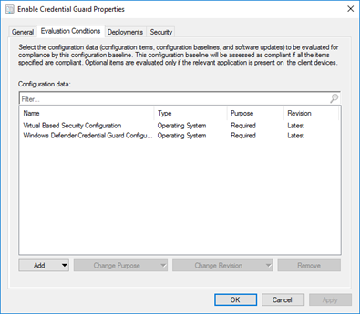

As you can see the Configuration Baseline includes two Configuration Items.

 	
- Virtual Based Security Configuration
 	
- Windows Defender Credential Guard Configuration

Since I don't want to bore you with 30+ screen shots, I'm just showing one example. They are all setup in the same way, just with different registry keys and values to check.

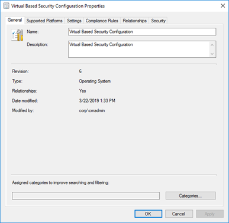

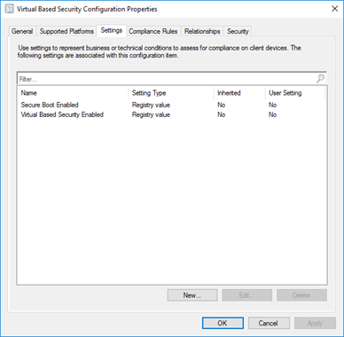

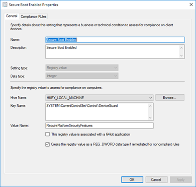

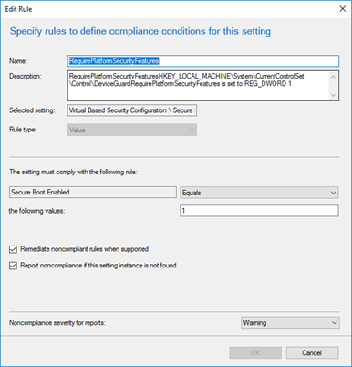

Okay, so now that we have setup the Configuration Baseline, we can deploy it to a target device. For this I suggest you create a Credential Guard test collection in ConfigMgr and deploy the Configuration baseline to that collection.

When we refresh the machine policy on the client, we get the Configuration baseline. Select **Evaluate** to run it

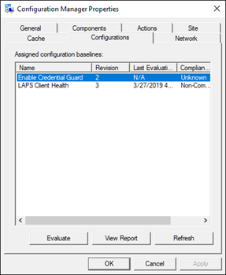

If all goes well, we get a "compliant" result.

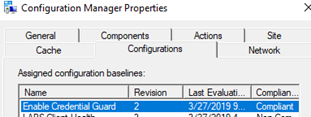

When opening MSINFO32.exe again, we can see the effect of the configuration that was applied.

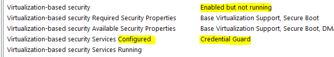

It's now all configured but not yet enabled, a reboot is required. Once that's done, open MSINFO32.EXE again and check the status.

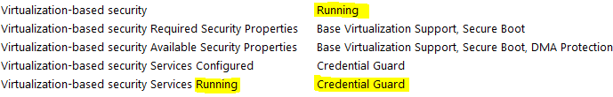

**Removing Credential Guard (Virtualization Based Security)
**

I haven't gone down the path yet in creating a configuration baseline that would remove the above configuration, but it's actually pretty straightforward, just remove these 3 keys, reboot and you're done. If you just want to disable credential guard, only run the first line. More details [here](https://docs.microsoft.com/en-us/windows/security/identity-protection/credential-guard/credential-guard-manage)
# Remove Credential Guard

Remove-ItemProperty -Path "Registry::HKEY_LOCAL_MACHINE\System\CurrentControlSet\Control\LSA" -Name "LsaCfgFlags" -Force

# Remove Virtualized Based Security

Remove-ItemProperty -Path "Registry::HKEY_LOCAL_MACHINE\SYSTEM\CurrentControlSet\Control\DeviceGuard" -Name "EnableVirtualizationBasedSecurity" -Force

# Remove Secure Boot requirement

Remove-ItemProperty -Path "Registry::HKEY_LOCAL_MACHINE\SYSTEM\CurrentControlSet\Control\DeviceGuard" -Name "RequirePlatformSecurityFeatures" -Force

Just In case that you used the "with UEFI lock" option, when removing Credential Guard, you also need to update the BCDStore. More details [here](https://docs.microsoft.com/en-us/windows/security/identity-protection/credential-guard/credential-guard-manage)

I've started wrapping the necessary bcdedit commands into PowerShell below. (not a nice clean script, but works for testing).

Start-Process -FilePath "mountvol.exe" -ArgumentList "x: /s" -PassThru -Wait

Copy-Item -Path "$env:systemroot\System32\SecConfig.efi" -Destination "X:\EFI\Microsoft\Boot\SecConfig.efi" -Force

Start-Process -FilePath "bcdedit.exe" -ArgumentList '/create {0cb3b571-2f2e-4343-a879-d86a476d7215} /d "DebugTool" /application osloader' -PassThru -Wait

Start-process -FilePath "bcdedit.exe" -ArgumentList '/set {0cb3b571-2f2e-4343-a879-d86a476d7215} path "\EFI\Microsoft\Boot\SecConfig.efi"' -PassThru -Wait

Start-Process -FilePath "bcdedit.exe" -ArgumentList '/set {bootmgr} bootsequence {0cb3b571-2f2e-4343-a879-d86a476d7215}' -PassThru -Wait

Start-Process -FilePath "bcdedit.exe" -ArgumentList '/set {0cb3b571-2f2e-4343-a879-d86a476d7215} loadoptions DISABLE-LSA-ISO,DISABLE-VBS' -PassThru -Wait

Start-Process -FilePath "bcdedit.exe" -ArgumentList '/set {0cb3b571-2f2e-4343-a879-d86a476d7215} device partition=X:' -PassThru -Wait

Start-Process -FilePath "bcdedit.exe" -ArgumentList '/set hypervisorlaunchtype off' -PassThru -Wait

Start-Process -FilePath "mountvol.exe" -ArgumentList "x: /d" -PassThru -Wait

Okay, I hope this blog post might be of use for someone one day

Cheers

Alex

