Windows Defender ATP provides SIEM integration, allowing you to pull alerts from Windows Defender ATP Security Center into Splunk. The SIEM integration uses the Windows Defender ATP Alerts Rest API. Since I have an actual customer demand for such an integration, I thought it's about time to get a feel for how this works.

# Prerequisites

 	
- An active Windows Defender ATP subscription with portal admin access
 	
- Windows Defender ATP SIEM integration enabled within the portal.
 	
- A Windows 10 Client onboarded in Windows Defender ATP
 	
- A Splunk Account used to download the trial software and install Add-ons and Apps.
 	
- A Splunk Instance with the REST API Modular Input app installed.  I had first signed up for a Splunk Cloud trial since I wanted to avoid the effort for installing Splunk, however the REST API Modular Input app that is required isn't available for Splunk Cloud, therefore I ended up installing Splunk Enterprise locally.
 	
- A Windows (or another supported OS) to install Splunk (I used a Windows 10 machine for that)
 	
- An Activation key for the RESTAPI Module input app. You can get the key for free from here: [https://www.baboonbones.com/#appdev](https://www.baboonbones.com/#appdev)

# Splunk Installation

First I installed Splunk Enterprise  7.2.5 for Windows that I downloaded from [here](https://www.splunk.com/en_us/download/splunk-enterprise.html) and then launched the splunk-7.2.5-088f49762779-x64-release.msi and simply followed the on screen instructions. For more details refer to the online documentation [here](https://docs.splunk.com/Documentation/Splunk/7.2.5/Installation/ChoosetheuserSplunkshouldrunas).  After providing an admin account and password, Splunk installed itself within minutes and when completed launches the admin portal.

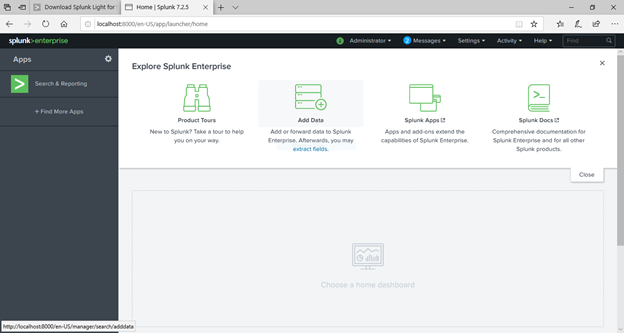

Next, click on **+ Find More Apps **and search for "rest input", if all goes well the Rest API Modular Input App should appear. Click **Install** and follow the instructions.

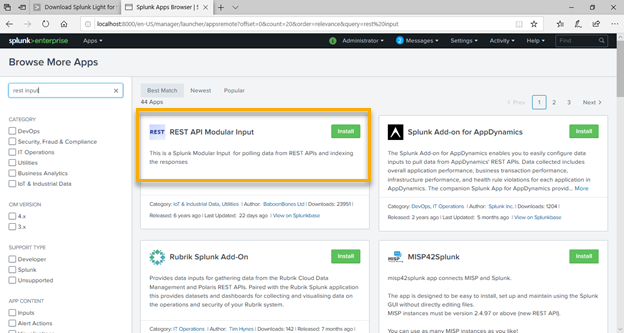

Wait for the installation to complete.

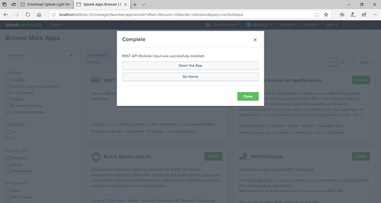

# Defender ATP SIEM Integration Configuration

Before you can continue with configuring Splunk, we need to get some connection details from WDATP. For that we switch over to the Windows Defender ATP portal. [https://securitycenter.windows.com/](https://securitycenter.windows.com/) and navigate to Settings / APIs / SIEM, Select **Enable SIEM Connector **and wait for the process to complete

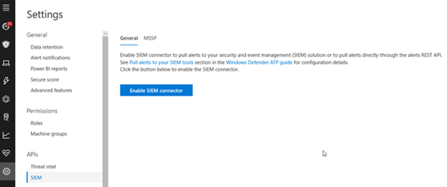

**Important**! When enabled, temporarily disable blocking pop-ups in your browser.

If all goes well, you should see the following information.

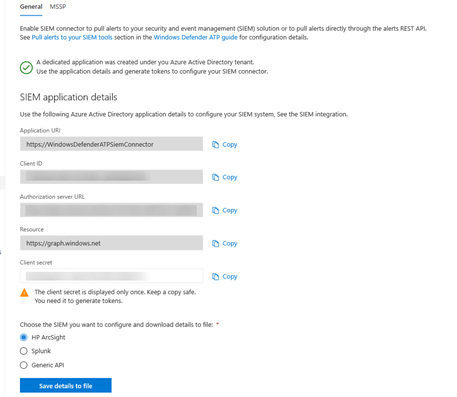

**Important**: Note down the Client Secret and save it somewhere, as it won't be shown again.  Then select **Splunk** and **Save details to file, **save it In a secure location.

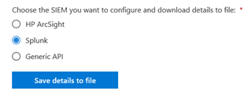

Next Select **Generate tokens** and copy the tokens to a file in a secure location.

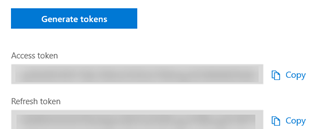

# Splunk Configuration

We now have all the information required to configure Splunk. So, now switch back to the Splunk Admin console and select **Settings** / **Data Inputs**

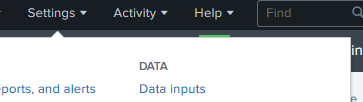

Scroll down the list until REST and select **+ Add New**

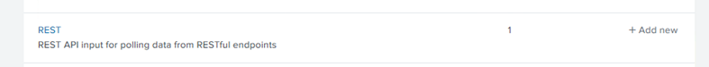

The REST Configuration page appears and now you have to provide several inputs.  There's good and comprehensive documentation for where to fill in what on the official Microsoft docs. Site here: [https://docs.microsoft.com/en-us/windows/security/threat-protection/windows-defender-atp/configure-splunk-windows-defender-advanced-threat-protection#configure-splunk](https://docs.microsoft.com/en-us/windows/security/threat-protection/windows-defender-atp/configure-splunk-windows-defender-advanced-threat-protection#configure-splunk)

Basically, what you need now is the following:

 	
- The Activation key for the REST API Modular app
 	
- The Splunk configuration file that you saved previously

Below some screenshots from my configuration as a reference

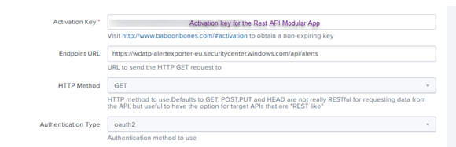

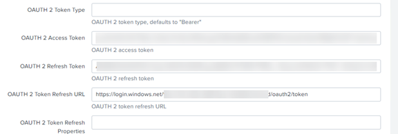

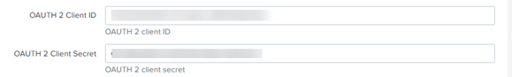

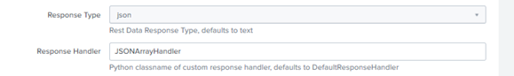

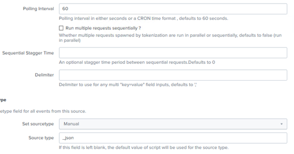

**Save** the configuration

# Generating Alerts

Now it's time to make some noise, so we're trigging an alert on the Windows Defender ATP onboarded device. Within the Windows Defender ATP Security portal, select **? / Simulations and Tutorials **and run one of them or more on the onboarded Windows 10 client.

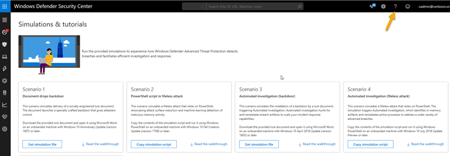

Wait for the Alerts to appear in the Defender ATP Console.

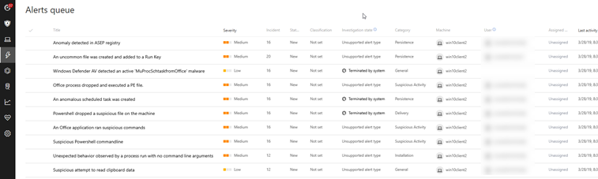

# Pulling WDATP Alerts in Splunk

Depending on the pulling configured pulling internal (60 seconds configured here), the Alerts will appear in the Splunk Console.

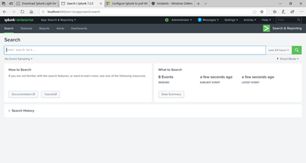

The Microsoft docs provide some guidance on how to View alerts using Splunk solution explorer
[https://docs.microsoft.com/en-us/windows/security/threat-protection/windows-defender-atp/configure-splunk-windows-defender-advanced-threat-protection#view-alerts-using-splunk-solution-explorer](https://docs.microsoft.com/en-us/windows/security/threat-protection/windows-defender-atp/configure-splunk-windows-defender-advanced-threat-protection#view-alerts-using-splunk-solution-explorer)

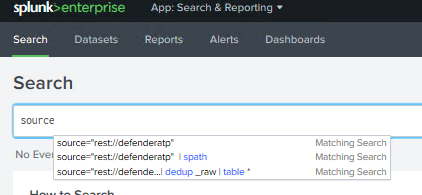

And there we go; we now have our Alerts in Splunk.

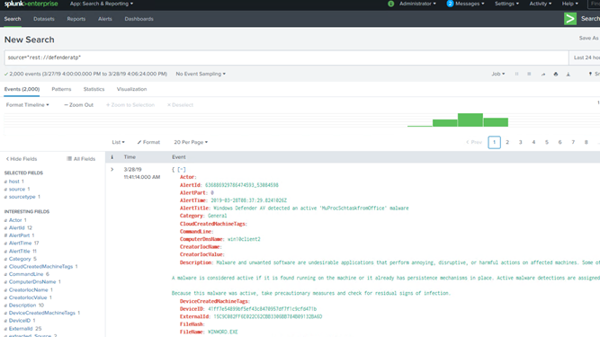

Have a great day

Alex

