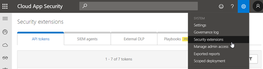
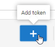
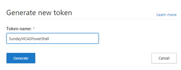
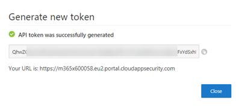
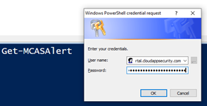
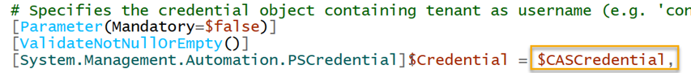
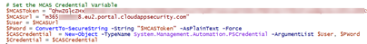
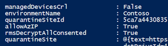
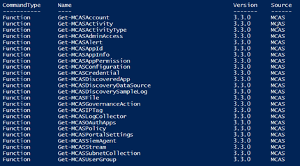

Last Friday I was given the opportunity to present at the Configuration Manager Community Event (CMCE1905) in Bern, Switzerland. Although Microsoft Cloud App Security is not really related to ConfigMgr, many of the attendees are dealing with managing classic and modern workplaces and security is almost on everyone's list of interest. During my session "Unleash the power of Microsoft Cloud App Security" I also demonstrated how one can explore information within Microsoft Cloud App Security through PowerShell. So, for all those interested how to do that, here we go.

 	
- In Part 1 of this blog series I explain how to install the PowerShell Module and set credentials to connect to MCAS with PowerShell, furthermore we take a look at some of the available PowerShell commands to pull data from Microsoft Cloud App Security
 	
- In Part 2 we drill down into specific Cloud App Security activities and alerts

Microsoft Cloud App Security provides an API interface that's described [here](https://m365x600058.eu2.portal.cloudappsecurity.com/api-docs/). But there's also an Unofficial [Microsoft Cloud App Security PowerShell module](https://github.com/Microsoft/MCAS) hosted on GitHub and hosted as well in the [PowerShell Gallery](https://www.powershellgallery.com/packages/MCAS/3.1.1), so that's what we're going to use here.

# Installing the PowerShell Module

The PowerShell Module for Microsoft Cloud App Security "MCAS" is installed as following:

Install-Module -Name MCAS

# Registering an API Token

To connect to MCAS using the MCAS PowerShell Module we need an API Token. This can be generated within the Microsoft Cloud App Security Portal.

Select Settings, Security Extensions



Click on the **+** button to create a new Token.



Enter a descriptive name and click **Generate**



Copy the API Token now (you won't be able to display it again) and also copy the URL



# Set the MCAS Credential Variable

When launching an MCAS cmdlet such as Get-MCASAlert, you'll be prompted to enter credentials, where the username is the URL and the Password is the API Token.



When running Get-MCASCredential we can set the credentials for the current PowerShell session, but I found it annoying to run this command each time I started a new PowerShell session, so here's what I'm using. We can save the credentials in a variable, because all the functions look for a credential variable **$CASCredential**.



Run the following commands (replace the URL and API Token with your information).

```
# Set the MCAS Credential Variable
$MCASToken="<YOUR TOKEN>"
$MCASUrl="<YOUR URL>"
$User=$MCASUrl
$PWord=ConvertTo-SecureString -String "$MCASToken" -AsPlainText -Force
$CASCredential=New-Object -TypeName System.Management.Automation.PSCredential -argumentList $User, $PWord
$Credential=$CASCredential
```

*Example:
*



We can test the credentials by just launching an MCAS function such as Get-MCASConfiguration, if the function returns information the credentials are good to go.



# Exploring MCAS with PowerShell

Now let's take a look at the commands available to explore MCAS through PowerShell

Get-Command -Module MCAS -Name Get*



So, if we run the following command, we get all the MCAS Alerts that have a high severity.

Get-MCASAlert -Severity High

Or if we want to see all events form a partical user we can run

Get-MCASActivity -UserName "jane@verboon.org"

So that's it for today, in Part 2, we'll look into more details and examples using PowerShell to explore Microsoft Cloud App Security. Stay tuned.

