I spend quite some time during the week travelling to and from customers, to make the best use of travel time, I usually read blogs and tweets or take online trainings to keep myself up to date about whatever interests me. Yesterday I noticed a tweet from someone regarding MDATP Portal access  "*Security Administrator can't be assigned to staff in my org. It's too powerful*." Maybe not everyone is aware of the RBAC capabilities in MDATP so I through it might be worth a blog post. Here we go. 

By default, when setting up the Microsoft Defender Advanced Threat Protection portal, users with the Global Administrator or Security Administrator directory role in Azure AD, are automatically assigned the default Microsoft Defender ATP administrator role with full access to everything with the portal, i.e. resources and configuration settings. 

While this configuration might work just fine for a small shop, where Mary or Joe take care of everything in IT, mid to large sized organizations usually have different roles within IT and want to apply more granular access permissions within the MDATP console.  Luckily MDATP does provide RBAC, it just needs to be turned on. 

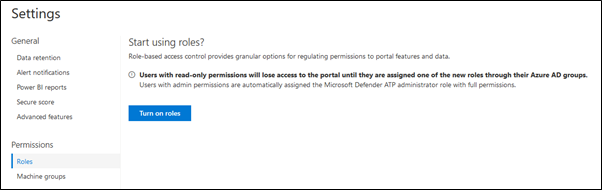

	

Now before you just hit that button, let's first take a look at the available permissions and the prerequisites. Setting up MDATP Roles basically consists of assigning  MDATP portal permissions to an AzureAD group, the following table provides an overview of the permissions that can be assigned to groups. 

**Permission**

**Description**

View Data

- View Data

Alerts Investigation

- Manage Alerts

- Initiate automated investigations

- Run scans

- Collect investigation packages

- Manage Machine tags

Active Remediation Actions

- Take response actions

- Approve or dismiss pending remediation actions

Manage Poral System Settings

- Configure storage settings

- Configure SIEM and Threat Intel API Settings

- Configure Advanced Settings

- Configure automated file uploads

- Configure roles and machine groups

Manage Security Settings

- Configure Alert suppression settings

- Manage allowed/blocked lists for automation

- Manage folder exclusions for automation

- Onboard and offboard machines

- Manage email notifications

Live Response Capabilities (Preview)

- Basic: Start a live response session, Perform read only live response commands on remote machine

- Advanced: Download a file from the remote machine, Upload a file to the remote machine, View scripts form the library, Execute scripts from the library on remote machines 

 

As you can see there are several permission sets that allow for a fine-grained setup of different roles within the Microsoft Defender Advanced Threat Protection portal. I Know you now want to push that "Turn on Roles" button but let us first think what we actually need and prepare the prerequisites. 

First we need to define who within the organization should have access to portal and what we want them to do there and whether that applies to all onboarded machines or just a group of machines, yes you can create machine groups as well and assign permissions to them. So as a next step we identify the roles and map the permissions as well as the machine scope and the AzureAD group. 

Below is an example of the outcome of such an exercise. 

**IT Role**

**Description**

**MDATP Permission**

**Machine Scope**

**Azure AD Group Name**

MDATP Full Admins

Security architects and administrators who are responsible for the MDATP Solution. They closely follow the MDATP roadmap, test new features, enable / disable features, the go to persons for MDATP in the organization. 

Manage Poral System Settings

All

sg-MDATP-FullAdmins

MDATP SecOps Admins

Security administrators involved in Security Operations, use this if you don't have separate analyst and response teams. 

Manage Security Settings

Alerts Investigation

Active Remediation Actions

Live Response Advanced

All

Sg-MDATP-SecOpsAdmins

MDATP-View-only users

Users who only need to have view access but don't push any buttons, CISO, IT Security Management. 

View Data

All or scoped

Sg-MDATP-ViewOnly

MDATP Security Analysts

Users involved in assessing incidents

Alerts Investigation

Live Response Basic

All or scoped

Sg-MDATP-SecAnalyst

MDATP Security Incident Response

Users involved in incident response activities

Active Remediation Actions

Live Response Advanced

All or scoped

Sg-MDATP-SecInicdentResponse

     
 

Okay, we're getting there, now that we know the roles and have defined the AzureAD groups, let's put these in place first. 

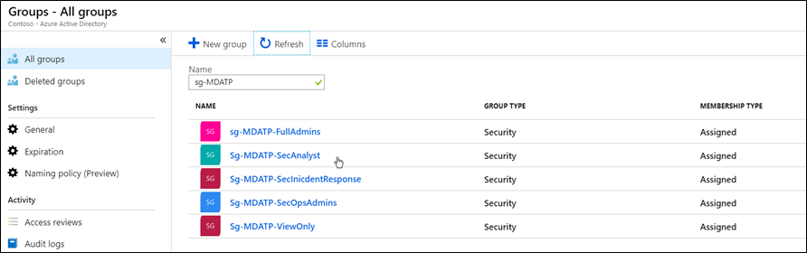

	

Good, we're getting closer, but before hitting that button, make sure that you are currently a member of the either the Global Admins or Security Admins role, otherwise you might lose access to the portal.  Within the portal, go to Settings / Permissions / Roles and select **Turn on roles**. 

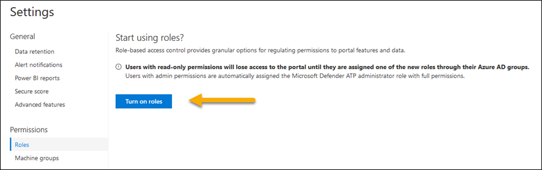

	

And if all goes well, after a few seconds you'll see this. 

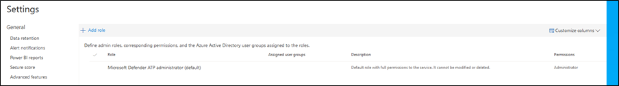

	

Notice that there is already a built-in role, Microsoft Defender ATP Administrator (Default). This role has the following permissions. 

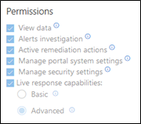

	

All the permissions, so that looks like the Full Admin we defined previously.  Open the Role and then search for the previously created AzureAD Group. 

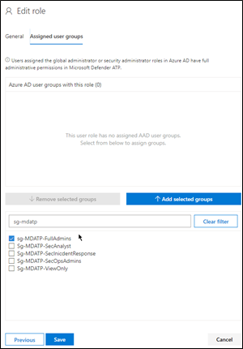

	

Select the Group and then press the **Add selected groups** button

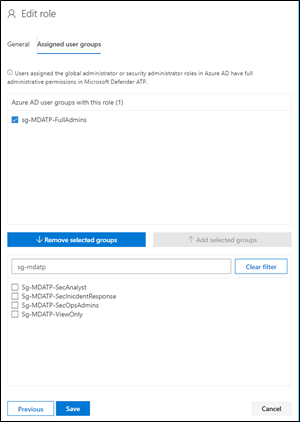

	

And finally click **Save**
	

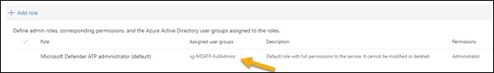

	

Now let's move on with the other groups. Select **Add Role **, enter the Role name , description and select the permissions

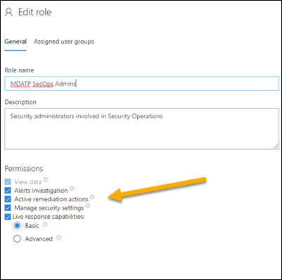

	

Select **Next**, and assign the corresponding AzureAD group. 

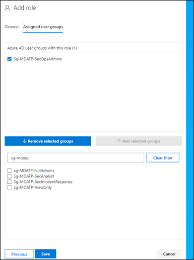

	

Click **Save**
	

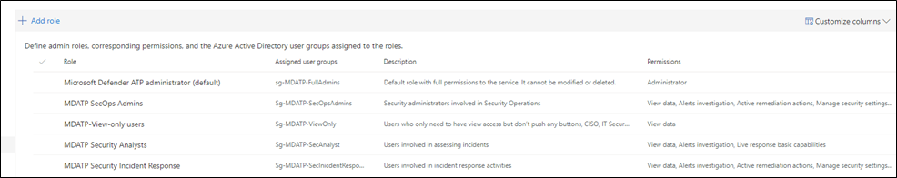

	

If all these users regardless of their role are allowed to see any onboarded device, we must update the default machine group configuration.  Select Settings / Permissions / Machine Groups. 

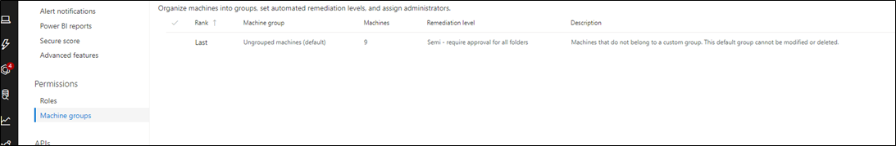

	

Then make sure that all groups are assigned access. 

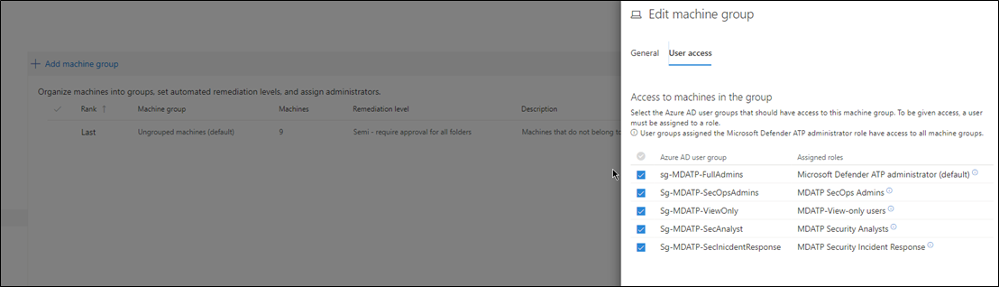

	

Important: select **Apply changes**
	

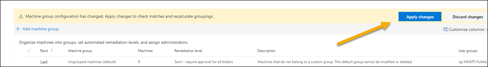

	

Okay that's it for today, next time we'll talk about the machine groups in more detail. Hope you enjoyed this blog post. 

Alex

Additional Resources:

Is your SOC running flat with limited RBAC?
[https://techcommunity.microsoft.com/t5/Windows-Defender-ATP/Is-your-SOC-running-flat-with-limited-RBAC/ba-p/320015#M49](https://techcommunity.microsoft.com/t5/Windows-Defender-ATP/Is-your-SOC-running-flat-with-limited-RBAC/ba-p/320015#M49)
	

Manage portal access using role-based access control
[https://docs.microsoft.com/en-us/windows/security/threat-protection/microsoft-defender-atp/rbac](https://docs.microsoft.com/en-us/windows/security/threat-protection/microsoft-defender-atp/rbac)

