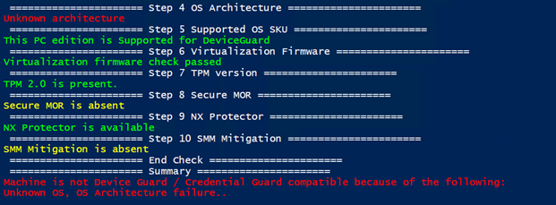
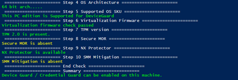

To close this week, let me share my findings with you about running the Windows Device and Credential Guard Hardware Readiness Tool and the unknown architecture error.

Believe it or not, there are still people, probably more than I assume, that run Windows in their native language instead of English. I can understand when end users do so, but honestly when administrating an infrastructure? Anyway, I recently worked for a client where the UI is set to German language, well after 10 minutes I felt so lost that I had to install the English language pack to become productive. While supporting the client to get ready for the Deployment of Windows Defender Credential Guard, following best practices I executed the Device Guard and Credential Guard Hardware Readiness Tool on one of their devices and got the following error:

*Machine is not Device Guard / Credential Guard compatible because of the following:
Unknown OS, OS Architecture failure..
*

I've ran this script so often , but never came across that message. So, I looked into the code and found the following function.

function CheckOSArchitecture

{

**$OSArch = $(gwmi win32_operatingsystem).OSArchitecture**

Log $OSArch

if($OSArch.Contains("64-bit"))

{

LogAndConsoleSuccess "64 bit arch....."

}

elseif($OSArch.Contains("32-bit"))

{

LogAndConsoleError "32 bit arch...."

$DGVerifyCrit.AppendLine("32 Bit OS, OS Architecture failure..") | Out-Null

}

else

{

LogAndConsoleError "Unknown architecture"

$DGVerifyCrit.AppendLine("Unknown OS, OS Architecture failure..") | Out-Null

}

}

Looked al good, so what's the issue? Let's check the result of gwmi win32_operatingsystem).OSArchitecture
64-Bit

Looks right, this box runs a 64-bit Windows, what's wrong here?

Well to keep this short, it's the capital B, this customer deployed Windows 10 in German and it looks like the value within the WMI table got saved with a capital B, what the script is expecting is
64-bit

So, I modified the script by simply changing the $OSARch variable to lowercase, and…the script now works.
function
CheckOSArchitecture

{$OSArch = $((gwmi **win32_operatingsystem).OSArchitecture).tolower()**

Log $OSArch

if($OSArch.Contains("64-bit"))

 {

LogAndConsoleSuccess
"64 bit arch....."

 }

elseif($OSArch.Contains("32-bit"))

 {

LogAndConsoleError
"32 bit arch...."

$DGVerifyCrit.AppendLine("32 Bit OS, OS Architecture failure..") |
Out-Null

 }

else

 {

LogAndConsoleError
"Unknown architecture"

$DGVerifyCrit.AppendLine("Unknown OS, OS Architecture failure..") |
Out-Null

 }

}

So if you happen to run into this error, update the CheckOSArchitecture function as shown below and you should be able to run the script on a Windows 10 client with a capital **B** for bits

That's it, have a great weekend

Alex

