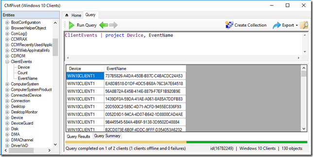
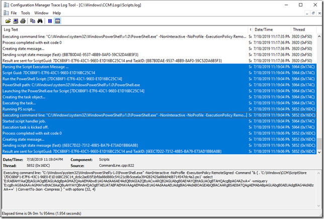
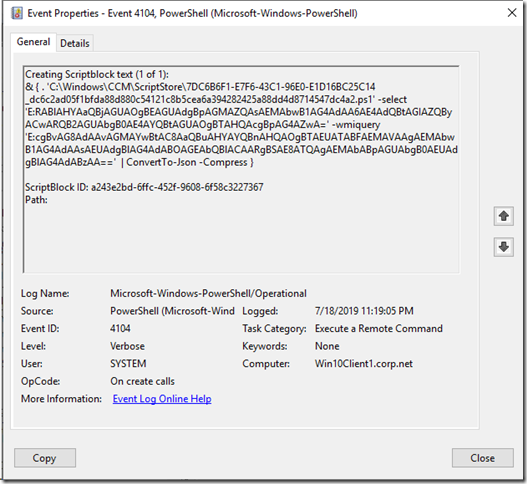
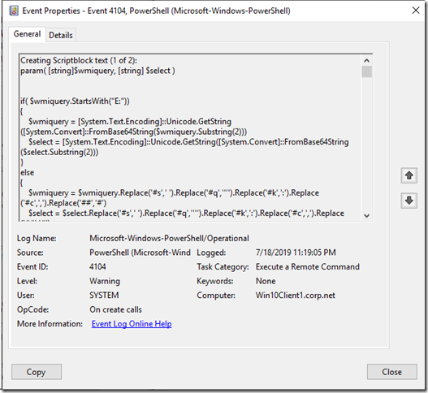
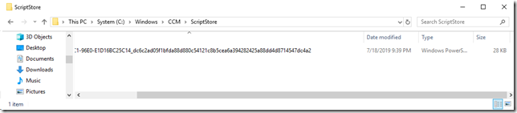
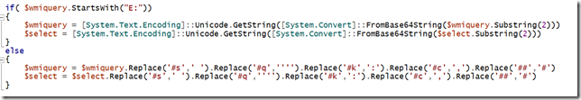
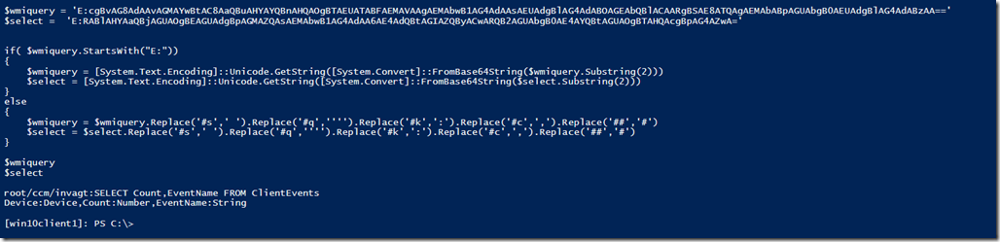

While working with CMPivot this week, I wanted to find out how locally on the client the data is collected, I already knew that when you execute a CMPivot query from the ConfigMgr console, it will run the query on the target device and returns the result back to ConfigMgr. While investigating I also came across this blog post [CM Pivot Internals](https://www.ephingadmin.com/CMPivotInternals/) that describes how things work, nevertheless I wanted to dig a bit deeper. So here we go.

When executing a CM Pivot query, the query is send to the client, we can follow all actions through the scripts.log file located in c:\windows\ccm\logs.

With PowerShell logging enabled, we see the following in the PowerShell EventLog.

Looking further into the PowerShell eventlog, we get an idea of the content of the script that is being executed, from

'C:\Windows\CCM\ScriptStore\7DC6B6F1-E7F6-43C1-96E0-E1D16BC25C14_dc6c2ad05f1bfda88d880c54121c8b5cea6a394282425a88dd4d8714547dc4a2.ps1’

Now reconstructing scripts from multiple script blocks is a bit of a pain, so let’s see if we an look at the file directly. Navigating to C:\Windows\CCM, I noticed that there is no ScriptStore directory, so I assume it’s being created and removed on the fly. So I run another query that takes a bit longer and there we go, the ScriptStore folder and the PowerShell script appear. But no luck with just copying the file, I first had to change the directories permissions.

Note: If you have read the CM Pivot Internals blog post I mentioned earlier, you know that you can also get the content of the script by running a query on the CM database.

Okay, now what about these encoded strings?

Executing command line: "C:\Windows\system32\WindowsPowerShell\v1.0\PowerShell.exe" -NonInteractive -NoProfile -ExecutionPolicy RemoteSigned -Command "& { . 'C:\Windows\CCM\ScriptStore\7DC6B6F1-E7F6-43C1-96E0-E1D16BC25C14_dc6c2ad05f1bfda88d880c54121c8b5cea6a394282425a88dd4d8714547dc4a2.ps1' -select 'E:RABlAHYAaQBjAGUAOgBEAGUAdgBpAGMAZQAsAEMAbwB1AG4AdAA6AE4AdQBtAGIAZQByACwARQB2AGUAbgB0AE4AYQBtAGUAOgBTAHQAcgBpAG4AZwA=' -wmiquery 'E:cgBvAG8AdAAvAGMAYwBtAC8AaQBuAHYAYQBnAHQAOgBTAEUATABFAEMAVAAgAEMAbwB1AG4AdAAsAEUAdgBlAG4AdABOAGEAbQBlACAARgBSAE8ATQAgAE
MAbABpAGUAbgB0AEUAdgBlAG4AdABzAA=='  | ConvertTo-Json -Compress } " with options (32, 4)

If we look at the content of the PowerShell script that is being executed, we get the answer right at the top of the script, where we find the following code.

Executing command line: "C:\Windows\system32\WindowsPowerShell\v1.0\PowerShell.exe" -NonInteractive -NoProfile -ExecutionPolicy RemoteSigned -Command "& { . 'C:\Windows\CCM\ScriptStore\7DC6B6F1-E7F6-43C1-96E0-E1D16BC25C14_dc6c2ad05f1bfda88d880c54121c8b5cea6a394282425a88dd4d8714547dc4a2.ps1' -**select** 'E:RABlAHYAaQBjAGUAOgBEAGUAdgBpAGMAZQAsAEMAbwB1AG4AdAA6AE4AdQBtAGIAZQByACwARQB2AGUAbgB0AE4AYQBtAGUAOgBTAHQAcgBpAG4AZwA=' -**wmiquery** 'E:cgBvAG8AdAAvAGMAYwBtAC8AaQBuAHYAYQBnAHQAOgBTAEUATABFAEMAVAAgAEMAbwB1AG4AdAAsAEUAdgBlAG4AdABOAGEAbQBlACAARgBSAE8ATQAgAE
MAbABpAGUAbgB0AEUAdgBlAG4AdABzAA=='  | ConvertTo-Json -Compress } " with options (32, 4)

So let’s extract the Select and wmiquery content and run it through that code.

and see, we have decoded the input values that go into the script. I recommend going through that PowerShell script , it contains a lot of code and gives you an idea how CM Pivot is collecting data , where the data is taken from etc.

Have a great day

Alex

