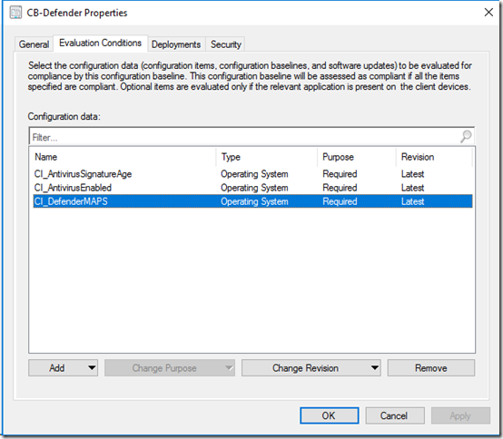
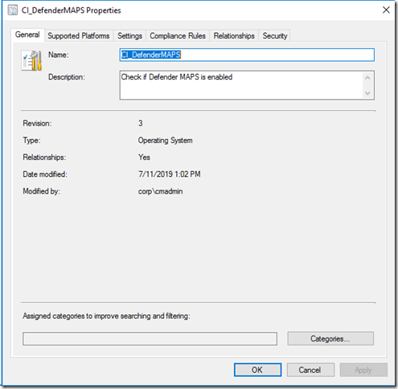
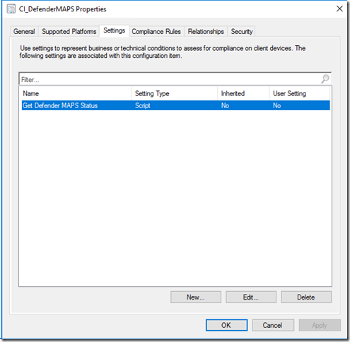
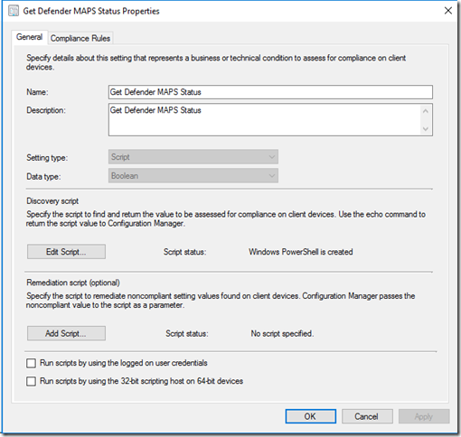
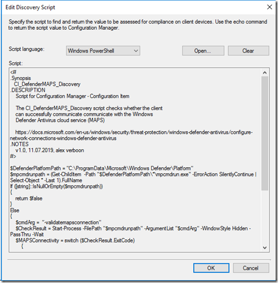
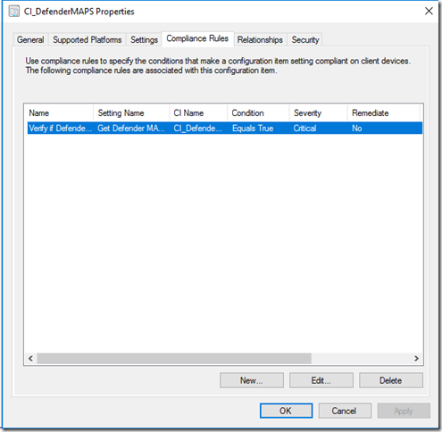
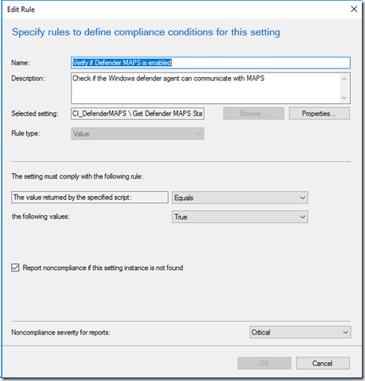
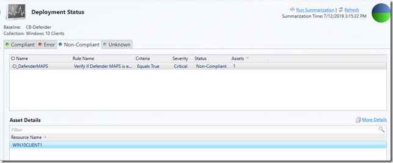
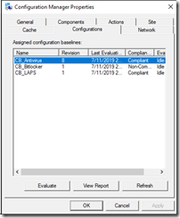
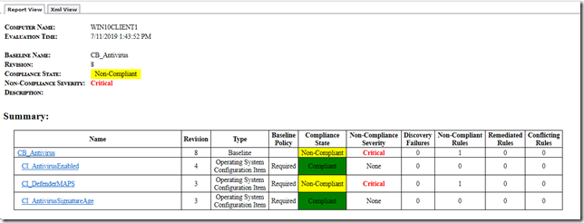

Hello everyone, earlier this week I wrote a blog post how to test Microsoft Defender Cloud Protection Service (MAPS) with PowerShell. Today I would like to share a possible approach how to actively monitor MAPS Connectivity across all your devices using ConfigMgr configuration baselines.

As mentioned in my earlier blogpost in order to take full advantage of Microsoft Defender protection capabilities, it’s important that clients can communicate with MAPS, if the client cannot communicate with MAPS the client will be unable to provide near-instant, automated protection against new and emerging threats, meaning that Windows Defender will only be using the latest protection updates installed locally, depending on the strategy how you deploy these, these might be a couple of hours if not days old.

With  MAPS enabled, your clients will be also be able to use the [block at first sight](https://docs.microsoft.com/en-us/windows/security/threat-protection/windows-defender-antivirus/configure-block-at-first-sight-windows-defender-antivirus) feature and emergency dynamic intelligence updates, which provide near real-time protection from emerging threats.

Clients that have MAPS enabled, must be able to communicate to the following endpoints:

*.wdcp.microsoft.com
*.wdcpalt.microsoft.com
*.wd.microsoft.com

On modern workplaces that often have a direct connection to the internet this isn’t an issue, however many mid to large sized enterprises still have firewalls and proxies in place that could block access, hence when implementing Windows Defender the above URLs must be whitelisted. Now we all know that in larger environments spread across multiple locations or even continents circumstances can be different or suddenly change. With regards to MAPS this could have a very negative impact on a companies security posture. This is why I brewed the idea of monitoring connectivity to MAPS using a ConfigMgr configuration baseline.

I am going to assume that you’re familiar with setting up and deploying a configuration baseline in ConfigMgr, so will save you 25 screenshots, but only illustrate those I believe are essential in understanding how this is setup.

Below are the properties of the Configuration Baseline I have in place for Windows Defender.

[

](https://www.verboon.info/wp-content/uploads/2019/07/image-1.png)

The CI for Defender MAPS is configured as following:

[

](https://www.verboon.info/wp-content/uploads/2019/07/image-2.png)

[

](https://www.verboon.info/wp-content/uploads/2019/07/image-3.png)

[

](https://www.verboon.info/wp-content/uploads/2019/07/image-4.png)

[

](https://www.verboon.info/wp-content/uploads/2019/07/image-5.png)

Script details are shown below.

[

](https://www.verboon.info/wp-content/uploads/2019/07/image-6.png)

[

](https://www.verboon.info/wp-content/uploads/2019/07/image-7.png)

Below the PowerShell based discovery script used in this configuration item, the script is also stored on GitHub here: [CI_DefenderMAPS_Discovery.ps1](https://github.com/alexverboon/MDATP/blob/master/PowerShell/CI_DefenderMAPS_Discovery.ps1)

 

```
<#
.Synopsis
   CI_DefenderMAPS_Discovery
.DESCRIPTION
    Script for Configuration Manager - Configuration Item

    The CI_DefenderMAPS_Discovery script checks whether the client
    can successfully communicate communicate with the Windows 
    Defender Antivirus cloud service (MAPS)

    https://docs.microsoft.com/en-us/windows/security/threat-protection/windows-defender-antivirus/configure-network-connections-windows-defender-antivirus
.NOTES
    v1.0, 11.07.2019, alex verboon
#>

$DefenderPlatformPath = "C:\ProgramData\Microsoft\Windows Defender\Platform"
$mpcmdrunpath = (Get-ChildItem  -Path "$DefenderPlatformPath\*\mpcmdrun.exe" -ErrorAction SilentlyContinue | Select-Object * -Last 1).FullName
If ([string]::IsNullOrEmpty($mpcmdrunpath))
{
    return $false
}
Else
{
    $cmdArg =  "-validatemapsconnection"
    $CheckResult = Start-Process -FilePath "$mpcmdrunpath" -ArgumentList "$cmdArg" -WindowStyle Hidden -PassThru -Wait 
    $MAPSConnectivity = switch ($CheckResult.ExitCode)
        {
            0 { $true}
            default {$false}
        }
            If ($MAPSConnectivity -eq "True")
            {
            return $true
            }
            Else
            {
                return $false
            }
}

```

 

 

 

**Deployment and Monitoring**

Once you’ve setup the configuration baseline, deploy it to all your Windows Defender enabled clients, following your companies change management process and after a while, depending on how often you check the settings compliance you can monitor the compliance within the ConfigMgr console or its reporting.

[

](https://www.verboon.info/wp-content/uploads/2019/07/image-8.png)

I recommend that you configure set a threshold and enable alerting for non compliant clients.

On a client, users or local IT support can verify MAPS connectivity as well using the ConfigMgr Agent configuration settings evaluation.

[

](https://www.verboon.info/wp-content/uploads/2019/07/image-9.png)

[

](https://www.verboon.info/wp-content/uploads/2019/07/image-10.png)

As always, I hope you enjoyed this article and find it useful, ideas, comments are always welcome.

I wish you a great weekend, till soon.

**Additional Information**

Windows Defender Antivirus cloud protection service: Advanced real-time defense against never-before-seen malware
[https://www.microsoft.com/security/blog/2017/07/18/windows-defender-antivirus-cloud-protection-service-advanced-real-time-defense-against-never-before-seen-malware/](https://www.microsoft.com/security/blog/2017/07/18/windows-defender-antivirus-cloud-protection-service-advanced-real-time-defense-against-never-before-seen-malware/)

```

```

