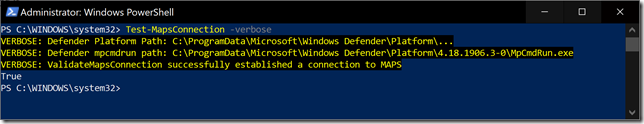

Whenever I work with customers on Windows Defender or Microsoft Defender Advanced Threat Protection, one of the first things I usually review are the current Windows Defender settings. Having Windows Defender properly configured is key, because otherwise you might not be able to make use of all the capabilities Defender and Defender ATP provides. One of them is MAPS (Microsoft Active Protection Service) or also known as Windows Defender Antivirus cloud-delivered protection service. Quite often I notice that clients have no connection to MAPS, this can be validated by running the following command from an elevated command prompt:

"C:\ProgramData\Microsoft\Windows Defender\Platform\**4.18.1906.3-0**\MpCmdRun.exe" –validatemapsconnection

If all is good, you get the following result:

**ValidateMapsConnection successfully established a connection to MAPS**

Now pay attention to the path above, the numbers in **bold** will actually change from time to time, this is because it relates to the Defender engine version, that gets periodically updated. More details about the old and new paths here: [https://support.microsoft.com/en-us/help/4052623/update-for-windows-defender-antimalware-platform](https://support.microsoft.com/en-us/help/4052623/update-for-windows-defender-antimalware-platform)

So whenever implementing Windows Defender, make sure that the service endpoints documented here: [https://docs.microsoft.com/en-us/windows/security/threat-protection/windows-defender-antivirus/configure-network-connections-windows-defender-antivirus#allow-connections-to-the-windows-defender-antivirus-cloud-service](https://docs.microsoft.com/en-us/windows/security/threat-protection/windows-defender-antivirus/configure-network-connections-windows-defender-antivirus#allow-connections-to-the-windows-defender-antivirus-cloud-service) can be accessed by the clients running Windows Defender and are not being blocked. 

Sometimes I get told “well back then this worked” , so the question is when did it stop working and why? Well we all know, within most IT environments there’s constant change, and sometimes these changes cause things to no longer work, hence it’s important to keep an eye such important things. Because I find it quite annoying to crawl though the folder structure every time I want to run the mpcmdrun.exe – validatemapsconnection, I decided to create PowerShell function for it that is basically a wrapper around the above defender command line tool. 

The Module [DefenderMAPS](https://www.powershellgallery.com/packages/DefenderMAPS/1.0.0) (currently with just one cmdlet) is available on the PowerShell Gallery and can be installed using the following command

Install-Module -Name DefenderMAPS 

Okay, that’s a handy tool to run just on a single device, so where do we go from here? Well Ideally at any time we know that all devices have proper connectivity to MAPS, so the next step when using ConfigMgr is to create a configuration baseline that runs on a regular basis and monitors MAPS connectivity. I write a post about that one soon. 

Have a great day

Alex

**Additional Sources:

**MAPS in the cloud: How can it help your enterprise? 
[https://www.microsoft.com/security/blog/2015/01/14/maps-in-the-cloud-how-can-it-help-your-enterprise/](https://www.microsoft.com/security/blog/2015/01/14/maps-in-the-cloud-how-can-it-help-your-enterprise/)

Enable cloud-delivered protection
[https://docs.microsoft.com/en-us/windows/security/threat-protection/windows-defender-antivirus/enable-cloud-protection-windows-defender-antivirus](https://docs.microsoft.com/en-us/windows/security/threat-protection/windows-defender-antivirus/enable-cloud-protection-windows-defender-antivirus)

Use next-gen technologies in Windows Defender Antivirus through cloud-delivered protection
[https://docs.microsoft.com/en-us/windows/security/threat-protection/windows-defender-antivirus/utilize-microsoft-cloud-protection-windows-defender-antivirus](https://docs.microsoft.com/en-us/windows/security/threat-protection/windows-defender-antivirus/utilize-microsoft-cloud-protection-windows-defender-antivirus)

