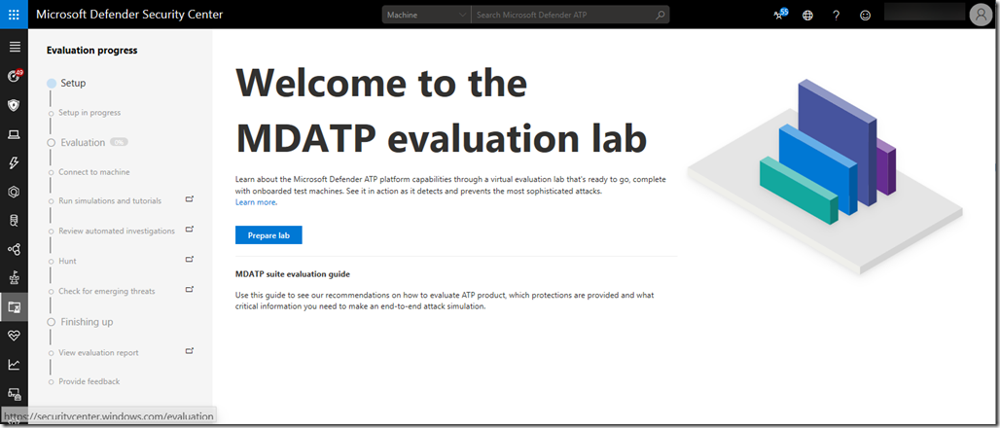
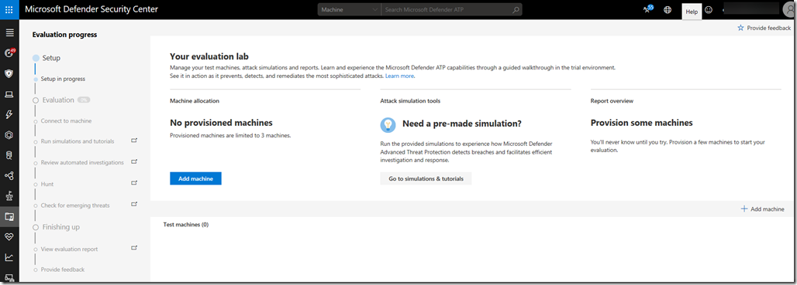
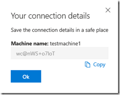
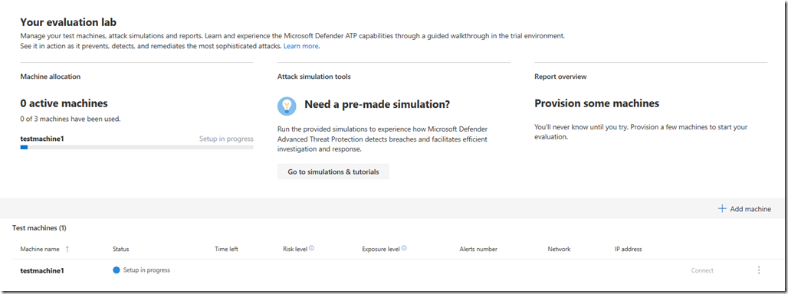
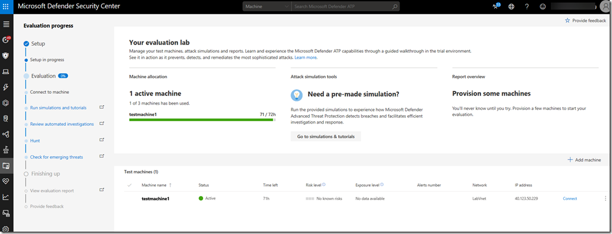
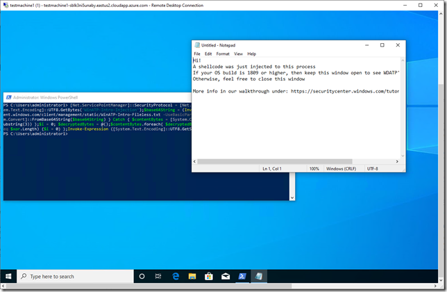
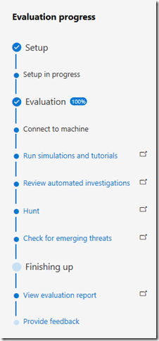
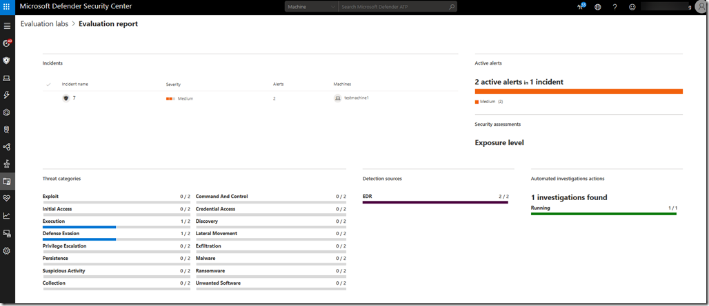
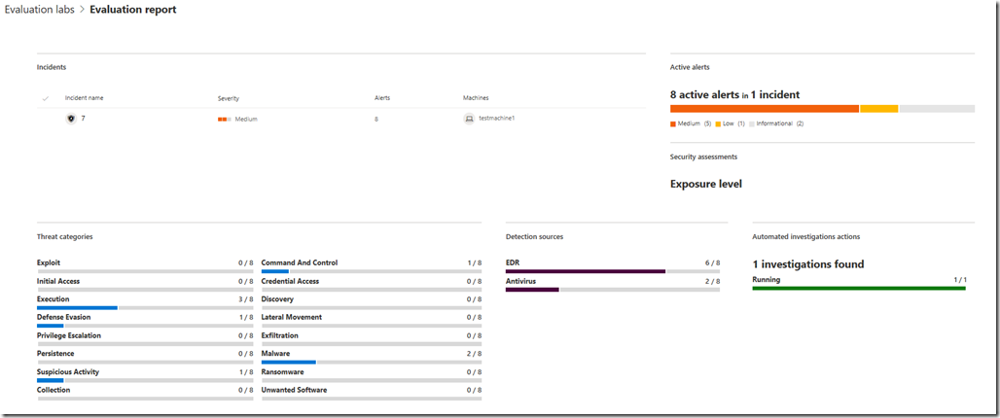

As with almost any solution, one of the time consuming activities is to get the prerequisites in place until you get things up and running, this is no different with Microsoft Defender Advanced Threat Protection. Although the solution itself is entirely hosted in the cloud, there are a few prerequisites on the client side that must be put in place before you can get your hands on MDATP. Getting these prerequisites in place is no rocket science but depending on the organization, even getting a few Windows 10 test clients prepared and a few service URLs approved to go through the firewall/proxy can trigger a lot of internal processes that must be reviewed, approved and executed. Going through such processes makes perfect sense when conducting a proof of concept / pilot or production deployment within an organizations production environment, but what if you have little time and just want to get an idea of how Microsoft Defender ATP works and want to see it in action?

There’s now a solution for that, called the **Microsoft Defender ATP Evaluation lab**.

When using the MDATP evaluation lab, you get instant access to up to three virtual machines that are hosted in a dedicated instance in Azure that are automatically onboarded and have all the software installed and clients configured to walk through the various scenarios and experience the power of Microsoft Defender Advanced Threat Protection.

All you need to run the MDATP Evaluation lab is an MDATP tenant (production or [trial](https://winatpregistration-prd.trafficmanager.net/UserAgreement?wt.mc_id=AID702266_QSG_245679&ocid=AID702266_QSG_245679)) and you must be able to use RDP to connect to the test clients. Please note that access to these test clients is provided for 3 days after you have provisioned the client, so I suggest that you plan your evaluation carefully and do not provision all three clients at once. Consider starting with one client, then add another one to simulate lateral movements and use the third one to share your findings with your colleagues and key stakeholders.

Let’s take a look how easy it is to launch the lab. When you open the evaluation lab page for the first time, you’ll see the **Prepare Lab** button, click it and within seconds your lab is ready to use.

Then click on the **Add Machine** button. Copy the password, you’ll need this one later to connect to the test machine. Note if you loose the password, you can reset the password.

Then wait until the test machine provisioning process is complete. Meanwhile you might want to look at the [Simulations and Tutorials](https://securitycenter.windows.com/tutorials) page that provides several hands on scenarios you can run to see MDATP in action.

As soon as the test machine is provisioned, you can connect to it through RDP, simply click on the **'Connect** button.

As mentioned earlier, these test machines are preconfigured with security configuration settings and have software and utilities pre-installed. For those interested in the details, take a look here:

"C:\Packages\Plugins\Microsoft.Compute.CustomScriptExtension\1.9.5\Downloads\0\RunConfigurations.log"
"C:\Packages\Plugins\Microsoft.Compute.CustomScriptExtension\1.9.5\Downloads\0\InstallOffice.log"
"C:\Packages\Plugins\Microsoft.Compute.CustomScriptExtension\1.9.5\Downloads\0\InstallPackages.log"
"C:\Packages\Plugins\Microsoft.Compute.CustomScriptExtension\1.9.5\Downloads\0\Main.log"
"C:\Packages\Plugins\Microsoft.Compute.CustomScriptExtension\1.9.5\Downloads\0\onboarding_v5.ps1"

Once connected, run something that triggers MDATP, in the example below  I used the script provided [in scenario 2](https://securitycenter.windows.com/tutorials).

Use the evaluation progress tracker to make sure that you don’t miss out on evaluating any of the important capabilities,

As you continue running simulations, either those provided by Microsoft or you own, the evaluation activities are nicely summarized in a report.

After running a few more simulations, the report is enriched with more information.

Note that all your test machines are provisioned within a dedicated Azure virtual network, so that ‘your’ test machines can communicate with each other.

To conclude, when planning deploying MDATP within an organizations network , I strongly recommend to spend enough time to ensure all prerequisites are in place, i.e. Windows Defender is configured properly, connectivity to MAPS and Defender service points is provided etc. etc. If you plan to run a stress free **evaluation** of MDATP and focus on the capabilities and features of MDATP, use the MDATP evaluation lab.

For additional Information see the below articles on the official Microsoft docs and tech community site

[Microsoft Defender ATP evaluation lab](https://docs.microsoft.com/en-us/windows/security/threat-protection/microsoft-defender-atp/evaluation-lab#evaluation-setup)

[Microsoft Defender ATP Evaluation lab is now available in public preview ](https://techcommunity.microsoft.com/t5/Microsoft-Defender-ATP/Microsoft-Defender-ATP-Evaluation-lab-is-now-available-in-public/ba-p/770271)

