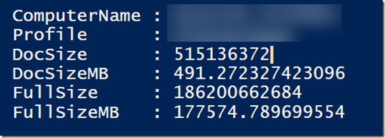
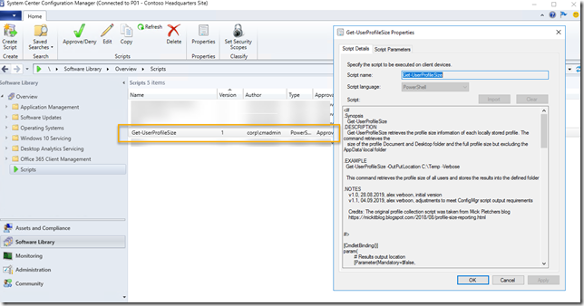
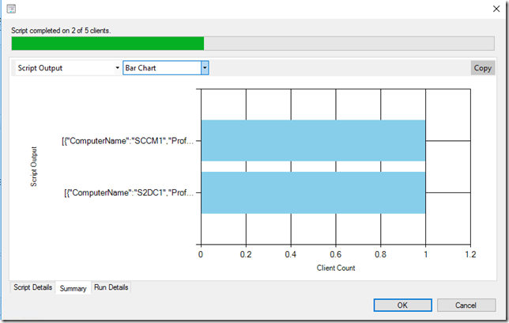
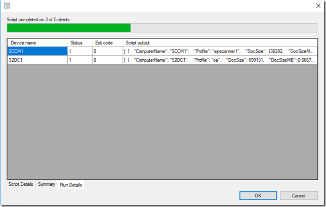
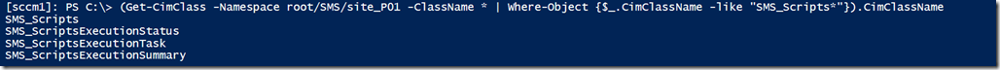
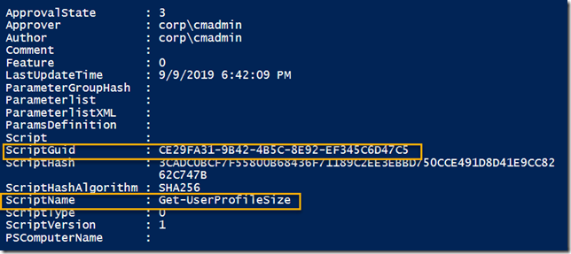
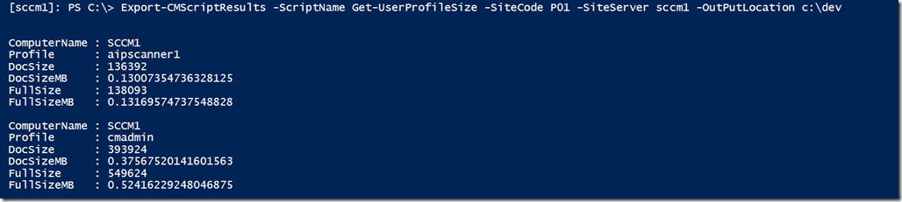

During a recent customer engagement I had to collect the size of user profiles across a large number of devices. I was first thinking of using a script that would collect the information we need, store it into a custom WMI table and then collect the data using ConfigMgr hardware inventory, but since we only needed a one time snapshot of this information I decided against that idea. The next option would be to go old school and run the script through Group Policy processing and store the results in a central location, but hey it’s 2019, no more logon scripts please  And then the idea came up to run the script on the target clients via ConfigMgr.

Just in case you’re not familiar with running PowerShell scripts via ConfigMgr, the basics are described here: [Create and run PowerShell scripts from the Configuration Manager console](https://docs.microsoft.com/en-us/sccm/apps/deploy-use/create-deploy-scripts)

Instead of reinventing the wheel from scratch I found a script on Mick Pletchers [blog](https://mickitblog.blogspot.com/2018/08/profile-size-reporting.html) that provided a good starting point to collect profile size information, I extended the script accordingly as we wanted to collect the following information.

- Computer name
- Profile Name
- Profile Size for the Documents and Desktop folder only
- Profile Size for the entire profile, except the AppData\local folder

You can find the code of the Get-UserProfileSize [here](https://gist.github.com/alexverboon/22a056ca04db0f758b2c3aca117bdaf8) on GitHub. When running the script locally, you get the following output.

Okay, so far no rocked science. Now let’s store the script into the ConfigMgr Script repository and run it against some devices.

Within the ConfigMgr console we can follow the status of the script execution.

and we also see the details of the script output. If we were to only collect one value, we could simply mark all the columns and copy paste it into excel. But since we collected multiple properties, the script output is stored in JSON format.

So this is where I started exploring where the data is stored within configmgr and how to extract it. The first place I usually look at is the SMS Provider, and there I found the following classes:

The SMS_Scripts class holds all registered scripts.

After exploring the other Classes, I created the Export-CMScriptResults cmdlet that allows me to extract the script results. Here’s what the script does.

First It will find the Script.

`$Script = Get-CimInstance -ComputerName $SiteServer -Namespace $Namespace -ClassName SMS_Scripts | Where-Object {$_.ScriptName -eq "$ScriptName"}`

Next it will retrieve the **last** Script execution

`$ExecTask = Get-CimInstance -ComputerName $SiteServer -Namespace $Namespace -ClassName SMS_ScriptsExecutionTask | Where-Object {$_.ScriptGuid -eq $Script.ScriptGuid} | Sort-Object ClientOperationId | Select-Object * -Last 1`

And finally it will retrieve the results

`$Summary = Get-CimInstance -ComputerName $SiteServer -Namespace $Namespace -ClassName SMS_ScriptsExecutionSummary | Where-Object {$_.TaskID -eq $ExecTask.TaskID}`

Here’s an example of the output.

A copy of the **Export-CMScriptResults.ps1** can be found [here](https://gist.github.com/alexverboon/e67fc2ecde3c2fbe44f6413cf20e00d9) on GitHub

