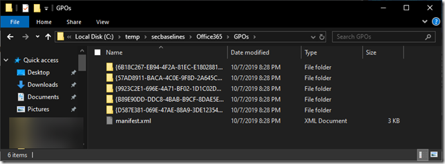
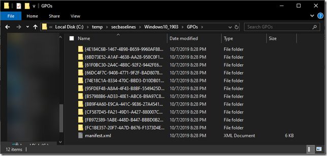
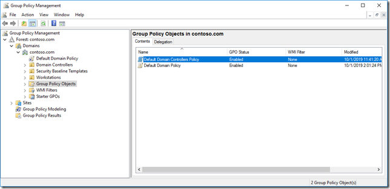
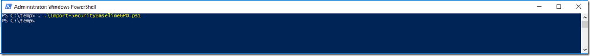
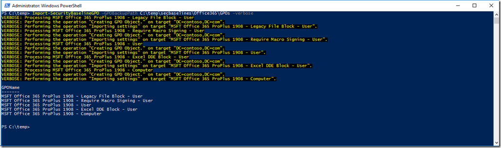
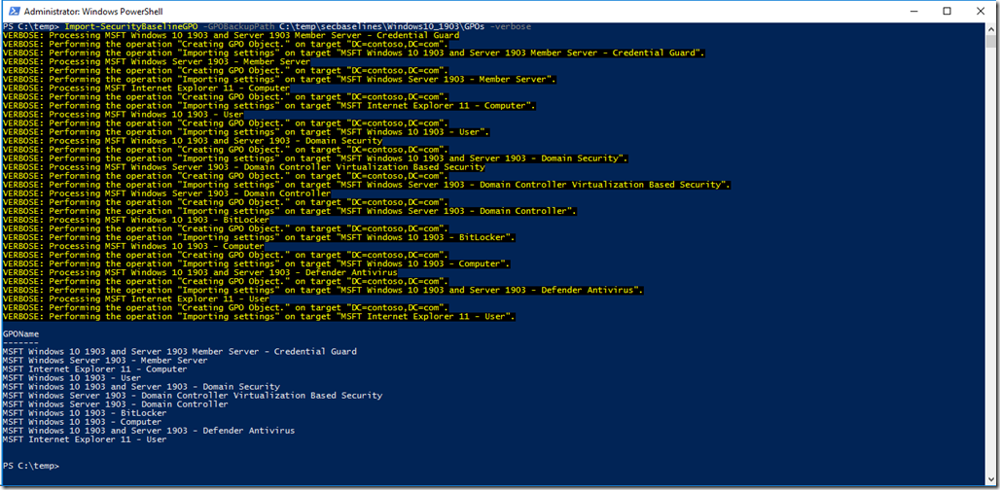
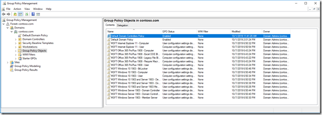

Okay there’s this rule , if you do something manually for the third time, it’s about time to think of automating it. Here’s a script that I created to create Group Policy Objects and import the security baseline settings. The script will work with any security baseline that is provided with Group Policy backups e.g. Microsoft Security baseline, CIS, NSA.

Let me show you this with an example:

First download the latest Microsoft Security baseline which is included in the Microsoft Security Compliance Toolkit. [https://www.microsoft.com/en-us/download/details.aspx?id=55319](https://www.microsoft.com/en-us/download/details.aspx?id=55319) there download Windows 10 Version 1903 and Windows Server Version 1903 Security Baseline - Sept2019Update.zip and Office365-ProPlus-Sept2019-FINAL.zip (or just the latest versions available).

Within each ZIP file you will find a folder called GPOs containing the GPO Backup files. Extract these GPOs as shown in the example below:

Before continuing, the script uses the Group Policy PowerShell cmdlets that come with the Group Policy Management console, so make sure you have the GPMC console and PowerShell module installed.

Below is a screenshot of the GPMC Console before importing the security baselines.

Next open PowerShell and load the function from the script or copy the function into PowerShell ISE and run it to load it. )whatever is your preferred method).

Then run the following commands to import the Windows and Office 365 security baselines:

Import-SecurityBaselineGPO -GPOBackupPath C:\temp\secbaselines\Office365\GPOs –verbose

Import-SecurityBaselineGPO -GPOBackupPath C:\temp\secbaselines\Windows10_1903\GPOs -verbose

and there we go, all security baselines imported.

That’s it for today, hope you enjoyed reading. Till next time.

Alex

