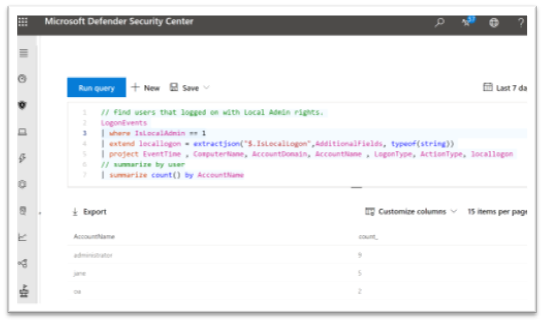
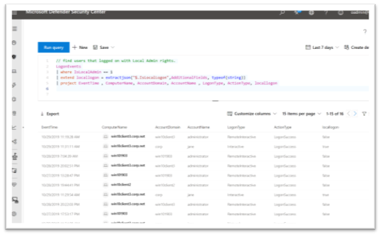

**Note**: I have updated the kql queries below, but the screenshots itself still refer to the previous (old) schema names

If you're among those administrators that use Microsoft Defender Advanced Threat Protection, here's a handy tip how to find out who's logging on with local administrators' rights. But first when would you want to run this? Well here are some scenarios I can think of:

- You want to find users that have local administrator rights on their devices.

- You introduced LAPS and instructed your IT support to no longer use their own credentials but use the LAPS Administrator and password. (here's a great article why you should do so. [Remote Use of Local Accounts: LAPS Changes Everything](https://blogs.technet.microsoft.com/secguide/2018/12/10/remote-use-of-local-accounts-laps-changes-everything/)

- You're proactively looking for suspicious behaviour

Or if you want to get more details about the computer and how they logged on (Remote Interactive, Interactive or via the network such as with PowerShell) simply comment out the summarize line in the kusto query code.

Yes I know screenshots with code aren't cool, so here again to copy paste:

**Update**: August 2020, i have updated the below query to work with the latest MDATP hunting schema

// Uses that logon with local admin rights summary

DeviceLogonEvents
| where IsLocalAdmin == 1
| extend locallogon = extractjson("$.IsLocalLogon",AdditionalFields, typeof(string))
| project Timestamp , DeviceName, AccountDomain, AccountName , LogonType, ActionType, locallogon
| summarize count() by AccountName

// users that logon on with Local Admin rights - detailed

DeviceLogonEvents
| where IsLocalAdmin == 1
| extend locallogon = extractjson("$.IsLocalLogon",AdditionalFields, typeof(string))
| project Timestamp , DeviceName, AccountDomain, AccountName , LogonType, ActionType, locallogon

