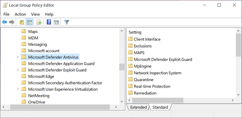
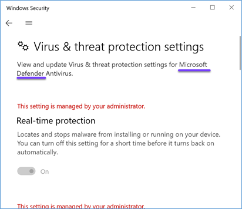
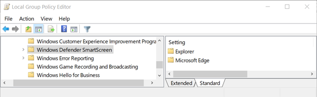
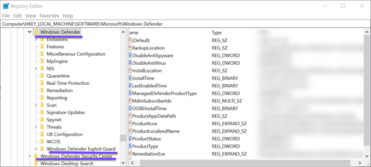
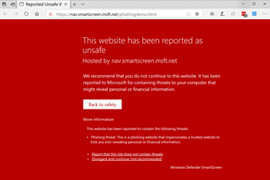
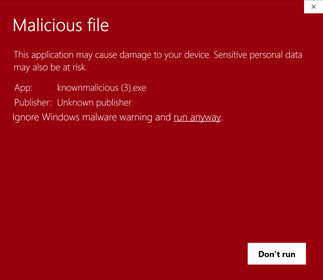
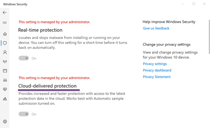
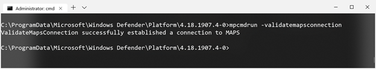
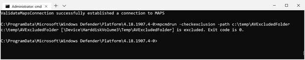

Due to my professional activity as a Cyber Security Consultant, I regularly speak with customers about Windows Defender and find that many are not fully aware of all the features and capabilities that Windows Defender offers. Also, when reviewing existing implementations, I've noticed a pattern of some common issues.

I guess the blog post title 'Windows Defender, more than just Antivirus' says it all. The objective of today's blog post is to provide you with a brief overview of Windows Defender and provide some advice on how to get the most out of it.

# History

If you're a long-time reader of my blog, you might know that I'm interested in technology history, so let's start there first. It was in November 2005 when Microsoft made the first announcement in a blog post about Windows Defender. [What's in a name?? A lot!! Announcing Windows Defender!](https://blogs.technet.microsoft.com/antimalware/2005/11/04/whats-in-a-name-a-lot-announcing-windows-defender/) We could even go further back in time Of Microsoft's history with Antivirus software like in 2004 when Microsoft [acquired Antispyware leader Giant](https://news.microsoft.com/2004/12/16/microsoft-acquires-anti-spyware-leader-giant-company/) software or in 1993 when Microsoft introduced [Microsoft Antivirus](https://en.wikipedia.org/wiki/MSAV) (MSAV) for MS-DOS 6.22. Windows Defender has been part of the Windows client operating system since Windows Vista and has since then been continuously improved until today where in 2019 Microsoft was named [a leader in the Endpoint Protections Platforms magic quadrants](https://www.microsoft.com/security/blog/2019/08/23/gartner-names-microsoft-a-leader-in-2019-endpoint-protection-platforms-magic-quadrant/).

# Features and capabilities that go under the term Windows Defender

When speaking about Windows Defender, people usually first think of Antivirus, that's absolutely correct, however Windows Defender is far more than just virus a scanner. Here's a summary of features that go with the name Windows Defender.

 	
- Windows Defender SmartScreen
 	
- Windows Defender Firewall
 	
- Windows Defender Exploit Guard
 	
- Windows Defender Credential Guard
 	
- Windows Defender Application Guard
 	
- Windows Defender Application Control (prior to Windows 10 1709 known as Defender Device Guard configurable code integrity policies)
 	
- Windows Defender Security Center
 	
- Windows Defender System Guard
 	
- Windows Microsoft Defender Advanced Threat Protection

# Windows Defender or Microsoft Defender?

In May 2019, Microsoft announced [Microsoft Defender ATP for Mac](https://techcommunity.microsoft.com/t5/Microsoft-Defender-ATP/Microsoft-Defender-ATP-for-Mac-now-in-open-public-preview/ba-p/634603), since then we've seen Microsoft starting to rename several components of Defender from Windows Defender to Microsoft Defender, simply because Defender is no longer limited to just run on Windows.

To be honest, I don't know whether Microsoft is still in the process of rebranding the individual features or not, but some of then still have Windows Defender in their name.

Anyway, under the hood, things most likely will remain at the same location for a while, because that can't just be changed overnight.

# Notes from the Field

As mentioned previously, when working with customers, now and then I see a common pattern of issues or some capabilities not being used at all. I won't be able to go through the complete feature set in this blog post, so I just highlight a few of them now.

## Windows Defender SmartScreen

Windows Defender SmartScreen Protects users when visiting known phishing or malware sites or downloading potentially malicious files. Before Windows 10, version 1703 this feature was called the SmartScreen Filter when used within the browser and Windows SmartScreen when used outside of the browser.

I strongly encourage people to enable Windows Defender SmartScreen for Edge/Internet Explorer, Windows Explorer and the Microsoft Store Apps and to configure to block and not allow users to bypass warnings. My argument here is that for most people at work, there is no requirement to download and install software as usually their IT department takes care of that and if a website gets blocked due to its bad reputation, there's most likely a good reason for that. Instead of allowing users to download content by themselves, setup an internal process where users can request something to be downloaded for them, where IT can make sure the content is clean, prior handing out the content to end users.

When it comes to configuring Windows Defender settings through Group Policy management there is a bit of a history here, not sure why, but SmartScreen settings got moved around quite a bit within the Administrative Template structure. If it's been a while since you last visited these settings, I suggest you read this online documentation. [Available Windows Defender SmartScreen Group Policy and mobile device management (MDM) settings](https://docs.microsoft.com/en-us/windows/security/threat-protection/windows-defender-smartscreen/windows-defender-smartscreen-available-settings).

If you're interested or need to now the impact of setting restrictive Windows Defender SmartScreen settings, you can either pull the results from the Windows Eventlog or if you have Microsoft Defender Advanced Threat Protection in place use the Advanced Hunting capability.

Windows Defender SmartScreen Events, when logging is enabled, are written to the following Windows Event Log: Microsoft-Windows-SmartScreen

  

**Event ID**
**Description**

**1000 **
Application SmartScreen Event 

**1001 **
Uri SmartScreen Event 

**1002**
User Decision SmartScreen Event

When using Microsoft Defender ATP, you can use the following advanced hunting queries:

 

**SmartScreen Event Totals**

MiscEvents

| where ActionType contains "smartscreen"

| summarize count() by ActionType

 

**SmartScreen Event – App Warnings**

MiscEvents

| where ActionType contains "SmartScreenAppWarning"

| summarize count() by FileName

For more details about Windows Defender SmartScreen see: [Windows Defender SmartScreen](https://docs.microsoft.com/en-us/windows/security/threat-protection/windows-defender-smartscreen/windows-defender-smartscreen-overview)

## Microsoft Windows Defender Antivirus

### Cloud based protection aka MAPS

In the old days, Antivirus software relied on definition updates, in simple words these are a set of files that contain detection logic to identify threats. Nowadays Microsoft releases several security intelligence updates per day (Take a look here: [Security intelligence updates for Windows Defender Antivirus and other Microsoft antimalware](https://www.microsoft.com/en-us/wdsi/defenderupdates)) But with thousands of threats out there we can just rely on so-called definition updates anymore, that's why Microsoft Defender Antivirus also uses cloud based protection. To learn more about cloud based protection, I suggest you read [Use next-gen technologies in Windows Defender Antivirus through cloud-delivered protection](https://docs.microsoft.com/en-us/windows/security/threat-protection/windows-defender-antivirus/utilize-microsoft-cloud-protection-windows-defender-antivirus).

Enabling Cloud enabled protection, is pretty straight forward, as it's just one setting, nevertheless I see many customers not enabling it or it's not working. So here a few tips.

Enabling cloud-based protection for Microsoft Defender Antivirus is really simple and requires just one configuration setting. The actual setting name varies depending on where you configure it. If you're using Microsoft Intune for managing the Defender Antivirus configuration the setting is called Cloud-delivered protection, if you use Group Policy the it's **Join Microsoft MAPS, **when using System Center Configuration Manager antimalware policies the setting is called **Cloud Protection Service membership** and finally you can also configure this setting manually within Defender Security Center or through PowerShell.

 

**Enable Cloud protection for Defender Antivirus with PowerShell**

Set-MpPreference -MAPSReporting Advanced**
**

Another often used term for the Microsoft Cloud Protection service is MAPS which stands for Microsoft Advanced Protection Service. One option to check if MAPS is enabled on your client is to run the following command from an elevated prompt.

mpcmdrun -validatemapsconnection

If all is working as expected you get the following result.

Please also consider reading my earlier blog posts about MAPS, [Testing Windows Defender MAPS Connectivity with PowerShell](https://www.verboon.info/2019/07/testing-windows-defender-maps-connectivity-with-powershell/) and [Monitoring Windows Defender Cloud Protection Service connectivity with ConfigMgr](https://www.verboon.info/2019/07/monitoring-windows-defender-cloud-protection-service-connectivity-with-configmgr/)

### The program folder

If you look at the above screenshot, you might have noticed that the mpcmdrun.exe is located underneath the ProgramData folder and that the path underneath the Platform folder contains a number. First, in the early days, Windows Defender was located under %ProgramFiles%\Windows Defender but was then moved to %ProgramData%\Microsoft\Windows Defender\Platform\<Version where version relates to the currently installed engine version. If you take a look on your computer, hou might find several version folders, but don't worry, Defender takes care of them by itself and will remove no longer needed versions.

### Exclusions

Antivirus exclusions are really a hot topic, when doing it wrong, not only can this have a huge impact on performance, but it also provides an entry point to those with malicious intends. We are all good at adding stuff, but usually no-one cares about cleaning up. Here's an example. If I intended to hack your company, I would start with gathering information, at some point I find out that you use Citrix, later I find out that you have been using Citrix for many years already. So quit likely that at some time you had the Citrix Program Neighborhood client installed, so there's a big chance that there were some AV exclusions in place for this although the software itself isn't deployed anymore since a long time.

Believe me, I don't' make up this example, last year I visited a customer where we migrated from a 3rd party AV solution to Microsoft Defender on both Servers and Clients, reviewing the existing configured exclusions that should be considered to be adopted into the defender exclusions made me going down the memory lane back into the early 2000s. There were SQL Server 2000 exclusions, old Citrix Client and SAP Client versions etc. etc. So, if I had malicious intends, I would try to place my payload exactly in these locations.

Bottom line I strongly recommend putting in place a solid process for managing Defender antivirus exclusions and this should also include reviewing existing exclusions on a regular basis. If you do it right, you should document each exclusion with information why it's needed, who requested it and to what software it relates.

The below table points to some Microsoft and 3rd party vendor articles related to antivirus exclusions.

  

**Vendor / Product**
**Reference**

**Microsoft Windows 10**
Virus scanning recommendations for Enterprise computers that are running currently supported versions of Windows.

[https://support.microsoft.com/en-us/help/822158/virus-scanning-recommendations-for-enterprise-computers-that-are-runni](https://support.microsoft.com/en-us/help/822158/virus-scanning-recommendations-for-enterprise-computers-that-are-runni)

**ConfigMgr**
For Clients and Servers running System Center Configuration Manager Agent

[https://blogs.technet.microsoft.com/systemcenterpfe/2017/05/24/configuration-manager-current-branch-antivirus-update/](https://blogs.technet.microsoft.com/systemcenterpfe/2017/05/24/configuration-manager-current-branch-antivirus-update/)

**Citrix **
Endpoint Security and Antivirus Best Practices

[https://docs.citrix.com/en-us/tech-zone/build/tech-papers/antivirus-best-practices.html](https://docs.citrix.com/en-us/tech-zone/build/tech-papers/antivirus-best-practices.html)

As mentioned in the referenced article, exclusions are usually not needed for the Citrix Receiver.

**Microsoft App-V**
App-V 5 and Security Software (Anti-Virus, Application Protection, and Software Inventory) Guidelines

[https://social.technet.microsoft.com/wiki/contents/articles/34034.app-v-5-and-security-software-anti-virus-application-protection-and-software-inventory-guidelines.aspx](https://social.technet.microsoft.com/wiki/contents/articles/34034.app-v-5-and-security-software-anti-virus-application-protection-and-software-inventory-guidelines.aspx)

**Bromium**
[https://support.bromium.com/s/article/Bromium-and-Third-Party-Software-Interoperability-Guide](https://support.bromium.com/s/article/Bromium-and-Third-Party-Software-Interoperability-Guide)

**Ivanti Environment Manager**
[https://forums.ivanti.com/s/article/Recommended-Anti-Virus-and-AppSense-Exclusions](https://forums.ivanti.com/s/article/Recommended-Anti-Virus-and-AppSense-Exclusions)

Tip: if you want to verify whether a particular file or folder is really excluded run the following command

mpcmdrun -checkexclusion -path c:\temp\AVExcludedFolder

# Part 2 coming soon

Knowing that many people don't have the time (or patience) to read through long blog posts and the fact that I am getting hungry, I just added a 'Part 1' to the title. In Part 2 I will continue to highlight some of the other Windows / Microsoft Defender features and capabilities.

Thanks for reading and have a great day

Alex

