**Update 11 January 2020** - Microsoft has updated the Advanced Hunting Schema, so ComputerName is now **DeviceName** in the queries.

Just recently Microsoft [announced](https://techcommunity.microsoft.com/t5/Microsoft-Defender-ATP/Reducing-risk-with-new-Threat-amp-Vulnerability-Management/ba-p/978145) that the Defender ATP advanced hunting schema was extended with the following tables:

- DeviceTvmSoftwareInventoryVulnerabilities

- DeviceTvmSoftwareVulnerabilitiesKB

- DeviceTvmSecureConfigurationAssessment

- DeviceTvmSecureConfigurationAssessmentKB

This allows us to run advanced hunting queries to find and extract Defender ATP TVM data.

https://gist.github.com/alexverboon/d22727c0c8f0d8ca32953b5e2c79ba7f

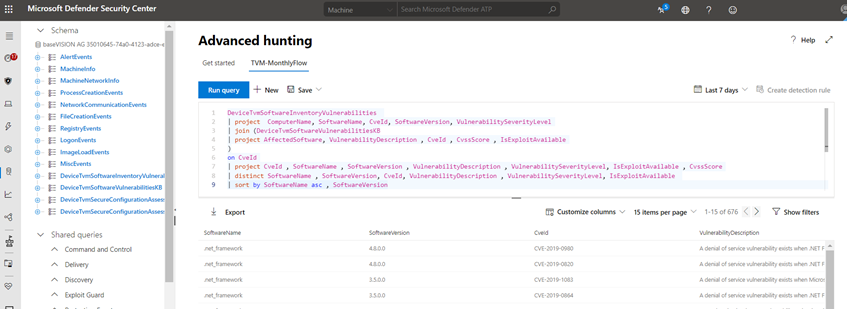

Now the people in your organization who are responsible for threat and vulnerability management might not necessarily have the knowledge of using the advanced hunting query language or are provided access to the Defender ATP console. So why not just send them a monthly report? Following is how to create a monthly Defender ATP TVM report using advanced hunting and Microsoft Flow.

Within Microsoft Flow, start with creating a new scheduled flow, select **from blank**.

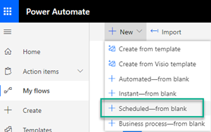

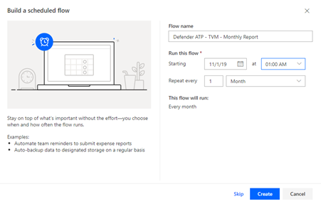

Within the Recurrence step, select Advanced options and adjust the time zone and time as per your needs.

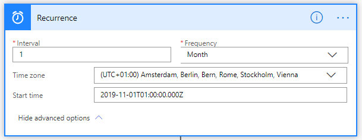

Within the Advanced Hunting action of the Defender ATP connector we use the following advanced hunting query.

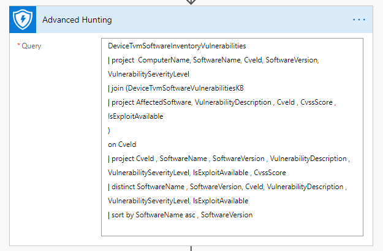

Next, we convert the data into CSV

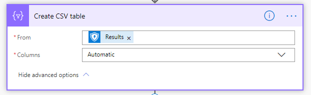

And then we save the CSV file to a SharePoint or OneDrive location. The below example saves the file to a folder in my personal OneDrive.

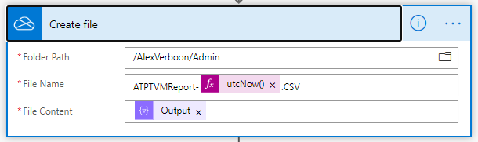

Next, we fetch the content, so we can use it as an attachment.

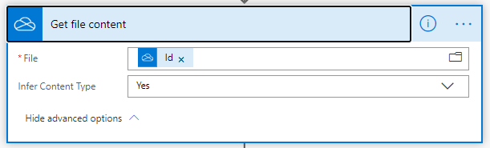

Now we run another advanced hunting query, so we get some numbers that we can add into our e-mail message.

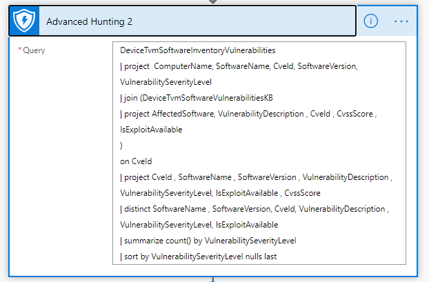

The results of the summary are now converted into a HTML table, that we embed into the e-mail message body.

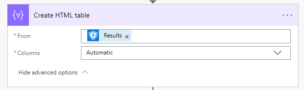

And finally, we compose the e-mail.

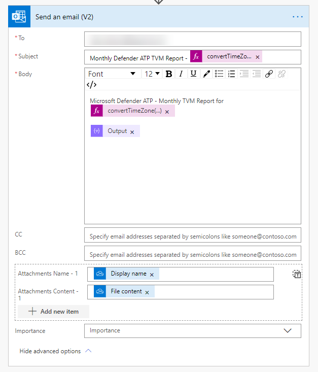

When all steps and actions are configured, we test the flow and if all goes well we get a summary as shown below.

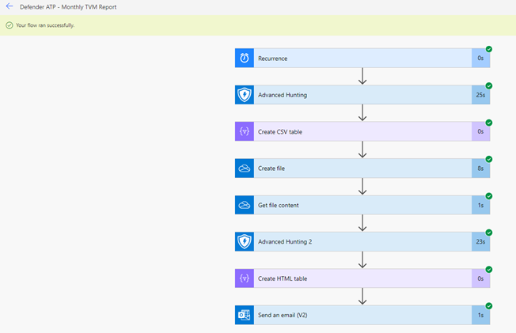

And an e-mail in our inbox.

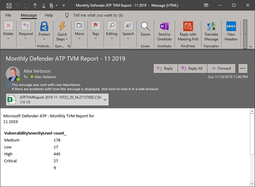

That's it for today, hope this provided you with some inspiration on how to share Defender ATP Threat and Vulnerability information.

Have a great day

Alex

