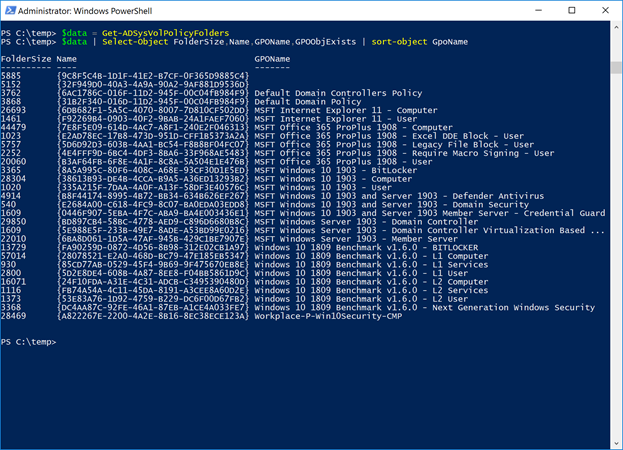
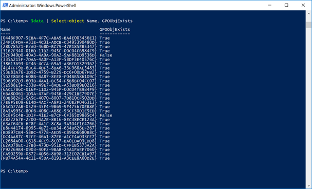

G'day everyone. Today I was working on a Microsoft Security Configuration baseline implementation and while browsing through the Sysvol folder I got the impression that there are less GPO objects stored within AD compared to the number of GPO content folders located within the Sysvol\Policies folder. As we speak about several hundred folders here, too many to count manually, and so another PowerShell script was born.

Now if the terms SYSVOL, policies folder doesn't mean anything to you, I suggest you first read this article from Darren (@grouppolicyguy) [Understanding Group Policy Storage](https://sdmsoftware.com/gpoguy/whitepapers/understanding-group-policy-storage/).

Okay, back to the script, no magic here, first it retrieves all folders located within the Sysvol \ Policies folder and then checks whether there is a corresponding GPO object for it. While looping through each folder, some GPO information is collected and added to the output.

That's it. Happy housekeeping and if you want to give it a try, here's the code.

