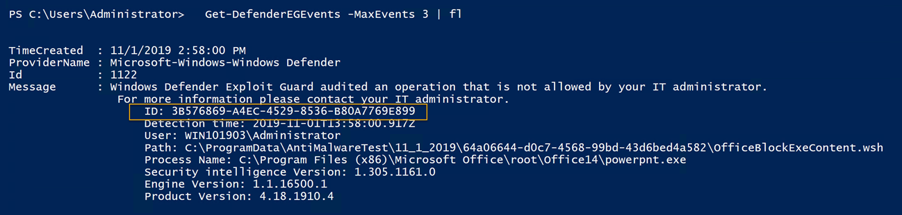
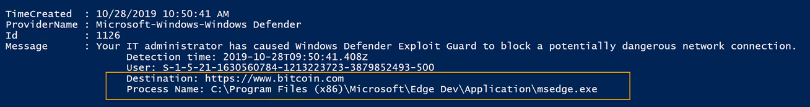
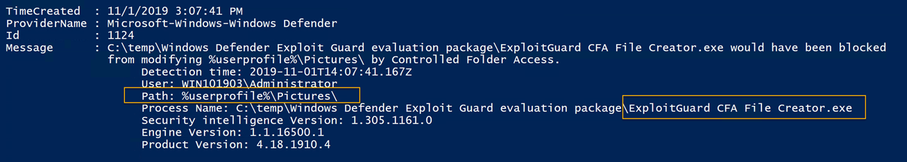
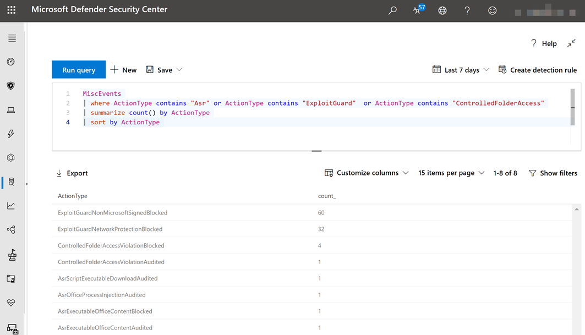
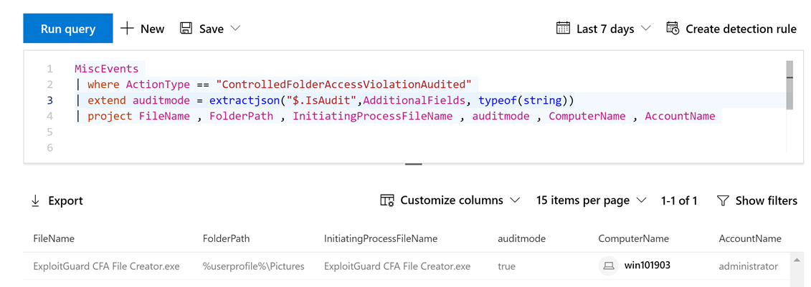
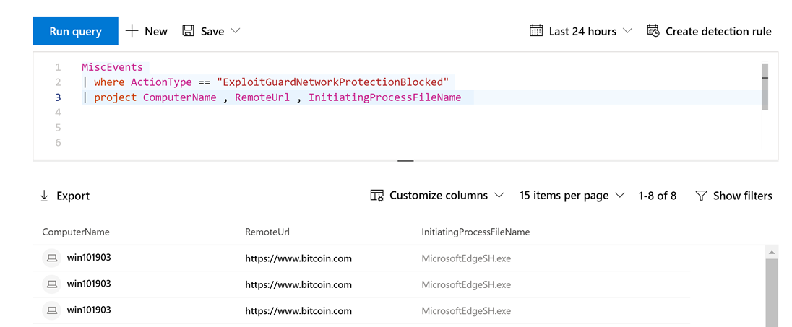
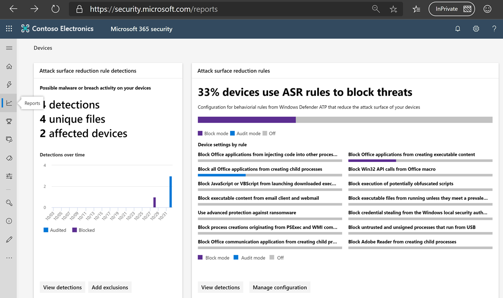
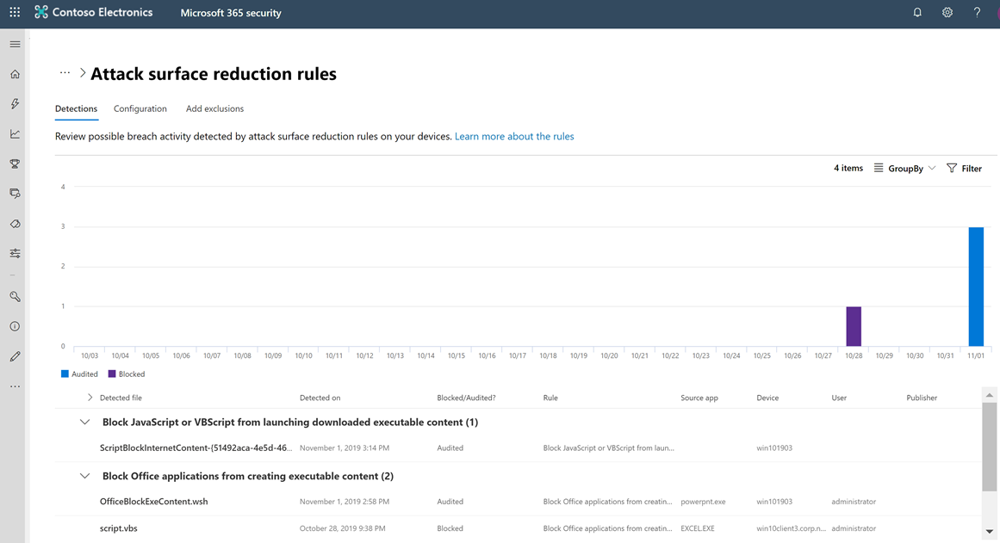
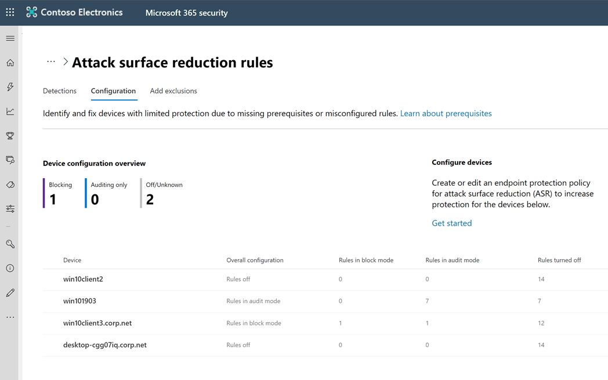
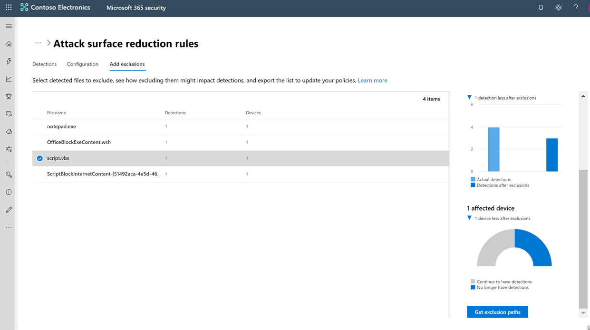

In the [previous post](https://www.verboon.info/2019/10/windows-defender-more-than-just-antivirus-part-1/) I provided an overview of the history of Windows Defender and an overview of the various features that have the name Windows Defender in them. When then looked at Windows Defender SmartScreen and Windows Defender Cloud based protection. Today I'd like to continue with my notes from the field and personal experiences and take a look at Windows Defender Exploit guard. Again, the objective of this blog post is to inspire you getting the most out of the Defender feature set to improve your security posture.

# Windows Defender Exploit Guard

First let's get rid of the wrong assumption out of the way that you need a Windows 10 E5 license to use Windows Defender Exploit Guard because you can and are allowed to use Exploit Guard as well with a Windows 10 E3 license. The thing with the E5 license is that you get more management capabilities such as monitoring the impact when auditing or enabling blocking rules.

Windows Defender Exploit guard consist of four components:

 	
- **Attack Surface Reduction (ASR):** A set of controls that enterprises can enable to prevent malware from getting on the machine by blocking Office-, script-, and email-based threats
 	
- **Network protection:** Protects the endpoint against web-based threats by blocking any outbound process on the device to untrusted hosts/IP through Windows Defender SmartScreen
 	
- **Controlled folder access:** Protects sensitive data from ransomware by blocking untrusted processes from accessing your protected folders
 	
- **Exploit protection:** A set of exploit mitigations (replacing EMET) that can be easily configured to protect your system and applications.

If you are totally unfamiliar with Windows Defender Exploit Guard, I suggest you read [Windows Defender Exploit Guard: Reduce the attack surface against next-generation malware](https://www.microsoft.com/security/blog/2017/10/23/windows-defender-exploit-guard-reduce-the-attack-surface-against-next-generation-malware/) first and then continue reading here.

Please note that the first three components require that [always on protection](https://docs.microsoft.com/en-us/windows/security/threat-protection/windows-defender-antivirus/configure-real-time-protection-windows-defender-antivirus) for Windows Defender must be enabled.

## Manageability and monitoring

Before looking at each individual component , let's first clarify the topic about manageability and monitoring.

### Configuring and deploying exploit guard settings

Depending on how you manage your clients, you can use on of the following methods to configure and deploy Windows Exploit Guard features.

 	
- Group Policy Management
 	
- System Center Configuration Manager
 	
- Microsoft Intune
 	
- PowerShell
 	
- Windows Security App

For more information see:

 	
- [Enable exploit protection](https://docs.microsoft.com/en-us/windows/security/threat-protection/microsoft-defender-atp/enable-exploit-protection)
 	
- [Enable network protection](https://docs.microsoft.com/en-us/windows/security/threat-protection/microsoft-defender-atp/enable-network-protection)
 	
- [Enable controlled folder access](https://docs.microsoft.com/en-us/windows/security/threat-protection/microsoft-defender-atp/enable-controlled-folders)
 	
- [Enable attack surface reduction rules](https://docs.microsoft.com/en-us/windows/security/threat-protection/microsoft-defender-atp/enable-attack-surface-reduction)

### Monitoring impact and effectiveness

You see, enabling and deploying these features is pretty straight forward. But depending on your environment enabling some of these features can negatively impact users, so what you want to do is monitor the possible impact and deploy these settings in a controlled manner.

With the exception of certain exploit protection rules, most of the features and rules can be configured to run in audit or in block mode. But regardless of the mode used, all results are always written into the Windows Event log.

**Feature**
**Event Log**
**Event ID**
**Description**

**attack surface reduction**
Microsoft-Windows-Windows-Defender/Operational
5007
Event when settings are changed

1121
Event when an attack surface reduction rule fires in block mode

1122
Event when an attack surface reduction rule fires in audit mode

**network protection**
Microsoft-Windows-Windows-Defender/Operational
5007
Event when settings are changed

1125
Event when a network connection is audited

1126
Event when a network connection is blocked

**controlled folder access**
Microsoft-Windows-Windows-Defender/Operational
5007
Event when settings are changed

1124
Audited controlled folder access event

1123
Blocked controlled folder access event

**Exploit Protection**
Security-Mitigations (Kernel Mode/User Mode)
1
ACG audit

3
Do not allow child processes audit

5
Block low integrity images audit

7
Block remote images audit

9
Disable win32k system calls audit

11
Code integrity guard audit

If you start experimenting with the various Windows Exploit Guard features on your own computer, you will want to examine the exploit guard event logs. For this I wrote a PowerShell cmdlet that helps you to easily retrieve these logs. When interested read: [Retrieving Windows Defender Exploit Guard Windows Event logs with PowerShell](https://www.verboon.info/2019/05/retrieving-windows-defender-exploit-guard-windows-event-logs-with-powershell/).

The below example shows the log result of an audited ASR Rule. Take note of the referende ID as it relates to the corresponding ASR Rule, in this case 'Block Office applications from creating executable content'. You find a list of all possible IDs [here](https://docs.microsoft.com/en-us/windows/security/threat-protection/microsoft-defender-atp/attack-surface-reduction). 

The next example shows the log result of a blocked network protection rule. Here Defender ATP custom indicators were used where I configured to block access to the domain shown below.

And here we see the result when auditing controlled folder access. Exploit Guard CFA File creator.exe was detected as it writes to a user protected folder. When deploying this in production, you will first want to identify these events and add any legitimate software to the CFA allowed applications configuration.

Okay, so you have tried out these settings on your own system and decided to move forward and deploy this to a number of test clients, pilot group however you name the within your organization. In any case as mentioned earlier , some of these rules could negatively impact your users, so you will want to monitor the effect, either by running, where possible, the rule in audit mode or in block mode. And here is where we get back to the E3 or E5 licensing topic. Here's how Microsoft explains it:

*To use ASR rules, you need either a Windows 10 Enterprise E3 or E5 license. We recommend an E5 license so you can take advantage of the advanced monitoring and reporting capabilities available in Microsoft Defender Advanced Threat Protection (Microsoft Defender ATP). These advanced capabilities aren't available with an E3 license, but you can develop your own monitoring and reporting tools to use in conjunction with ASR rules.*

What this means is that if you are already doing Windows Event log forwarding either through native Windows Event Forwarding, Azure Log Analytics or any other 3rd party event collection solution, you should include the above described events in your log collection so that you can review the results. If you don't have a Windows Event log forwarding in place but have a Windows 10 Enterprise E5 license, you can use the Microsoft Defender Advanced Threat Hunting capability to analyze the log results.

When running the following advanced hunting query, we get a summary of exploit guard events.

MiscEvents

| where ActionType contains "Asr" or ActionType contains "ExploitGuard"  or ActionType contains "ControlledFolderAccess"

| summarize count() by ActionType

| sort by ActionType

So to find the results when auditing Windows Defender Exploit Guard Controlled folder access we run the following querry:

MiscEvents

| where ActionType == "ControlledFolderAccessViolationAudited"

| extend auditmode = extractjson("$.IsAudit",AdditionalFields, typeof(string))

| project FileName , FolderPath , InitiatingProcessFileName , auditmode , ComputerName , AccountName

And here an example to find Windows Defender Network Protection logs.

MiscEvents

| where ActionType == "ExploitGuardNetworkProtectionBlocked"

| project ComputerName , RemoteUrl , InitiatingProcessFileName

But wait there's more, when opening [https://security.microsoft.com](https://security.microsoft.com) under the Reports node, we find more information about our ASR deployment.

When going to the details page by selecting 'View detections' we get more detailed results of the audited or blocked rules. Use the 'GroupBy' option to group the results by rule, Device, Application etc.

Here we see an overview of how many clients receive ASR rules and whether they run in audit or block mode.

And finally we can use the 'add exclusions' node to see the impact and get the exclusion information that we would need to configure to mitigate possible issues.

Good, now just in case all this has triggered an interest in looking closer at Windows Defender Exploit guard, below are some additional refences , blog posts I recommend reading.

 	
- [Windows Defender Exploit Guard ASR VBScript/JS Rule](https://www.darkoperator.com/blog/2017/11/6/windows-defender-exploit-guard-asr-vbscriptjs-rule)
 	
- [Windows Defender Exploit Guard ASR Rules for Office](https://www.darkoperator.com/blog/2017/11/11/windows-defender-exploit-guard-asr-rules-for-office)
 	
- [Windows 10: Windows Defender Exploit Guard-Attack Surface Reduction rules](https://blogs.technet.microsoft.com/yongrhee/2019/02/24/windows-10-windows-defender-exploit-guard-attack-surface-reduction-rules/)
 	
- [Windows 10: Windows Defender Exploit Guard-Exploit Protection](https://blogs.technet.microsoft.com/yongrhee/2019/02/21/windows-10-windows-defender-exploit-guard-exploit-protection/)
 	
- [Assessing the effectiveness of a new security data source: Windows Defender Exploit Guard](https://medium.com/palantir/assessing-the-effectiveness-of-a-new-security-data-source-windows-defender-exploit-guard-860b69db2ad2)
 	
- [Hunting Windows Defender Exploit Guard with ATP](http://blog.sec-labs.com/2019/04/hunting-windows-defender-exploit-guard-with-atp/)

That's it for today, stay tuned for Part 3 of this series anytime soon.

