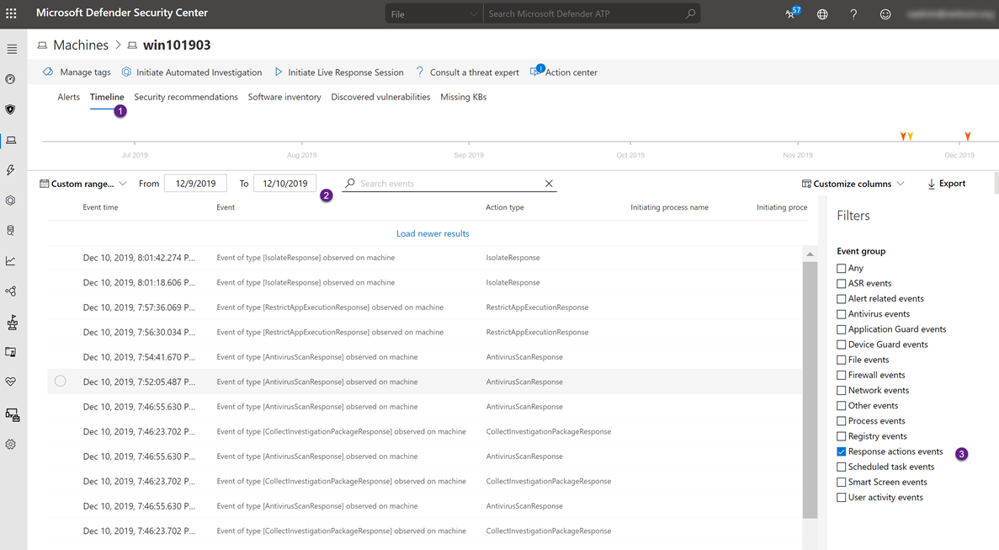
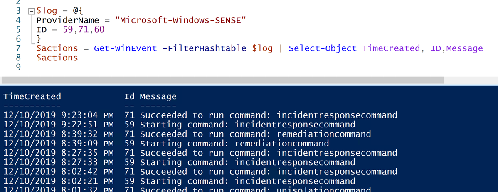

Hey there, to be honest I had some difficulties to find the right title for todays blog post, so if you are still wondering here's what this is all about. I had a customer asking me "*how can we see what MDATP Respond actions were taken on a particular machine both from a Console and client perspective?*". At the time of writing this blog post we have the following machine response actions that trigger a remote action available for MDATP managed devices.

 	
- Initiate Automated Investigation
 	
- Initiate Live Response Session
 	
- Collect investigation package
 	
- Run antivirus scan
 	
- Restrict app execution
 	
- Isolate machine

# Console View

If you want to see the response actions that were taken on a machine, go to the **machine** detail page, select the **Timeline** option, set the **time range** and then set the filter to **Response Action Event** and there you go, you see all the response action events.

# Client View

Okay now let's have a look on the client itself. Here we look at the Windows event log provider for Microsoft Defender Advanced Threat Protection that is **Microsoft-Windows-SENSE**

  

**Event ID**
**Description**

59
Starting command:

60
Failed to run command:

71
Succeeded to run command:

So if now we pull just these events from the MDATP Event log, we see all the individual actions.

The mapping of the response actions to the event message is as following:

  

**Console Response Action**
**Event Message**

Initiate automated investigation
remediationcommand

Initiate live response session
incidentresponsecommand

Collect investigation package
forensicscollectioncommand

Run antivirus scan
scancommand

Restrict app execution
Restrictexecutioncommand unrestrictexecutioncommand

Isolate machine
Isolationcommand

unisolationcommand

That's it for today, hope you enjoyed reading

Alex

