On December 16th
[Joey](https://twitter.com/joeyaiello)
[announced](https://devblogs.microsoft.com/powershell/announcing-the-powershell-7-0-release-candidate/) the availability of the PowerShell 7.0 release candidate. Time to look at the configuration options. Since I'm interested in the aspects of managing these settings within an enterprise environment, I closely followed the discussions on GitHub here [https://github.com/PowerShell/PowerShell/pull/10468](https://github.com/PowerShell/PowerShell/pull/10468) and here [https://github.com/PowerShell/PowerShell/issues/9309](https://github.com/PowerShell/PowerShell/issues/9309) and the outcome of these discussions is documented here [https://github.com/PowerShell/PowerShell-RFC/blob/master/4-Experimental-Accepted/RFC0041-Policy.md](https://github.com/PowerShell/PowerShell-RFC/blob/master/4-Experimental-Accepted/RFC0041-Policy.md)

# Installation

Now let's look what options we have for the configuration of logging PowerShell 7 events. Let's start with installing PowerShell 7.0 RC1. All download packages are listed here [https://github.com/PowerShell/PowerShell/releases/tag/v7.0.0-rc.1](https://github.com/PowerShell/PowerShell/releases/tag/v7.0.0-rc.1) There are multiple options available for installing PowerShell 7 on Windows (AppX, ZIP, MSI) but for this demonstration I use the MSI based installer. [https://github.com/PowerShell/PowerShell/releases/download/v7.0.0-rc.1/PowerShell-7.0.0-rc.1-win-x64.msi](https://github.com/PowerShell/PowerShell/releases/download/v7.0.0-rc.1/PowerShell-7.0.0-rc.1-win-x64.msi)

When installing PowerShell 7, make sure to enable the 'Register Windows Event Logging Manifest".

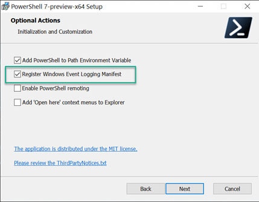

When the installation is complete, PowerShell 7 is installed within the following directory: **C:\Program Files\PowerShell\7-preview**

# Group Policy Administrative Template for PowerShell 7

Bering a curious person, first thing I usually do whenever installing something is to browse through the installed files and registry and look at the content whenever possible. Here we find the script 'InstallPSCorePolicyDefinitions.ps1'  all this script does is copying the group policy administrative templates for PowerShell7 into the local Policy Definitions folder of the system.

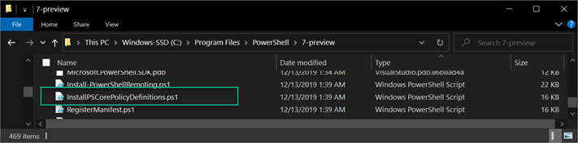

Thus, If you want to manage PowerShell 7 on your AD joined devices, grab these files and add them to your Group Policy Central store.

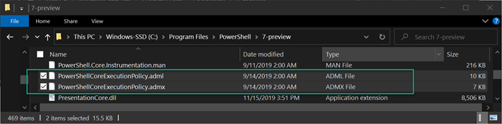

I am going to continue the further configuration on the local computer, so let's copy the administrative templates using the provided script.

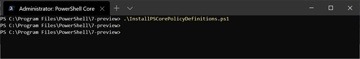

Within the Policydefinitions folder we now have the administrative template for Windows PowerShell 5.1 (PowerShellExecutionPolicy.admx) and for PowerShell (Core) 7 (PowerShell**Core**ExecutionPolicy.admx. (of course, with the corresponding adml language files within the en-US sub folder).

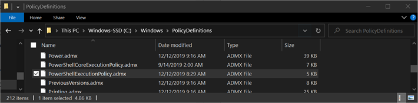

# The configuration settings

When opening the Group Policy editor, you will find the new settings for PowerShell 7 as shown below.

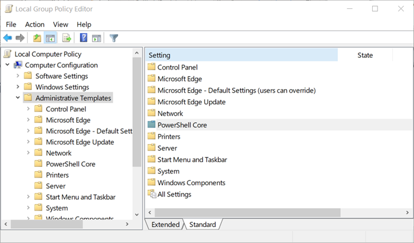

While the settings for Windows PowerShell 5.1 are still located here:

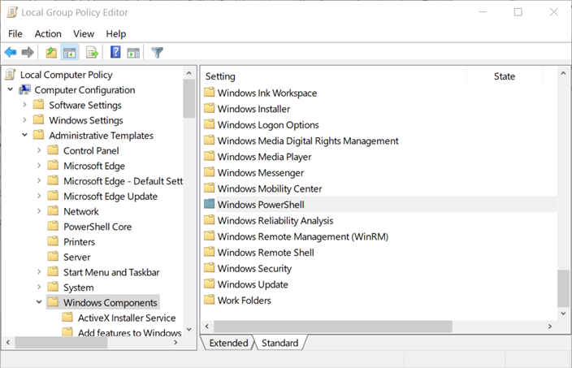

When looking at the available settings for PowerShell logging they don't look any different from the ones we use for PowerShell 5.

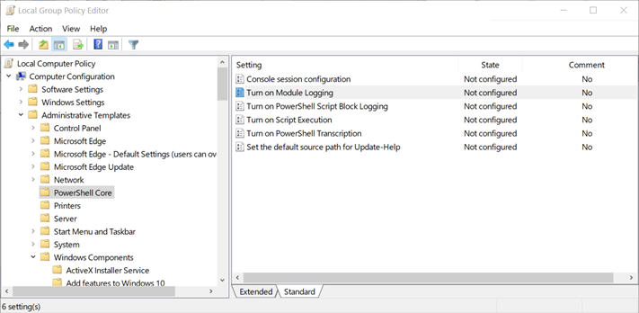

But when opening the individual settings, we see a new option. '**Use Windows PowerShell Policy setting**'

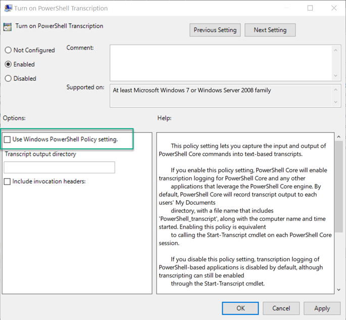

This is the **Policy settings Setting Fall-Back** that is described within the [PowerShell Core Policy RFC](https://github.com/PowerShell/PowerShell-RFC/blob/master/4-Experimental-Accepted/RFC0041-Policy.md) So if you already have PowerShell logging enabled for Windows PowerShell, you can simply adopt the same settings for PowerShell (Core) 7 by enabling all the settings and set the **Use Windows PowerShell Policy setting**' to enabled.

# The Windows Event Log

With regards to Windows Event logging, PowerShell 7 stores its information in a different log than Windows PowerShell 5.1.

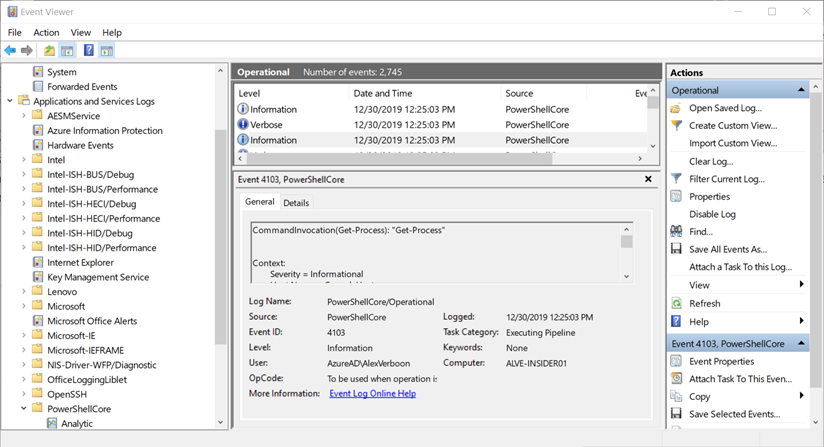

**PowerShell version**
**Log Name**

**Windows PowerShell 5.1**
Microsoft-Windows-PowerShell/Operational

**PowerShell 7**
PowerShellCore/Operational

So, if you are currently using event forwarding, you will need to update that configuration to also include PowerShell 7 events.

Below just an example how to retrieve the events from PS5 and PS7 using the appropriate Providers.

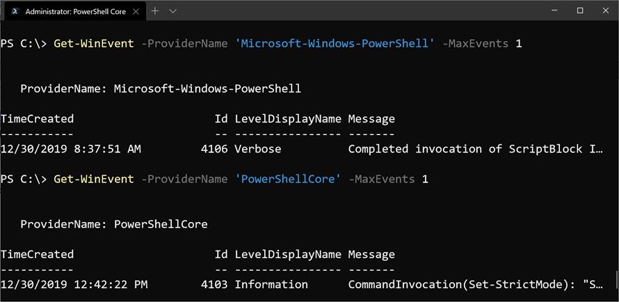

