Since Microsoft introduced WSL ([Windows Subsystem for Linux](https://blogs.msdn.microsoft.com/wsl/2016/04/22/windows-subsystem-for-linux-overview/)) I've been playing with it occasionally, in the beginning however some of the tools I wanted to use like nmap and hping3 would not work due to issues with networking in WSL 1.0, however with WSL 2.0 these issues seem to be resolved so gave it another try earlier this year in June and all worked as expected.

What's nice about running kali in WSL is that you get easy and quick access to linux tools without having to setup and start a complete virtual machine.

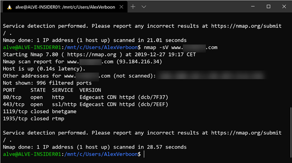

But what if you want to run a tool with a GUI? Well with a few tricks that works as well. Now let me be honest here all the information described below does already exist across various websites and forums, the primary objective of this blog post is to put it all in one place to provide others and myself with all the necessary instructions to get kali linux up and running in WSL 2.0 and use RDP to connect to the kali desktop.

# Prerequisites

At the time of writing this blog post you must run Windows 10 build 18917 or higher, which means that you need to be at least on the slow ring of the Windows Insiders builds. The examples below are from a system running Windows Insider build 10.0.19041.1.

# Windows Features

The following windows features must be enabled to run WSL 2.0

 	
- Virtual Machine Platform
 	
- Windows subsystem for Linux

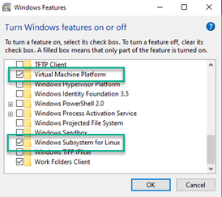

These can be enabled via the Windows GUI or by running the following commands in an elevated prompt.

dism.exe /online /enable-feature /featurename:Microsoft-Windows-Subsystem-Linux /all /norestart

dism.exe /online /enable-feature /featurename:VirtualMachinePlatform /all /norestart

When completed, restart the system and wait for the configuration to complete. To ensure that the linux distribution is WSL 2.0 enabled, I suggest to run the following command in an elevated prompt.

wsl --set-default-version 2

# Download and install Kali Linux distro for WSL

Next download the Kali-Linux distribution from here: [https://aka.ms/wsl-kali-linux-new](https://aka.ms/wsl-kali-linux-new) and save it in a temporary location. If you want to install another Linux distribution, here's a list of all available distros [https://docs.microsoft.com/en-us/windows/wsl/install-manual](https://docs.microsoft.com/en-us/windows/wsl/install-manual) you can also install Kali Linux via the Windows store.

Once downloaded launch the installer kali-linux-08-06-2019.appx and follow the on-screen instructions.

# First startup

When Kali is started for the first time, you're prompted to enter a username and password. Note this is your Linux admin account that you will use when running commands that require elevation (sudo). More details here: [https://docs.microsoft.com/en-us/windows/wsl/initialize-distro#setting-up-a-new-linux-user-account](https://docs.microsoft.com/en-us/windows/wsl/initialize-distro)

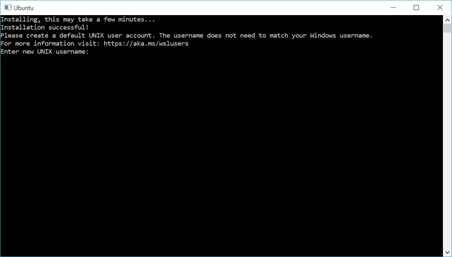

# Update the Kali distribution

Next it's recommended to update Kali, using the following commands:

sudo apt update && sudo apt upgrade

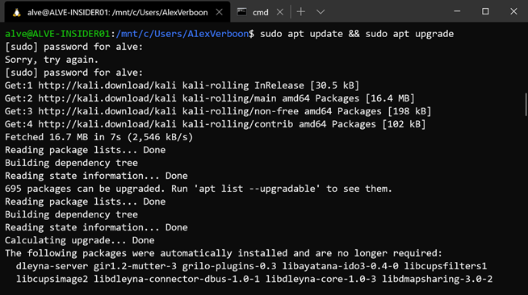

When prompted confirm with **Y** to run the updates.

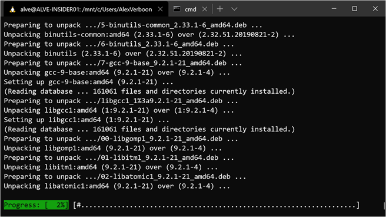

# Installing Kali Tools

The Kali Linux distribution that we have just installed has a minimum footprint, it's now up to the user to install the tools they need. Luckily Kali has bundled these in so called Metapackages that contain a subset of specific tools. An overview of all available metapackages can be found here: [https://tools.kali.org/kali-metapackages](https://tools.kali.org/kali-metapackages)

For this demonstration we are going to install the kali-tools-top10 metapackage that contains the most commonly used tools.

 	
- aircrack-ng
 	
- burpsuite
 	
- crackmapexec
 	
- hydra
 	
- john
 	
- metasploit-framework
 	
- nmap
 	
- responder
 	
- sqlmap
 	
- wireshark

Run the following commands to install the kali-top10 tools.

sudo apt-get update && apt-cache search kali-linux-top10

sudo apt -y install kali-linux-top10

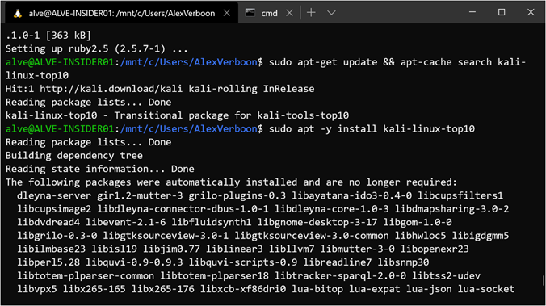

# Running NMAP

Now that we have installed some kali tools we can start using them, below an example of running nmap scanning my local network.

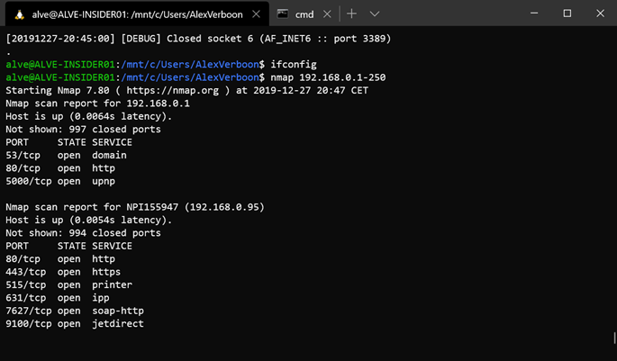

# Enabling RDP

So far we're all set to use the kali Linux terminal, but to use tools with a GUI such as Wireshark, we need a remote desktop connection. The following instructions describe how to install and configure RDP within Kali Linux.

Run the following commands to install and start the xrdp service.

sudo apt-get install xrdp

sudo service xrdp start

sudo update-rc.d xrdp enable

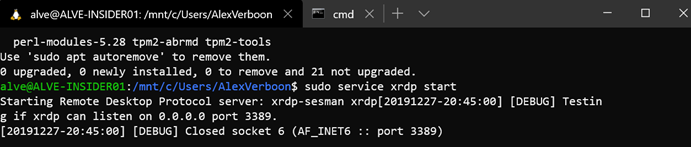

The following commands shows us the IP address used by WSL

ifconfig eth0

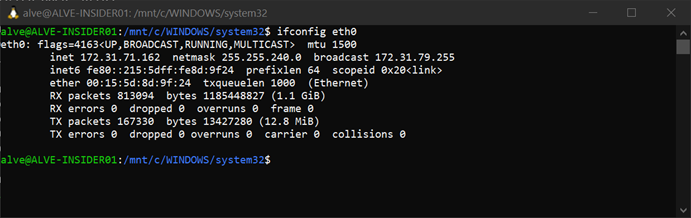

So now that the xrdp service is running and we have the IP address we're almost good to launch a remote desktop session using mstsc.exe But wait most likely when trying to connect you get an error as shown in the sample screenshot below.

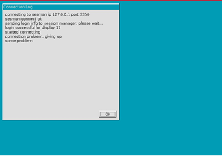

There is plenty of information about this issue on the web, some with very long descriptions of how to solve it, some shorter. Finally I used the instructions described here: [https://msitpros.com/?p=3209](https://msitpros.com/?p=3209)

So if you also received the above error message do the following

sudo apt-get install lxde-core lxde kali-defaults kali-root-login desktop-base

sudo update-alternatives --config x-session-manager

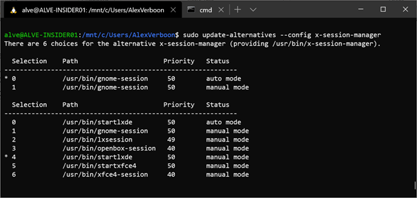

# Launching RDP

And now keep fingers crossed, let's launch Windows Remote Desktop and connect to our kali Linux running in WSL.

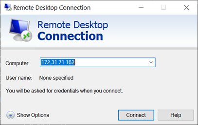

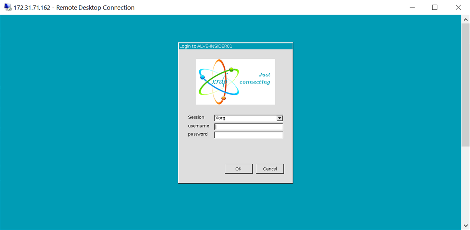

And we get access to the Kali desktop and can launch tools with a GUI. Below an example of running Wireshark.

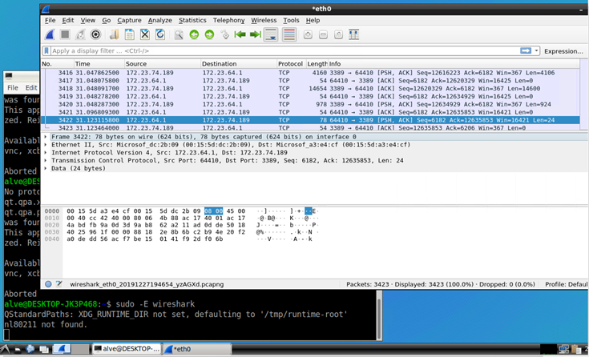

That's it for today, Bye

Alex

