This week Hadar Feldmann, senior program manager and security researcher at Microsoft [announced](#) the public preview of the new Microsoft Defender ATP evaluation lab that now includes two attack simulation solutions from AttackIQ and SafeBreach. The term 'evaluation' might indicate that the lab is only intended for new customers hat are in the process of evaluating Microsoft Defender ATP, but that's not the case, personally I think that it is also a perfect playground for existing customers to advance their investigation and hunting skills using Microsoft Defender ATP.

With the addition of the attack simulators from AttackIQ and SafeBreach, you can now run the following attack simulations:
**Microsoft****AttackIQ****SafeBreach**Backdoor with a lure document

Fileless attackPersistence methods

Defense evasion techniquesAPT29

Credential Theft

OS Configuration Changes

Code Execution

Known Ransomware Infection
One way to evaluate Microsoft Defender ATP's ability to monitor and detect malicious activity is to use the tactics described within the [MITRE ATT&CK framework](#).

At the time of writing this blog post, the attack simulations included within the Microsoft Defender ATP evaluation lab, include the following MITRE ATT&CK techniques.

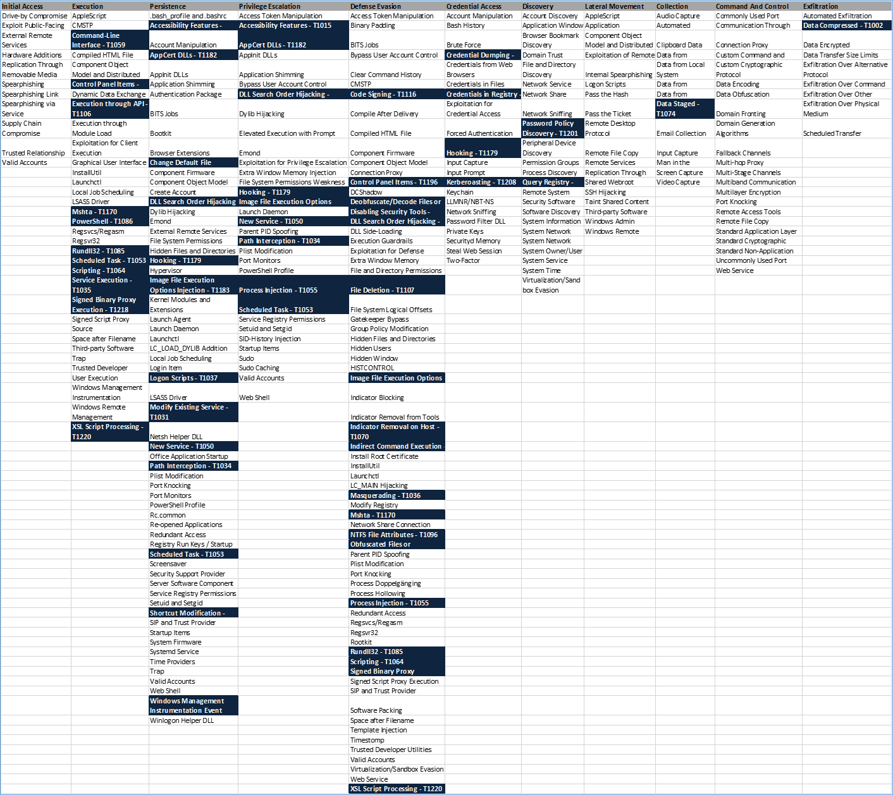
# Initial Setup

When accessing the evaluation lab for the first time within the Microsoft Defender ATP portal, you will see the following welcome message:

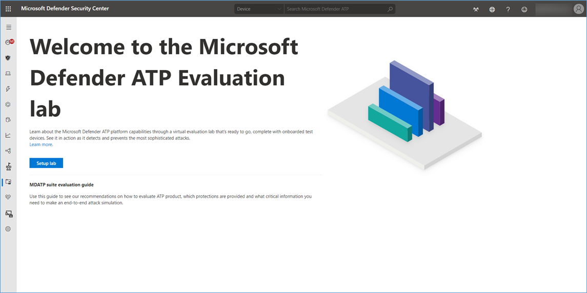

Click on the **Setup Lab** button to start setting up the lab. Now you will need to setup your lab configuration. Now do not rush through this by just clicking next because it is important that you think of how you plan to run your evaluation or testing.

The test devices provided with the evaluation lab are only available for a limited duration, once you have consumed all devices and time, you can no longer add more devices unless you submit a support ticket to the Microsoft Defender ATP team.

The evaluation lab provides you with three options.

- 3 Devices, for 73 hours each
- 4 Devices, for 48 hours each
- 8 Devices, for 24 hours each

*There is no limit when you start using these devices, so as an example, If you selected 8 devices for 24 hours each, you can provision the first test client today, that test client will be available for 24 hours and then it will be automatically deleted, so you can no longer access it. A week later, you can provision two more devices, these again will be available for 24 hours and then be deleted as well. So now you have 5 devices left over.
*

Select the number of devices and then click on the **Next** button.

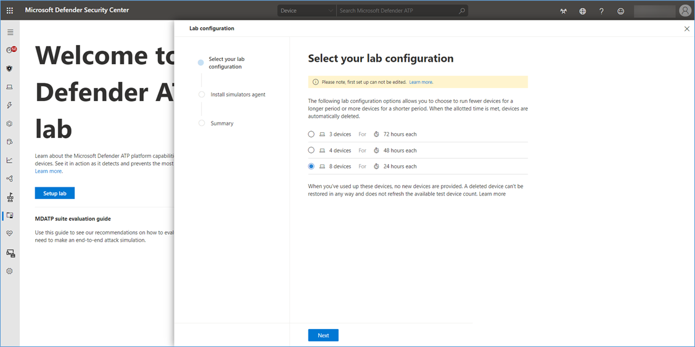

Next you must confirm the Terms from Microsoft, AttackIQ and SafeBreach

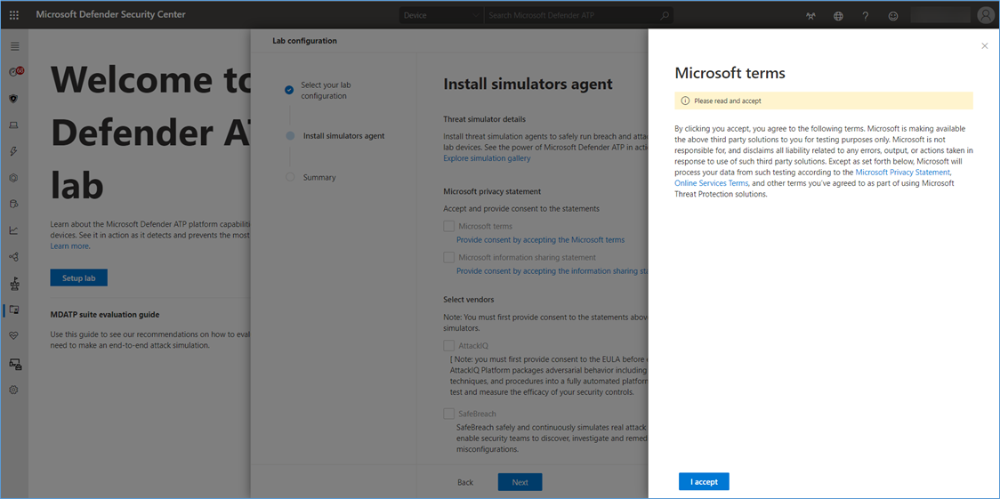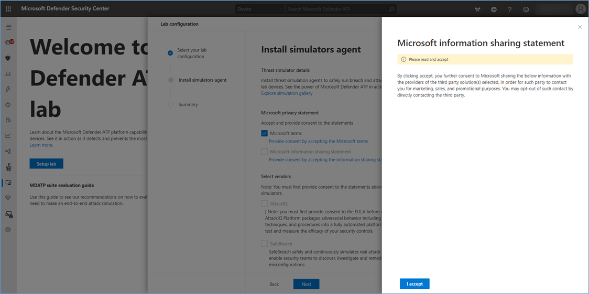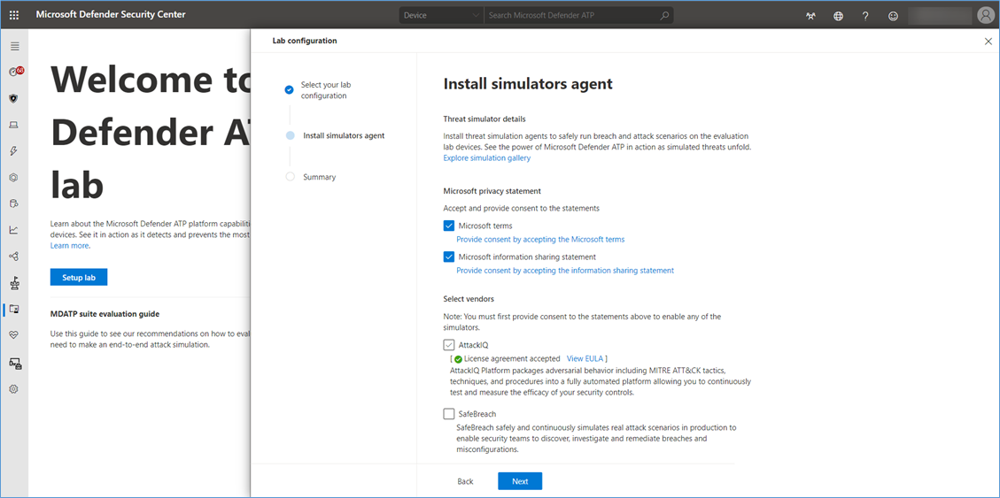

Click on **Setup lab** to complete the initial setup process

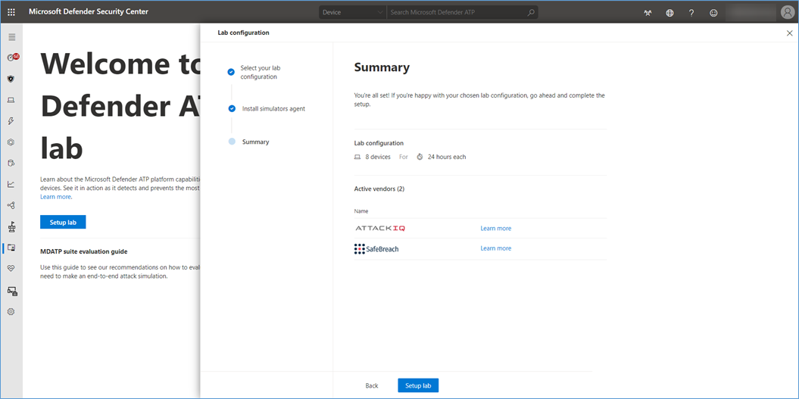

Now that are lab is setup, let's proceed with provisioning a device and run our first simulation.

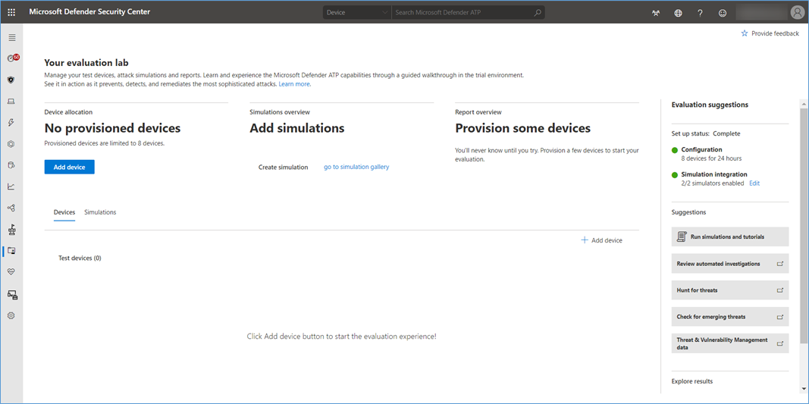

Click on the **Add device** button, and select Windows 10 or Windows Server 2019.

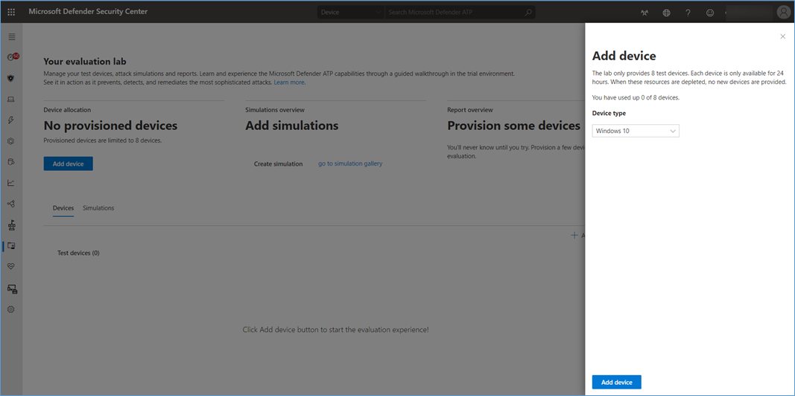**Important**: Copy the password and save it so that you can access the password later, it won't be displayed here again, so if you forget the password, you must reset the password, which is a bit of a lengthy process.

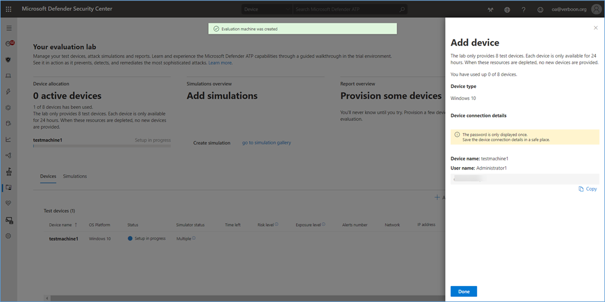

When providing a device, the following happens:

- A new Windows 10 or Windows Server device is added to the lab, this device is provisioned within Azure in a dedicated network that is NOT connected to your network, so you can run anything on it and make a lot of noise and let the MDATP console shine with detections and alerts.
- Once the VM is provisioned the attack simulators are deployed, note that this can take a little while, hover over the simulator status column, to see the progress.

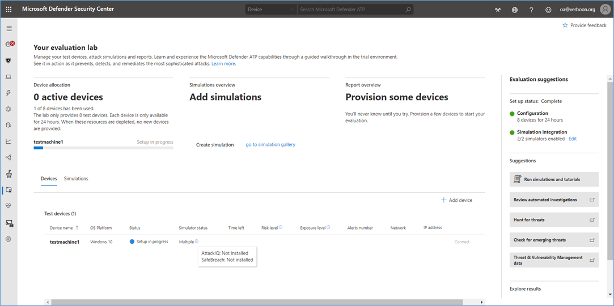

Here we see, the installation of the simulators is completed, now were' good to go and start running a simulation.

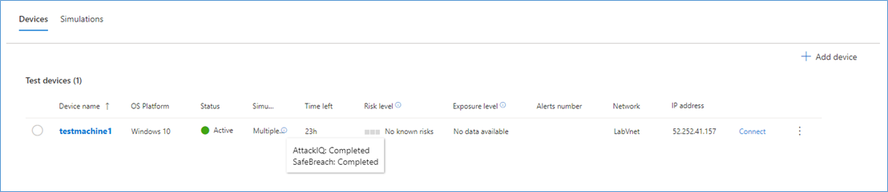

Select the Simulations tab, and click on **Create simulation**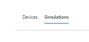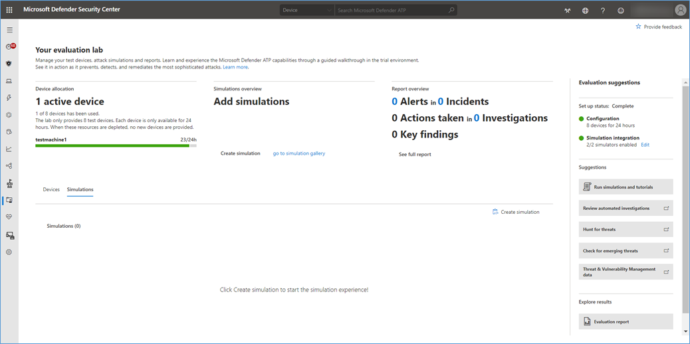

Select a **Simulator**, the **simulation**, and the **device, **then click on **Create simulation**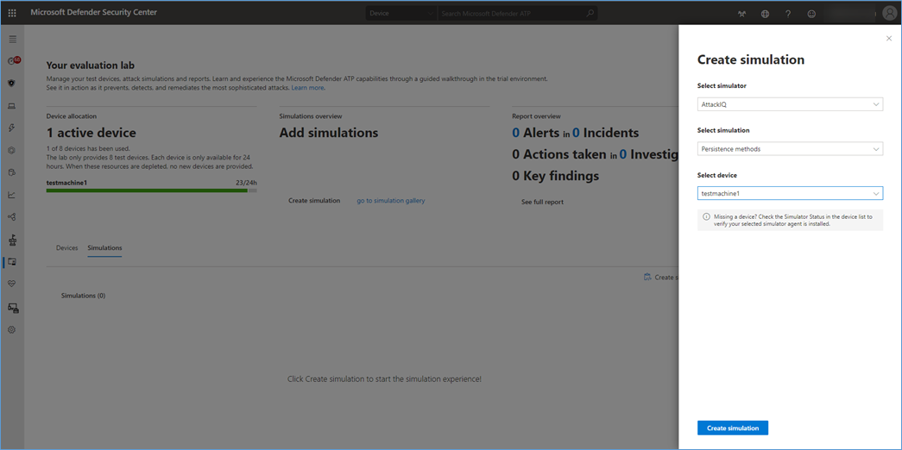

Within the evaluation lab dashboard we now see the progress of the simulation.

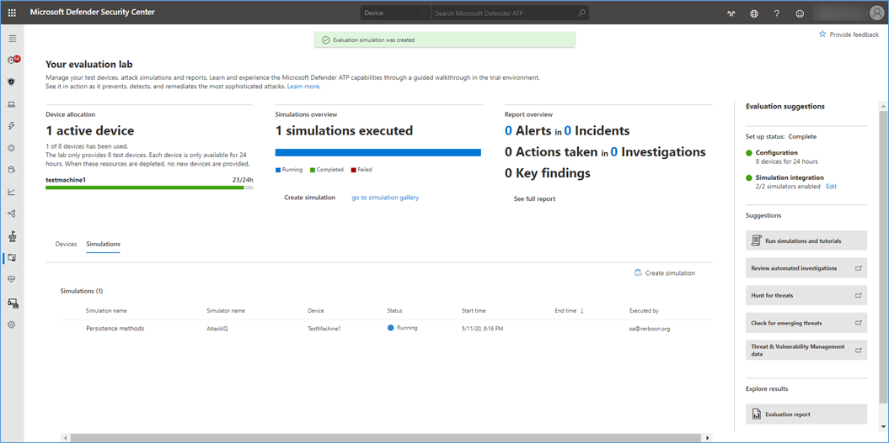

By selecting the simulation, we get a detailed description of the simulation, including references to the MITRE ATT&CK techniques

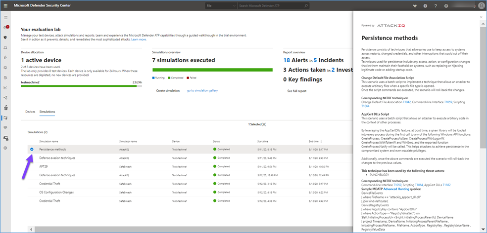

Now let us look at the device Alerts and timeline. We have an alert **for Suspicious change to file association setting, **that corresponds to [**T1042**](#)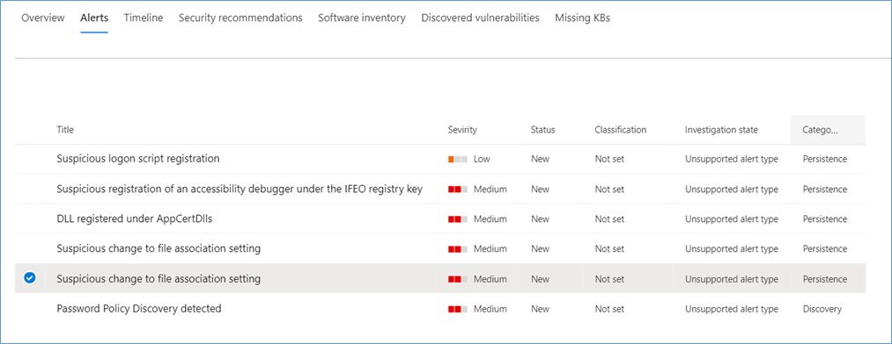

Within the timeline we select the alert and the select **Hunt for related events**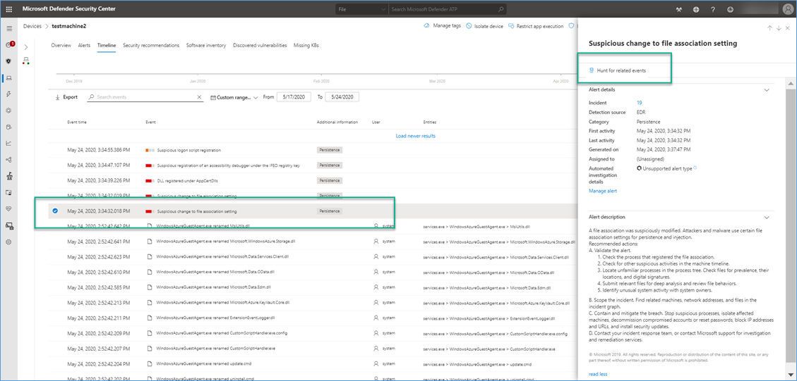

This opens the Advanced hunting page and shows us all events around this alert, search for selected events and then select the row, this opens the inspect record window where we get more information.

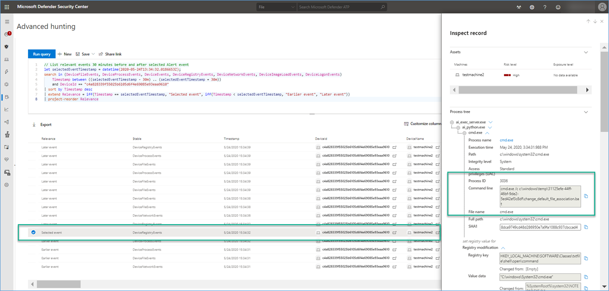

We now get more details about the script (from the simulator) that made the change and what was changed.

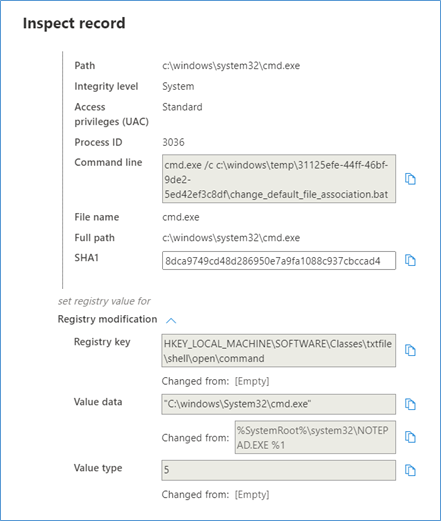

Well that is it for today, hope you enjoyed this blog post, if you have not tried out the Microsoft Defender ATP Eval lab, give it a try

Bye

Alex

