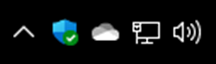
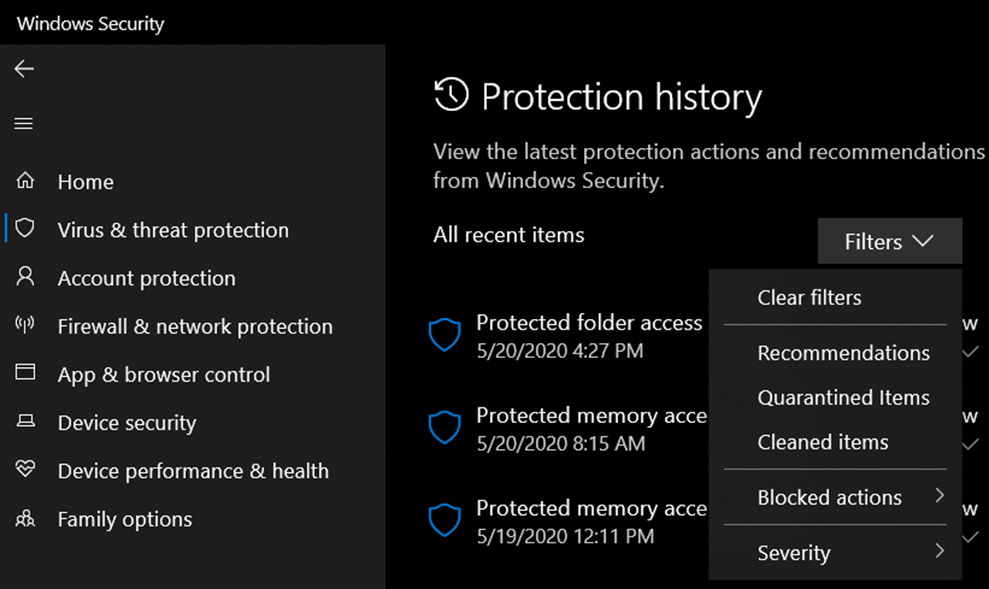
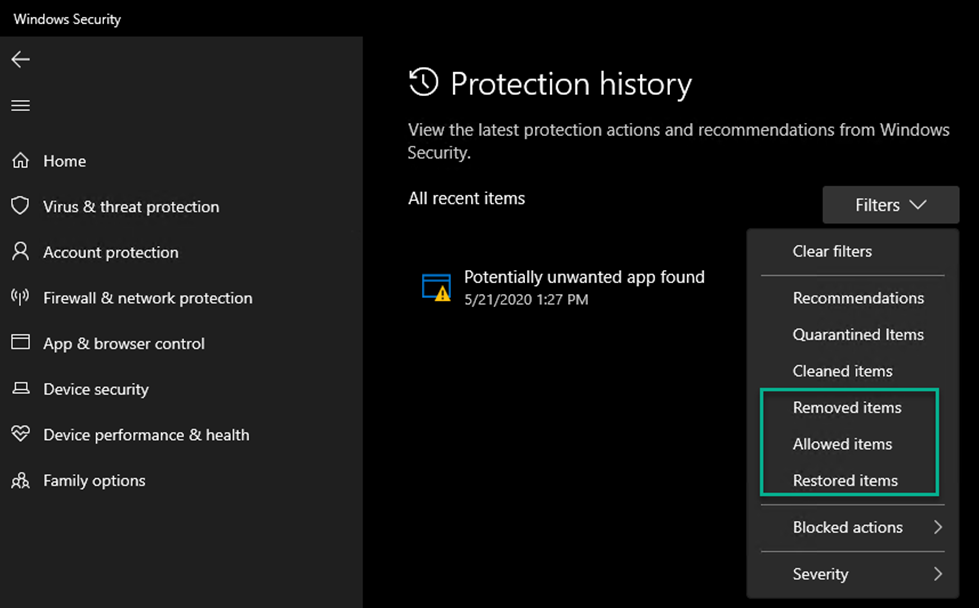
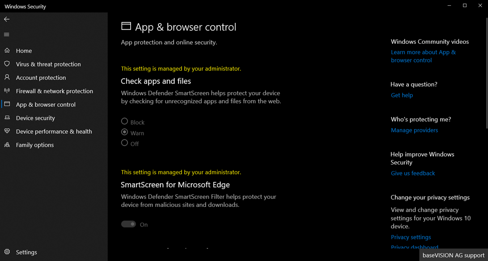
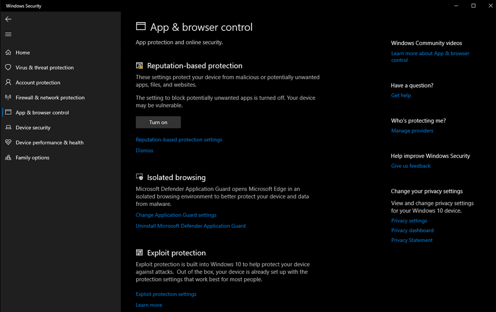
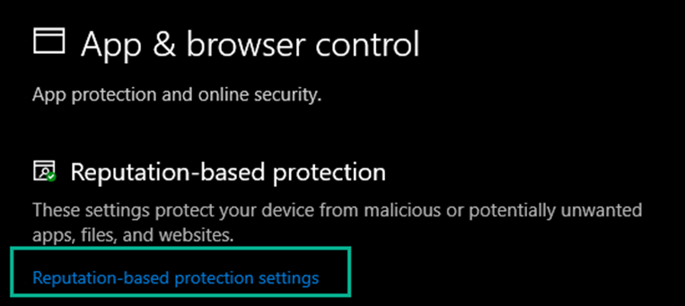
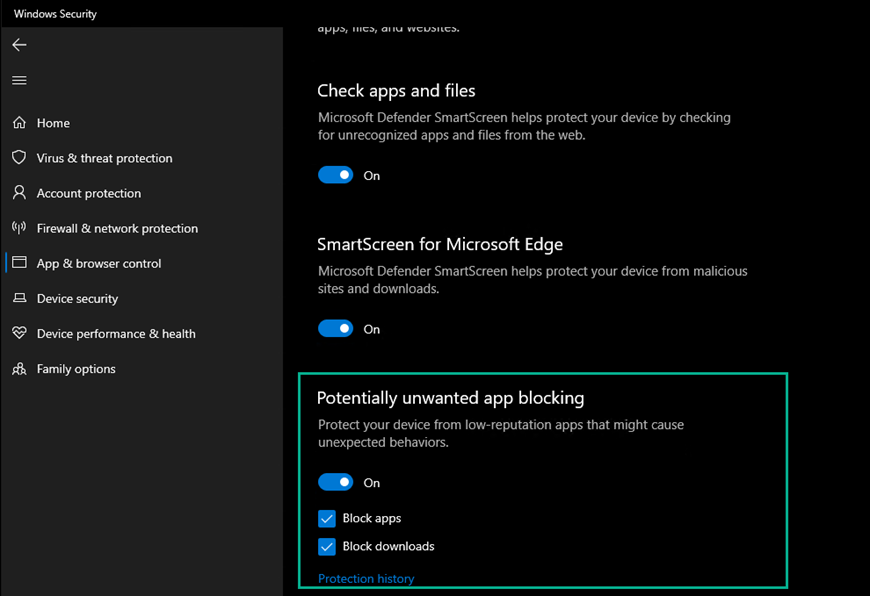
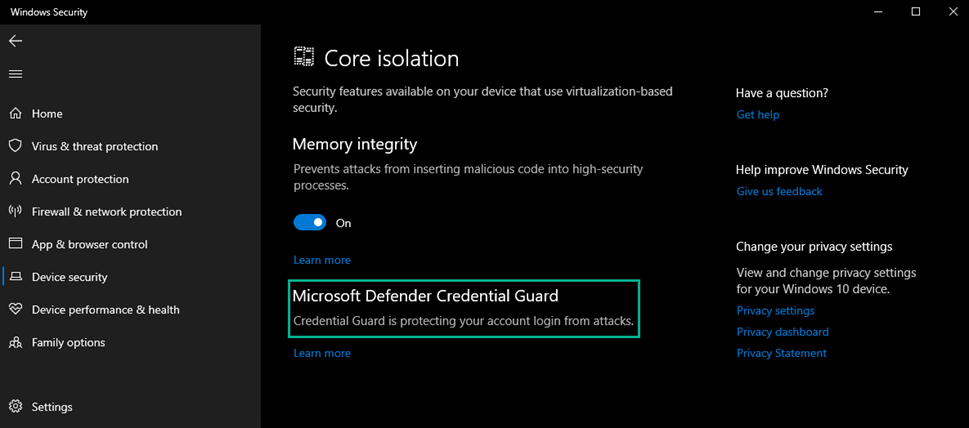

When all goes well, Microsoft will soon release the next version of Windows 10 aka as Windows 10 2004. I am an active Windows Insider user and noticed a few little changes within the Windows 10 Security App that I think are worth sharing.

I used the following Windows 10 builds to identify changes, new features:

- Windows 10, 1909, Version 10.0.18363.836
- Windows 10, 2004, Version 10.0.19628.1

# Windows Security App Icon

First thing you will notice is that there is a new tray icon.
***Windows 10 – 1909******Windows 10 - 2004***
# Protection History Filter

The filter of the protection history has been extended with three more options.
***Windows 10 – 1909******Windows 10 - 2004***
# Reputation-based Protection

Here we see a couple of changes, under Windows 10 1909 we have the options for configuration SmartScreen settings for Windows Explorer, Microsoft Edge, and the Windows Store, in Windows 10 2004 these have now moved into the Reputation-based settings. Although the feature itself has existed for a while in Windows 10 and can be configured through [ConfigMgr](#)/[Intune](#), [Group Policy](#) or [PowerShell](#), the Potentially unwanted app blocking feature is now also visible in the Security App. If you want to try out how PUA works, I recommend you use the Defender demo page and use the demo PUA app. [https://demo.wd.microsoft.com/Page/PUA](https://demo.wd.microsoft.com/Page/PUA)

For more information about Potentially unwanted applications see: [Detect and block potentially unwanted applications](#)***Windows 10 – 1909******Windows 10 - 2004*********
# Microsoft Defender Credential Guard

Nothing new here, but since I am writing about the Security App, I thought I mention this anyway. There is no option to enable or disable Credential Guard within the Security App, but when enabled, it shows up as shown below.

Well that is it for now, if anything changes with the final release of Windows 10 2004, I'll let you know. And in case I missed something , let me know.

Alex

