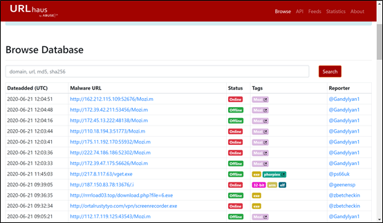
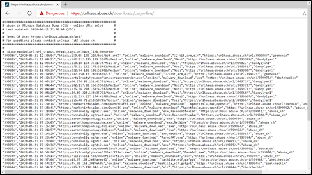
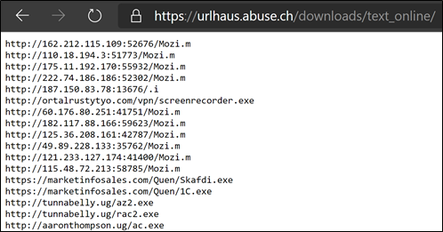
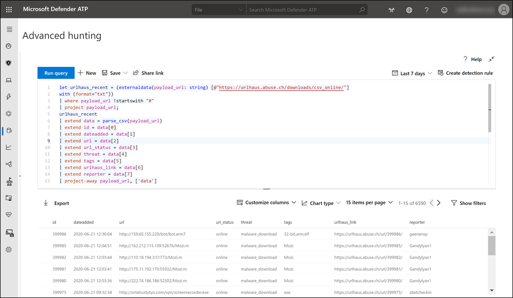
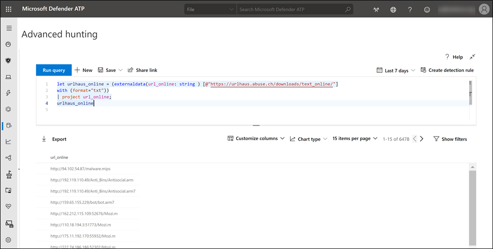
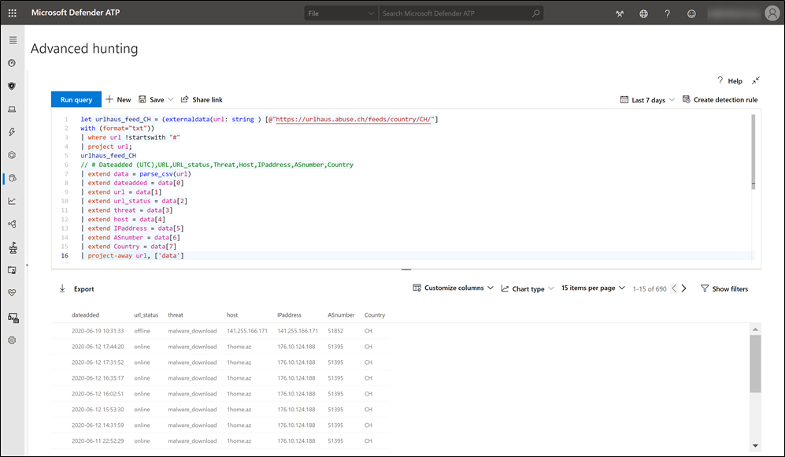
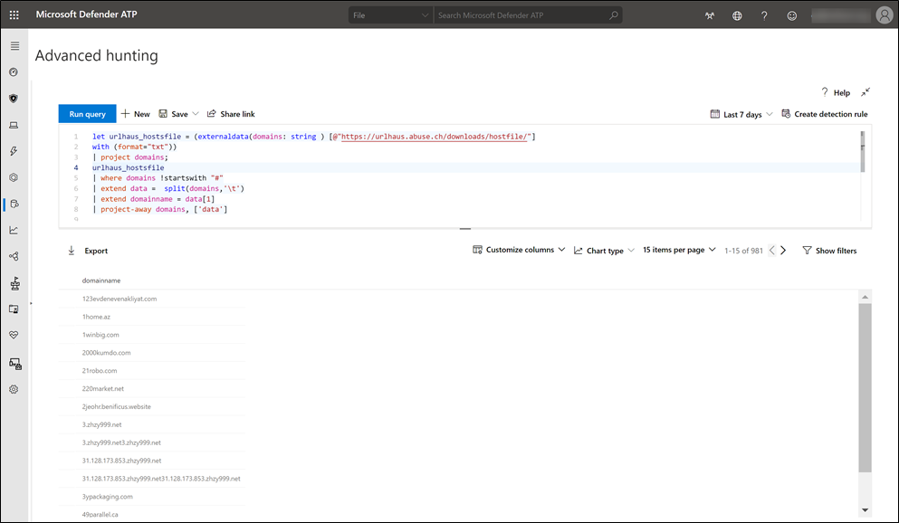
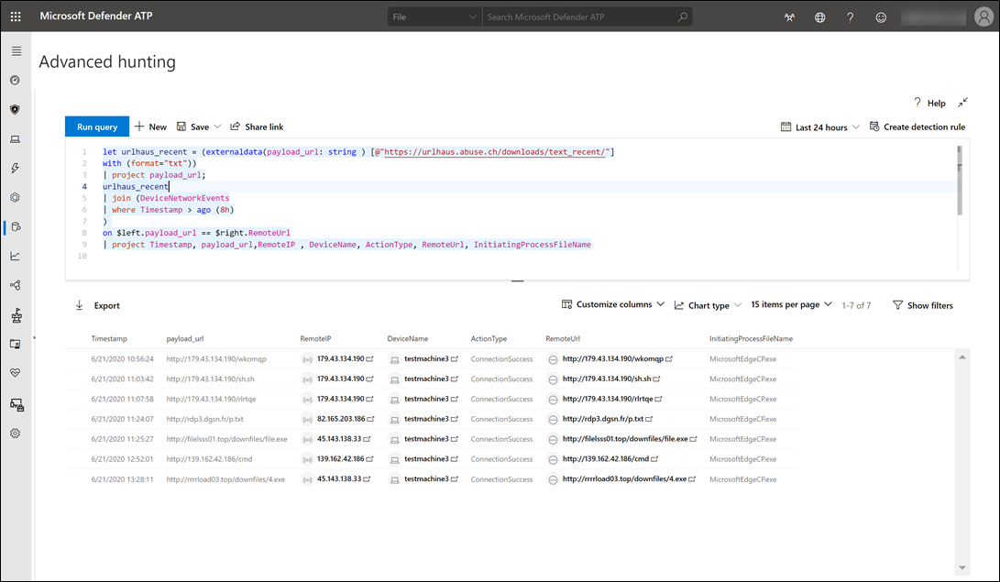
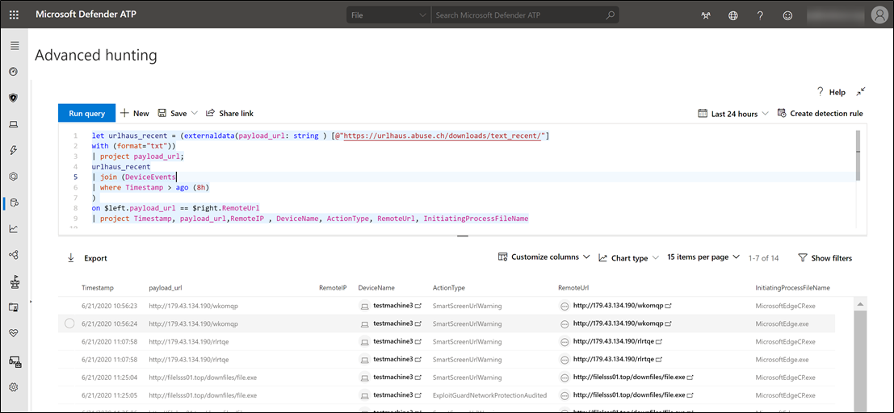
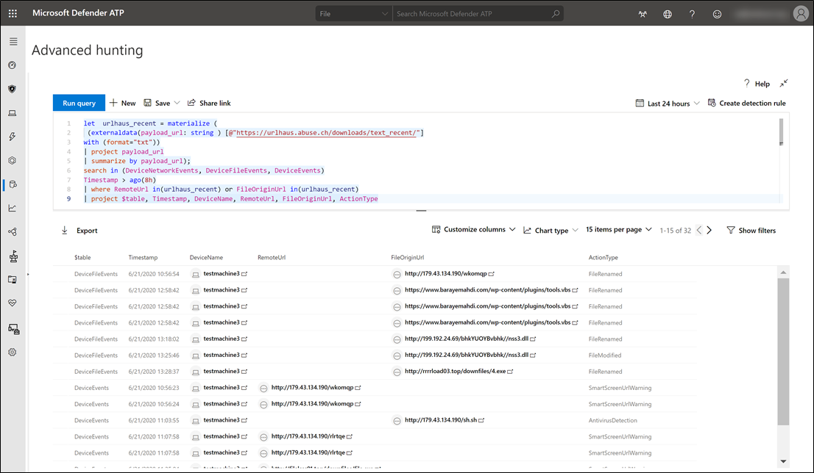

Hello everyone, in today's article we are going to take look at how we can use Threat Intelligence (TI) data from URLhaus with Microsoft Defender ATP advanced hunting.

# URLhaus

URLhaus is a project from abuse.ch with the goal of sharing malicious URLs that are being used for malware distribution. [https://urlhaus.abuse.ch/](#) The project provides several ways to find and retrieve information about malware URLs.

You can browse the URL database interactively through [https://urlhaus.abuse.ch/browse/](#)

You can also download the database in various formats such as a CSV file that contains the following information:

- ID
- Dateadded (UTC)
- URL
- URL status
- Threat
- Associated tags
- Link to URLhaus entry
- Reporter

Or just as plain text file with URLs only. Here there are several downloads available:

- Plain text URL list with all malware URLs known to URLhaus
- Plain text URL list – most recent additions from the past 30 days
- Plain text URL list – online - containing only **online** (active) malware URLs

# Advanced Hunting and the externaldata operator

Advanced hunting in Microsoft Defender ATP is based on the [Kusto query language](#). The [externaldata operator](#) allows us to read data from an external storage such as a file hosted as a feed or stored as a blob in Azure blog storage.

Let me show two examples using two data sources from URLhaus. First we are going to retrieve the URLhaus detailed database information containing online URLs.

[https://urlhaus.abuse.ch/downloads/csv_online/](#)

In the following example, we use the online URLs only list.

[https://urlhaus.abuse.ch/downloads/text_online/](#)

And how about looking at malicious all URLs from the URLhaus database whose domain name resolve to an IP address associated with a particular geo IP location (country code)? (*To see data related to your country, simply change the country code i.e. NL, US etc.* )

Now that we are at it anyway, let pull the list of domain names that are associated with malware URLs.

# Advanced hunting finding matches based on TI from URLhaus

Now that we know how to retrieve external data from URLhaus using advanced hunting, let us use this data for with our hunting queries in Microsoft Defender ATP or Microsoft Threat Protection.

Below is query where we can identify any [**DeviceNetWorkEvents**](#) associated with malware URLs.

Let's change the query a bit and let us look at [**DeviceEvents**](#)****

Now instead of just looking at teach Defender table separately, let us search across various tables.

Finally, if you're interested at looking up data from URLhaus through PowerShell, take a look at my [PowerShell module PSURLhaus](#)

I would like to credit [@Pawp81](#) who's query included in the [AdvancedHuntingCheatCheet](#) inspired me to look further into the use of externaldata in advanced hunting queries.

You can find all the KQL queries mentioned in this blog post here; https://github.com/alexverboon/MDATP/tree/master/AdvancedHunting/URLHaus

Well, that is it for today, hope you enjoyed this article.

Alex

