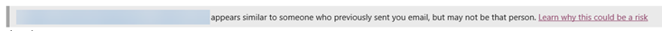
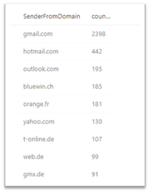
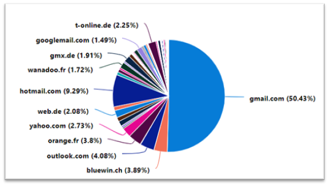
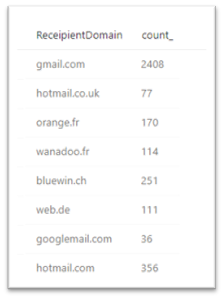
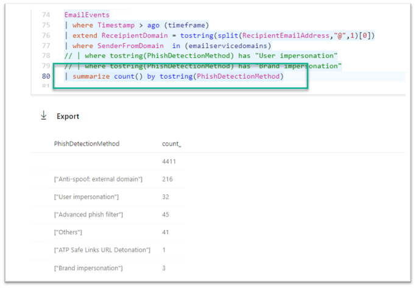
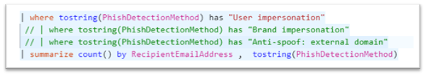

Today I received an e-mail from a customer explaining to me that at times they have false positives with e-mail Impersonation. Depending on your configuration the e-mail will end up being moved to the user's junk folder or into quarantine. When releasing such a message and have safety tips turned on, you might see the following message at the top of the message.



Reading Tip: [Protect yourself from phishing schemes and other forms of online fraud](#)

This can happen when for example a co-worker who works on a project for a client has a identity created within the customer's environment. When John Doe who works with me at Contoso.com sends me an e-mail as [john.doe@woodgroove.com](#) it's very likely that Office ATP identifies this as an impersonation attempt. The case of my customer was that a senior person was sending e-mail to themselves from their personal e-mail account. Example: [boss@gmail.com](#) sends e-mail to [boss@contoso.com](#)

This triggered the idea write some MTP advanced hunting queries on public free e-mail services. In the first query, I going to look at the e-mail **received** from free e-mail services.

The variable **emailservicedomains** contains a list of most popular free email services across the globe.
```kql
// Query 1:
// Summary of e-mail RECEIVED from free web mail services
let timeframe = 7d;
// popular public web service domains
let emailservicedomains =dynamic (["gmail.com","outlook.com","hotmail.com","gmx.de",
"yahoo.com","mail.com","web.de","mail.ru","freenet.de","ziggo.nl","xs4all.nl",
"seznam.cz","email.cz","aol.com","hotmail.co.uk","hotmail.fr",
"msn.com","yahoo.fr","orange.fr","wanadoo.fr","comcast.net",
"yahoo.com.br","yahoo.co.in","live.com","rediffmail.com","free.fr","yandex.ru","ymail.com","libero.it",
"uol.com.br","bol.com.br","cox.net","hotmail.it","sbcglobal.net","sfr.fr","live.fr","verizon.net","live.co.uk","googlemail.com","yahoo.es",
"ig.com.br","live.nl","bigpond.com","terra.com.br","yahoo.it","neuf.fr","yahoo.de","alice.it","rocketmail.com","att.net","laposte.net",
"facebook.com","bellsouth.net","yahoo.in","hotmail.es","charter.net","yahoo.ca","yahoo.com.au","rambler.ru","hotmail.de","tiscali.it",
"shaw.ca","yahoo.co.jp","sky.com","earthlink.net","optonline.net","freenet.de","t-online.de","aliceadsl.fr",
"virgilio.it","home.nl","qq.com","telenet.be","me.com","yahoo.com.ar","tiscali.co.uk","yahoo.com.mx","voila.fr","gmx.net",
"mail.com","planet.nl","tin.it","live.it","ntlworld.com","arcor.de","yahoo.co.id","frontiernet.net","hetnet.nl","live.com.au",
"yahoo.com.sg","zonnet.nl","club-internet.fr","juno.com","optusnet.com.au","blueyonder.co.uk","bluewin.ch","highspeed.ch",
"skynet.be","sympatico.ca","windstream.net","mac.com","centurytel.net","chello.nl","live.ca","aim.com","bigpond.net.au"
"yahoo.co.uk"]);
EmailEvents
| where Timestamp > ago (timeframe)
| extend ReceipientDomain = tostring(split(RecipientEmailAddress,"@",1)[0])
| where SenderFromDomain  in (emailservicedomains)
| summarize count() by SenderFromDomain
```

What we get is a list of all the e-mail received from the defined e-mail domains.



By adding | render piechart at the end of query we get a nice graph.



Now let's turn things around and take a look at how much e-mail is **send** to free e-mail service domains.
```kql
// Query2
// Summary of e-mail SEND to free web mail services
let timeframe = 7d;
// popular public web service domains
let emailservicedomains =dynamic (["gmail.com","outlook.com","hotmail.com","gmx.de",
"yahoo.com","mail.com","web.de","mail.ru","freenet.de","ziggo.nl","xs4all.nl",
"seznam.cz","email.cz","aol.com","hotmail.co.uk","hotmail.fr",
"msn.com","yahoo.fr","orange.fr","wanadoo.fr","comcast.net",
"yahoo.com.br","yahoo.co.in","live.com","rediffmail.com","free.fr","yandex.ru","ymail.com","libero.it",
"uol.com.br","bol.com.br","cox.net","hotmail.it","sbcglobal.net","sfr.fr","live.fr","verizon.net","live.co.uk","googlemail.com","yahoo.es",
"ig.com.br","live.nl","bigpond.com","terra.com.br","yahoo.it","neuf.fr","yahoo.de","alice.it","rocketmail.com","att.net","laposte.net",
"facebook.com","bellsouth.net","yahoo.in","hotmail.es","charter.net","yahoo.ca","yahoo.com.au","rambler.ru","hotmail.de","tiscali.it",
"shaw.ca","yahoo.co.jp","sky.com","earthlink.net","optonline.net","freenet.de","t-online.de","aliceadsl.fr",
"virgilio.it","home.nl","qq.com","telenet.be","me.com","yahoo.com.ar","tiscali.co.uk","yahoo.com.mx","voila.fr","gmx.net",
"mail.com","planet.nl","tin.it","live.it","ntlworld.com","arcor.de","yahoo.co.id","frontiernet.net","hetnet.nl","live.com.au",
"yahoo.com.sg","zonnet.nl","club-internet.fr","juno.com","optusnet.com.au","blueyonder.co.uk","bluewin.ch","highspeed.ch",
"skynet.be","sympatico.ca","windstream.net","mac.com","centurytel.net","chello.nl","live.ca","aim.com","bigpond.net.au"
"yahoo.co.uk"]);
EmailEvents
| where Timestamp > ago (timeframe)
| extend ReceipientDomain = tostring(split(RecipientEmailAddress,"@",1)[0])
| where ReceipientDomain in (emailservicedomains)
| summarize count() by ReceipientDomain
```

What we get is a list of all the e-mail send **to** the defined e-mail domains.



Next, let's take a look at emails where user impersonation was detected.
```kql
// Query 3:
// find potential impersonation
let timeframe = 7d;
// popular public web service domains
let emailservicedomains =dynamic (["gmail.com","outlook.com","hotmail.com","gmx.de",
"yahoo.com","mail.com","web.de","mail.ru","freenet.de","ziggo.nl","xs4all.nl",
"seznam.cz","email.cz","aol.com","hotmail.co.uk","hotmail.fr",
"msn.com","yahoo.fr","orange.fr","wanadoo.fr","comcast.net",
"yahoo.com.br","yahoo.co.in","live.com","rediffmail.com","free.fr","yandex.ru","ymail.com","libero.it",
"uol.com.br","bol.com.br","cox.net","hotmail.it","sbcglobal.net","sfr.fr","live.fr","verizon.net","live.co.uk","googlemail.com","yahoo.es",
"ig.com.br","live.nl","bigpond.com","terra.com.br","yahoo.it","neuf.fr","yahoo.de","alice.it","rocketmail.com","att.net","laposte.net",
"facebook.com","bellsouth.net","yahoo.in","hotmail.es","charter.net","yahoo.ca","yahoo.com.au","rambler.ru","hotmail.de","tiscali.it",
"shaw.ca","yahoo.co.jp","sky.com","earthlink.net","optonline.net","freenet.de","t-online.de","aliceadsl.fr",
"virgilio.it","home.nl","qq.com","telenet.be","me.com","yahoo.com.ar","tiscali.co.uk","yahoo.com.mx","voila.fr","gmx.net",
"mail.com","planet.nl","tin.it","live.it","ntlworld.com","arcor.de","yahoo.co.id","frontiernet.net","hetnet.nl","live.com.au",
"yahoo.com.sg","zonnet.nl","club-internet.fr","juno.com","optusnet.com.au","blueyonder.co.uk","bluewin.ch","highspeed.ch",
"skynet.be","sympatico.ca","windstream.net","mac.com","centurytel.net","chello.nl","live.ca","aim.com","bigpond.net.au"
"yahoo.co.uk"]);
EmailEvents
| where Timestamp > ago (timeframe)
| extend ReceipientDomain = tostring(split(RecipientEmailAddress,"@",1)[0])
| where SenderFromDomain  in (emailservicedomains)
| where tostring(PhishDetectionMethod) has "User impersonation"
// | where tostring(PhishDetectionMethod) has "Brand impersonation"
```

For privacy reasons, I can't show you the output of the above query, but I suggest you run it in your domain and look at the results.

Office ATP has several Phish detection methods, so simply change the query as shown below to get a list of possible methods detected.



Change the query as following to identify the users affected



As always, I hope you enjoyed reading this blog post, comments, suggestions are always welcome

Alex
