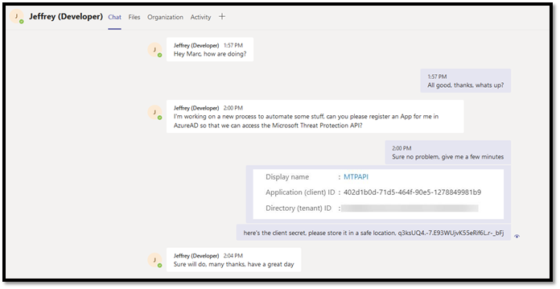
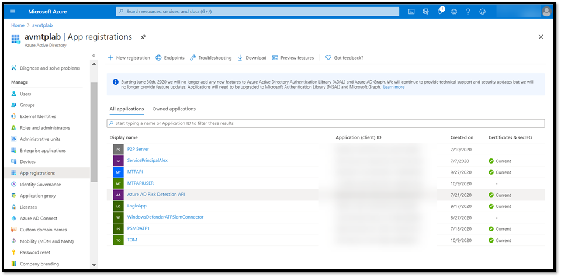
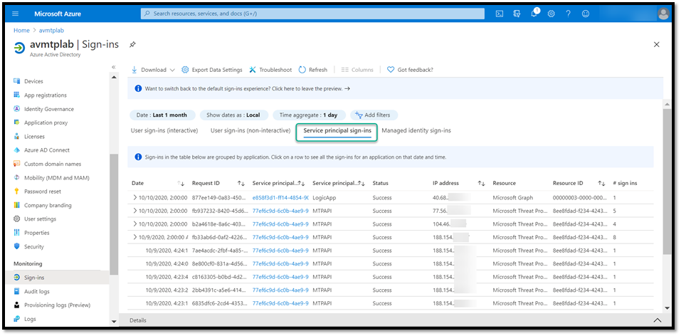
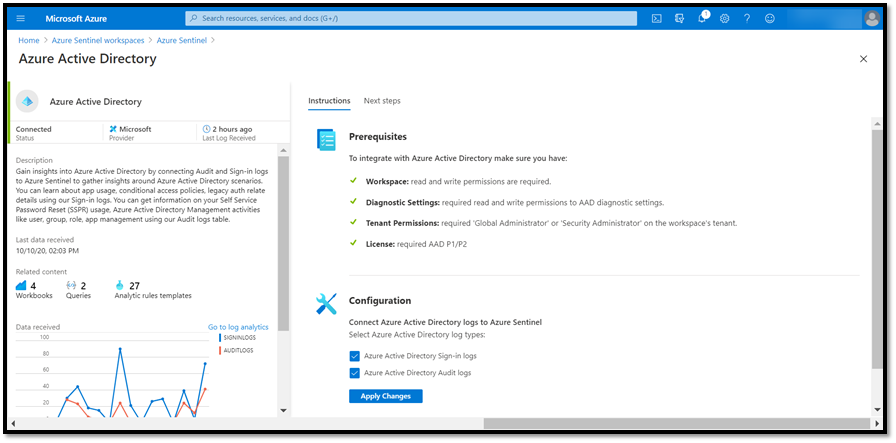
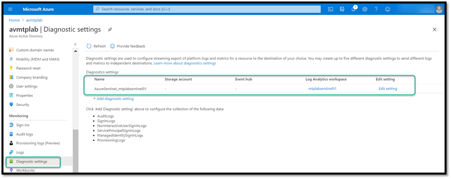
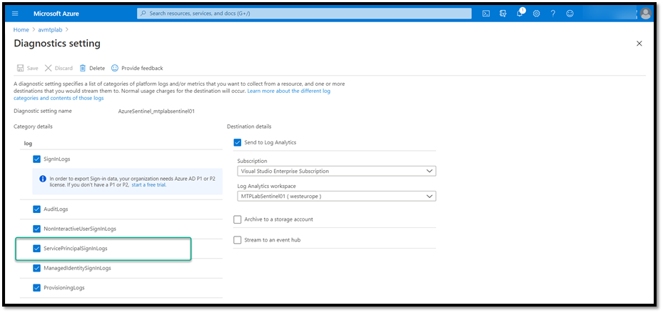
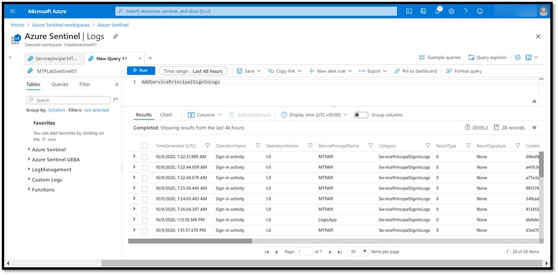
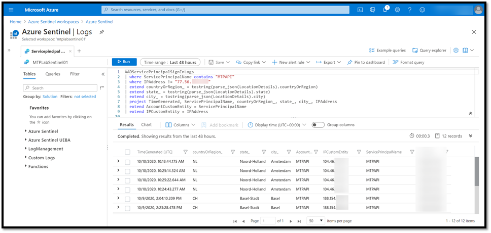
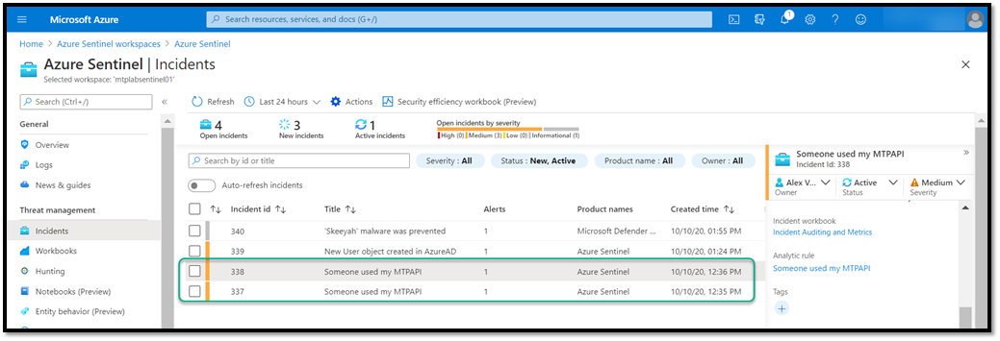

Here is a conversation between Jeffrey (Developer) and Marc (IT Admin) working for ECorp Ltd.



Looks familiar? Take a look in your Azure Active directory, how many applications do you have there? In an ideal world you maintain an inventory of all these applications somewhere in your asset management database so that you know who is the owner of the Application and what it is used for and what API permissions are granted. As for the client secret, this should be stored in a Vault.



Now we trust Jeffrey that he will take good care of the client secret, but what if for whatever reason that client secret gets in the wrong hands and is then used by someone to access information from the outside?

What we need is monitoring the use of the Application and alert when it is being used from an unknown location. The good news, service-principal sign-ins is in public preview right now. Within the Azure Active Directory portal, navigate to Monitoring, Sign-ins.



Great, so we can now see when the application was used and from where. The following information is stored in the [**AADServicePrincipalSignInLogs**](#)ColumnTypeDescription

AppIdstringUnique GUID representing the app ID in the Azure Active DirectoryCategorystringCategory of the sign-in eventCorrelationIdstringID to provide sign-in trailDurationMslongThe duration of the operation in millisecondsIdstringUnique ID representing the sign-in activityIdentitystringThe identity from the token that was presented when you made the request. It can be a user account, system account, or service principalIPAddressstringIP address of the client used to sign inLevelstringThe severity level of the eventLocationstringThe region of the resource emitting the eventLocationDetailsstringDetails of the sign-in locationOperationNamestringFor sign-ins, this value is always Sign-in activityOperationVersionstringThe REST API version that's requested by the clientResourceDisplayNamestringName of the resource that the service principal signed intoResourceGroupstringResource group for the logsResourceIdentitystringID of the resource that the service principal signed intoResultDescriptionstringProvides the error description for the sign-in operationResultSignaturestringContains the error code, if any, for the sign-in operationResultTypestringThe result of the sign-in operation can be Success or FailureServicePrincipalIdstringID of the service principal who initiated the sign-inServicePrincipalNamestringService Principal Name of the service principal who initiated the sign-inSourceSystemstringDetails of source system of the object being provisionedTenantIdstringTimeGenerateddatetieThe date and time of the event in UTCTypestringThe name of the table
To monitor these events with Azure Sentinel, we first need to update the AzureAD connector configuration right?



But wait, where are the additional logs? When you first enabled and configured the AzureAD connector, the configuration is stored within the Diagnostic Settings of AzureAD as shown below.



Click on **Edit**, and we now see the additional logs, enable them and save the configuration.



After a while we see the logs from [**AADServicePrincipalSignInLogs**](#)****coming into Azure Sentinel.



Below is the query for the scheduled Query rule in Azure Sentinel. The query will return all logs of the service principal sign-in that do not originate from a known IP address.
```
AADServicePrincipalSignInLogs
| where ServicePrincipalName contains "MTPAPI"
// your IP address
| where IPAddress != "77.56.n.n"
| extend countryOrRegion_ = tostring(parse_json(LocationDetails).countryOrRegion)
| extend state_ = tostring(parse_json(LocationDetails).state)
| extend city_ = tostring(parse_json(LocationDetails).city)
| project TimeGenerated, ServicePrincipalName, countryOrRegion_, state_, city_, IPAddress
| extend AccountCustomEntity = ServicePrincipalName
| extend IPCustomEntity = IPAddress
```


After setting up the scheduled query rule and accessing the application from two other different locations an incident is created in Azure Sentinel.

**Additional Information
**[https://docs.microsoft.com/en-us/azure/active-directory/reports-monitoring/concept-all-sign-ins](#)[https://docs.microsoft.com/en-us/azure/azure-monitor/reference/tables/aadserviceprincipalsigninlogs](#)

