During the past 5 years I have onboarded a couple of thousand devices into Microsoft Defender for Endpoint and can say that, provided that you done your homework with regards to network connectivity, onboarding devices into Defender for Endpoint usually just works. But as always in IT, there are exceptions.

Should you ever run into an issue with onboarding devices, I recommend checking the guidance provided here: [Troubleshoot Microsoft Defender for Endpoint onboarding issues](https://docs.microsoft.com/en-us/windows/security/threat-protection/microsoft-defender-atp/troubleshoot-onboarding). Now if you have just a couple of devices to manage you will most likely spot any missing device within the Defender for Endpoint management portal, but what if you have several hundred or even thousands of devices? How would you find out that that particular device Computer0073 in Building D1 on the 6th floor is not correctly onboarded?

If we take security seriously and apply good IT infrastructure hygiene, we must ensure that every managed device on the network is properly onboarded in Defender for Endpoint.

In this blog post I will share a solution that we have put together recently to remediate onboarding devices that are managed by Microsoft Endpoint Configuration Manager.

When managing devices with Microsoft Endpoint Configuration you are most likely using a Microsoft Defender for Endpoint policy to onboard devices into Microsoft Defender for Endpoint.

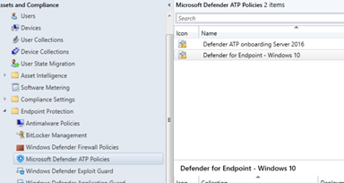

Microsoft Endpoint Configuration Manager pushes down the onboarding policy just like any other configuration baseline and when executed the device is onboarded into Defender for Endpoint. You can verify the state on a client as shown in the example below.

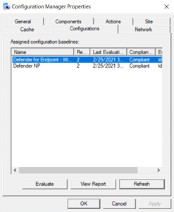

Another way to check the onboarding state is to use CMPivot. Run the following query to retrieve the MDE onboarding state.

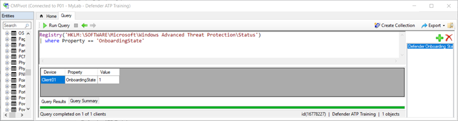

You also want to check the state of the services.

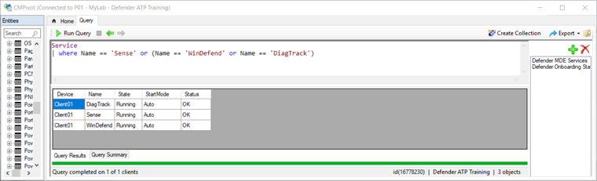

Now when it comes to onboarding issues, I have seen a couple of situations:
- The Sense service is not running because it is not set to start automatically
- The Sense service is not running, although the service is set to start automatically

On the troubleshooting page mentioned previously, Microsoft describes that this can happen when:
- Onboarding package is deployed to newly built devices
- Sensor does not start because the Out-of-box experience (OOBE) or first user logon has not been completed
- Device is turned off or restarted before the end user performs a first logon
- In this scenario, the SENSE service will not start automatically even though onboarding package was deployed

Sometimes just restarting the service works. Another option is to rerun the ConfigMgr compliance evaluation on the client either locally or by invoking the compliance evaluation remotely. But I have also seen devices where the onboarding policy on the device was broken.

When all of the above does not work, the final action that in most cases will always solve these issues is to rerun the onboarding script manually. But again, with hundreds or thousands of clients to manage you do not want to rely on a manual task. What we need is automation.

With Microsoft Endpoint Configuration Manager, you have several options to identify systems that are not onboarded in Defender for Endpoint. When using manually created collections you will need to create two collections, one that has all devices where the onboarding state value is set to 1 and another collection that excludes the collection with onboarded devices. This is because when a device is not onboarded there is no onboarding state attribute in the device inventory.

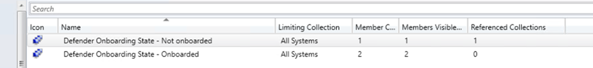

Below is the collection query for devices that are onboarded.

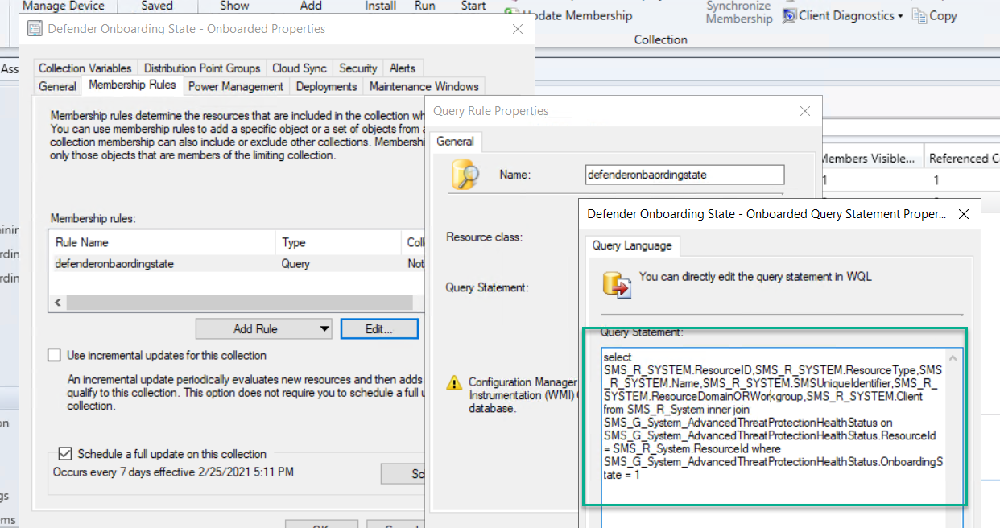

Great, we now have visibility on devices that are not onboarded into Defender for Endpoint, so let us move on. To rerun the onboarding script on devices that have onboarding issues, we leverage the capability of Microsoft Endpoint Configuration Manager compliance baselines.

My first idea was to simply embed the onboarding file, which is a batch script, into a configuration item, but that turned out to be a cumbersome approach. My colleague Athi (@AKugaseelan) came up with the idea to convert the onboarding script into a base64 string that we then embed into the remediation script.

To convert the onboarding file into the base64 string, download the onboarding file from the Defender for Endpoint portal. Make sure to select the Group Policy version, because that script does not have a prompt to confirm execution. Once downloaded, extract the script from the ZIP file.

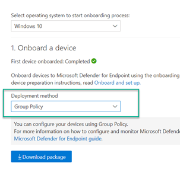

Next adjust the helper script `$onbaordingScript` variable and then run it.

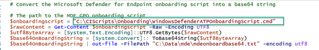

Open the generated `mdeonboardbase64.txt` and copy the content into the clipboard.

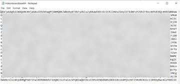

Next, open the script `CI_DefenderOnboarding_Remediation.ps1`.

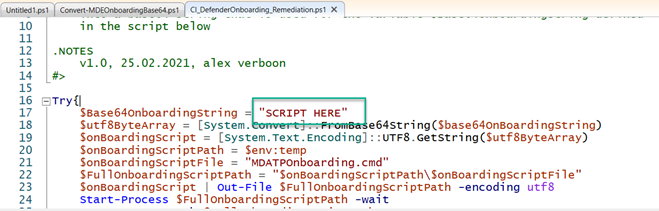

Then copy the previously generated base64 string into the script.

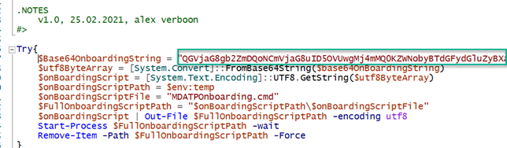

Now that we have the remediation script ready for our configuration item, we need to get it into Microsoft Endpoint Configuration Manager. You can create the CI manually and import the script or use the `New-CMCIDefenderOnboarding_Remediation.ps1` script that I include in the source code, which will create the CI for you.

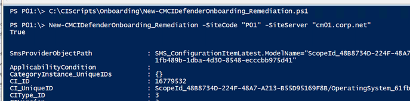

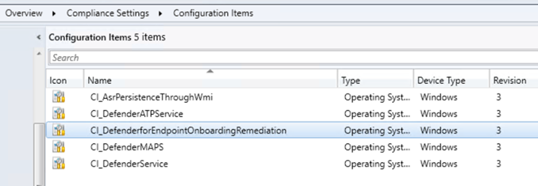

The CI has two scripts embedded.
- `CI_DefenderOnboarding_Discovery.ps1`
- `CI_DefenderOnboarding_Remediation.ps1`

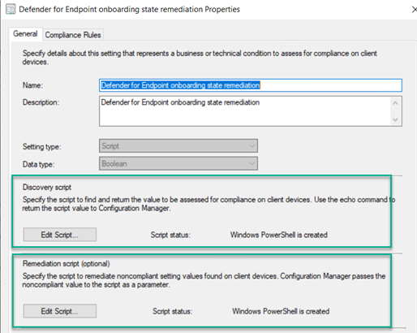

The `CI_DefenderOnboarding_Discovery.ps1` script simply checks the onboarding status by querying the appropriate registry key.

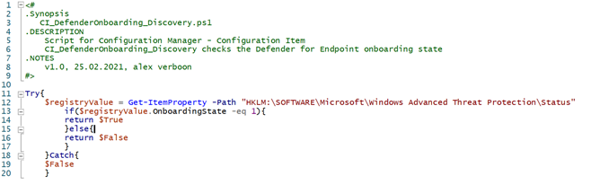

The `CI_DefenderOnboarding_Remediation.ps1` script does the following:
1. Writes the base64 encoded string that contains the content of `DefenderATPOnboardingScript.cmd` to a temporary location
2. Executes the script
3. Removes the temporary script
4. Checks the onboarding state by querying the appropriate registry key

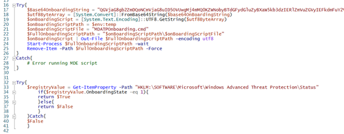

The CI is now in the console so we can continue creating the configuration baseline.

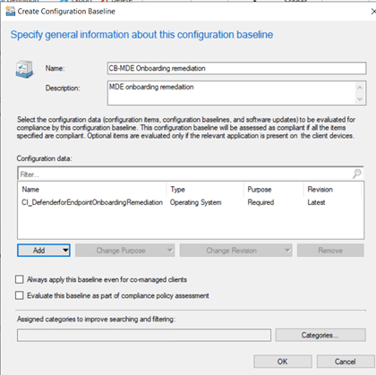

When created, we deploy the configuration baseline to our collection that contains devices not onboarded into Defender for Endpoint.

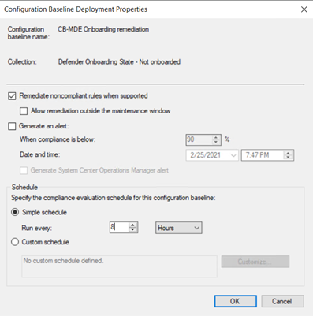

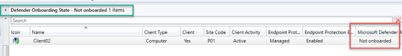

On the client we see that the device is not onboarded and the configuration baseline has not run yet.

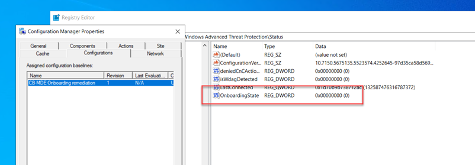

As soon as the CI is triggered the device is successfully onboarded.

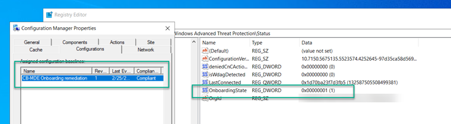

After a while we have our client back under control.

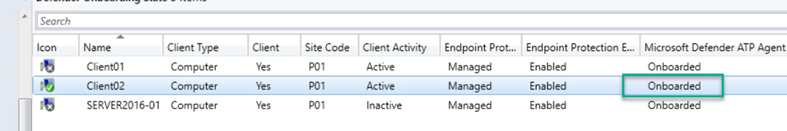

That is it for today. Hope you found this useful and that it helps you get devices successfully onboarded into Defender for Endpoint. You can find all scripts referenced in this blog post in my GitHub repository here: [https://github.com/alexverboon/PowerShellCode/tree/main/DefenderforEndpoint/Onboarding](https://github.com/alexverboon/PowerShellCode/tree/main/DefenderforEndpoint/Onboarding).

