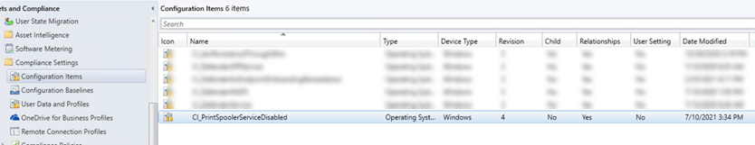
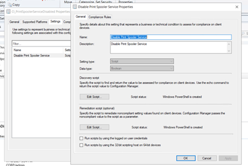
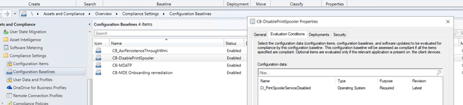
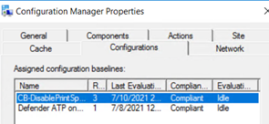
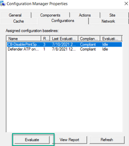
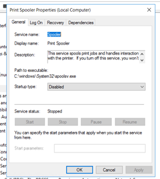

Hello there,

In [my earlier post](https://www.verboon.info/2021/07/use-microsoft-endpoint-configuration-manager-to-stop-the-windows-print-spooler-service/) [Use Microsoft Endpoint Configuration Manager to stop the Windows Print Spooler Service – Anything about IT (verboon.info)](https://www.verboon.info/2021/07/use-microsoft-endpoint-configuration-manager-to-stop-the-windows-print-spooler-service/) I explained how to stop the Print Spooler service using Microsoft Endpoint Configuration Manager leveraging CMPivot to identify servers where the Print Spooler is running and the Run Script function to stop and disable the service. This method was intended as a first response action, however as new servers get deployed, we want to make sure the print spooler remains disabled, so we need a more permanent solution.

In this blog post I will explain how we can use Microsoft Endpoint Configuration Manager and a Configuration Baseline to ensure the Print Spooler is stopped and disabled. And yes, this blog post is intended for those who for whatever reason cannot or do not want to use AD Group Policy.

First download the scripts from my GitHub repo [https://github.com/alexverboon/PowerShellCode/tree/main/PrintSpooler/MEMCMBaseLine](https://github.com/alexverboon/PowerShellCode/tree/main/PrintSpooler/MEMCMBaseLine) and save them locally as shown in the example below.


Next open the Microsoft Endpoint Configuration Manager and then launch PowerShell ISE from the console.


Next load the function that is included in `New-CMCIPrintSpoolerService.ps1` and then run the function that creates the Configuration Item in Microsoft Endpoint Configuration Manager.

```powershell
. .\New-CMCIPrintSpoolerService.ps1
New-CMCIPrintSpoolerService -SiteCode P01 -SiteServer cm01.corp.net -Verbose
```


When all goes well, you now have a new Configuration Item.



The CI has both the discovery script and remediation script embedded.



Next create a configuration baseline and include the newly created configuration item.



And finally deploy the configuration baseline to a device collection that includes all servers where the print spooler must be disabled. As soon as the device picks up the configuration baseline, you can verify the status on the device.



Test the configuration baseline by setting the print spooler to automatic and/or start it, and then run the evaluation again.



If all works as expected, the service is stopped and set to disabled.



You can find the scripts mentioned in this blog post here on GitHub: [https://github.com/alexverboon/PowerShellCode/tree/main/PrintSpooler/MEMCMBaseLine](https://github.com/alexverboon/PowerShellCode/tree/main/PrintSpooler/MEMCMBaseLine)

I would also like to refer to another [blog post from Thijs Lecomte](https://thecollective.eu/blog/implement-workarounds-for-pinter-nightmare-with-mem/), where he describes how to use MEM to deploy Print Spooler patches and configuration through Microsoft Intune.

Have a great day

Alex


