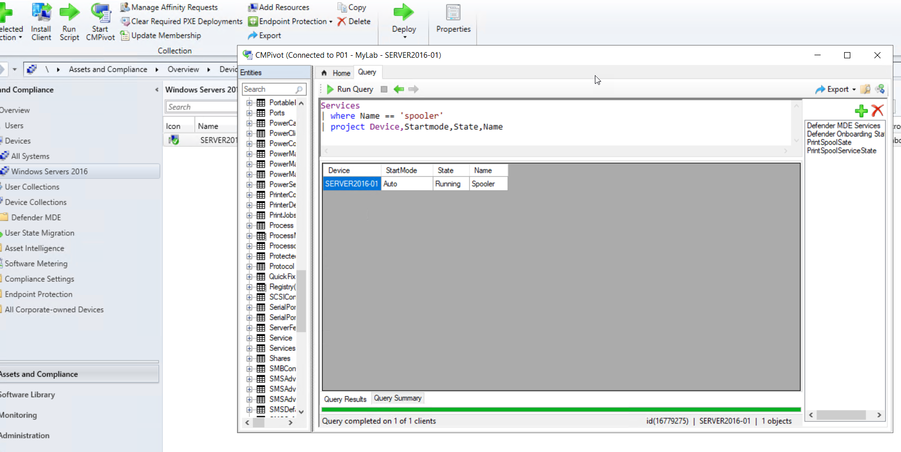
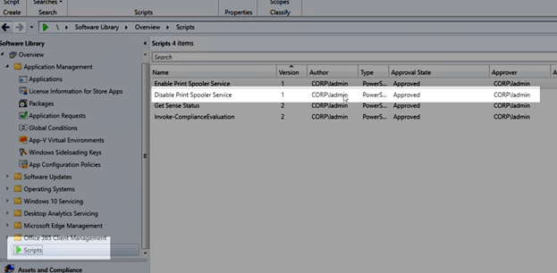
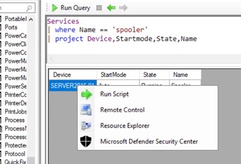
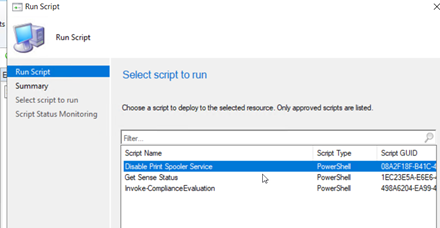
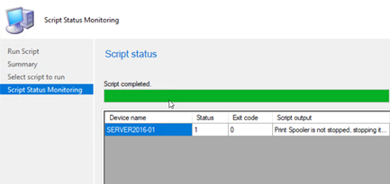
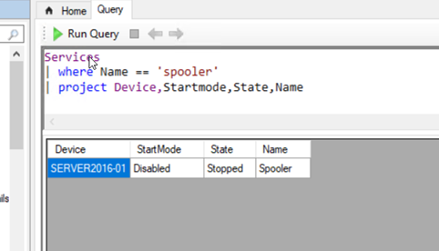

Hello there,

I guess by now, everyone has heard of the Windows Print Spooler Remote Code Execution Vulnerability ([CVE-2021-34527](https://msrc.microsoft.com/update-guide/vulnerability/CVE-2021-34527)). At this time Microsoft recommends disabling the Print Spooler service on domain controllers and on servers where it is not needed or to Disable inbound remote printing through Group Policy. In this short blog post I will demonstrate how you can use Microsoft Endpoint Configuration Manager to identify systems where the print spooler service is running and how to stop and disable the service.

**Disclaimer**! I have only tested this in my lab so far.

## Identify Systems with the Print Spooler Service Running

We can leverage CMPivot to find systems where the print spooler service is running and configured to start automatically by running the following query:

```
Services
| where Name == 'spooler'
| project Device,Startmode,State,Name
```



## Use Scripts to Stop and Disable the Print Spooler

Import the following script into the Script library:

```powershell
<#
.Synopsis
  Disable Print Spooler Service
.DESCRIPTION
   Disable Print Spooler Service to mitigate the Windows Print Spooler Remote Code Execution Vulnerability
   https://msrc.microsoft.com/update-guide/vulnerability/CVE-2021-34527
.NOTES
  03.07.2021, v1.0.0, alex verboon
#>
Begin{
    $PrintSpoolerState   = (Get-Service -Name Spooler).Status
    $PrintSpoolStartMode =  (Get-Service -Name Spooler).StartType
}
Process{
    If ($PrintSpoolerState -ne "Stopped"){
        Write-host "Print Spooler is not stopped, stopping it now"
        Stop-Service -Name Spooler -Force
    }

    If ($PrintSpoolStartMode -ne "Disabled"){
        Write-host "Print Spooler is not disabled, disabling it now"
        Set-Service -Name Spooler -StartupType Disabled
    }
}
End{}
```



## Disabling and Stopping the Print Spooler Service

Now that we have our script within the script library, we can execute it on the device.







Once executed, when we run the query in CMPivot again, we see that the Print Spooler service is now stopped and startup is disabled.



## Enabling Print Spooler Startup

Okay, we always need a rollback plan, so just in case something stops working and you need to revert the change, here's how to set the start mode back to automatic and start the print spooler service. You might want to import this script as well into the script library.

```powershell
<#
.Synopsis
  Enable Print Spooler Service
.DESCRIPTION
   Enable Print Spooler Service
.NOTES
  03.07.2021, v1.0.0, alex verboon
#>
Begin{
    $PrintSpoolerState   = (Get-Service -Name Spooler).Status
    $PrintSpoolStartMode =  (Get-Service -Name Spooler).StartType
}
Process{

    If ($PrintSpoolStartMode -ne "Automatic"){
        Write-host "Print Spooler is not set to autostart, configuring that now"
        Set-Service -Name Spooler -StartupType Automatic
    }

    If ($PrintSpoolerState -ne "Running"){
        Write-host "Print Spooler is stopped, starting it now"
        Start-Service -Name Spooler
    }
}
End{}
```

Hope this helps you with your mitigation actions.

Alex


