In this blog post I am going to show you how you can quickly (in 5 minutes) deploy Windows 11 in Hyper-V using the AutomatedLab PowerShell module. In fact the process is no different than when deploying other Windows operating systems, but just in case you haven't heard of AutomatedLab yet and plan to install Windows 11 in a VM, this might be a good opportunity to get familiar with it.

I am just going to assume that you have the Hyper-V role already enabled on your Windows 10 device. Follow the next steps to install the AutomatedLab PowerShell module, download the ISO and deploy your first VM.

Open Windows PowerShell as Administrator and run the following command to install AutomatedLab.

```powershell
Install-Module AutomatedLab -AllowClobber
```powershell
Next run the following command to create the Lab sources folder

```powershell
New-LabSourcesFolder -Drive C
```powershell
Now we have to [download](https://www.microsoft.com/en-us/software-download/windowsinsiderpreviewiso?wa=wsignin1.0) the Windows 11 ISO file and save it in the lab sources \ ISO folder as shown below. Note to access the Windows Insider download page, you must be a member of the Windows Insider program.


Now because the generic Product key isn't known yet and AutomatedLab looks for product keys here "C:\ProgramData\AutomatedLab\Assets\ProductKeys.xml" we have to tweak one script within the AutomatedLab module to skip the product key check. Depending on when you read this blog post, this step might no longer be necessary.

"C:\Program Files\WindowsPowerShell\Modules\AutomatedLab\5.39.0\AutomatedLabDisks.psm1"

And comment out line 28 – 34 as shown below

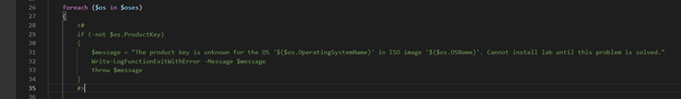

Okay, now we're good to go. Here's the Windows 11 Installation script that I created from the sample script: "C:\LabSources\SampleScripts\HyperV\Single 10 Client.ps1". Note the value for the **-OperatingSystem** parameter.

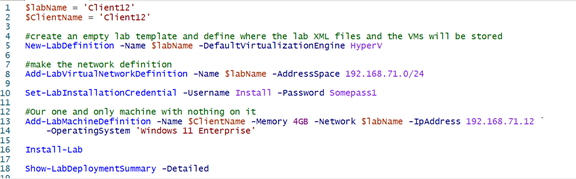

To check what operating systems you can deploy, simply run the following command which will list all the OS versions and editions available in the AutomatedLab ISO source folder.

```powershell
Get-LabAvailableOperatingSystem
```

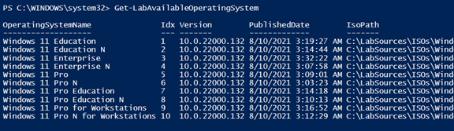

Now let's run our script and the deployment of Windows 11 starts

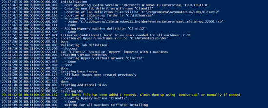

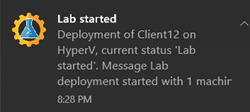

Note when you run AutomatedLab for the first time you will see some prompts related to PowerShell remoting.

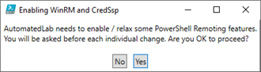

Also the very first time you install a certain version of Windows, AutomatedLab will create a base Image, this can take a while but speeds up future installations. See below, the second deployment only took 5 minutes and 10 seconds.

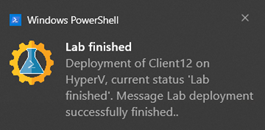

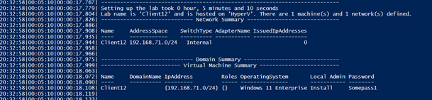

Next connect to the VM, you'll notice that the user Install is already logged on.

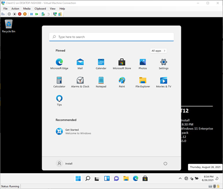

Before we can use the client for further testing we have to configure a few settings that were used for the AutomatedLab deployment.

- Remove the Autologon of user Install. Set the autologon count to 1 and remove the password.

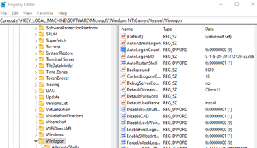

- Enable Windows Firewall

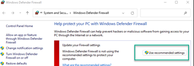

- Enable UAC

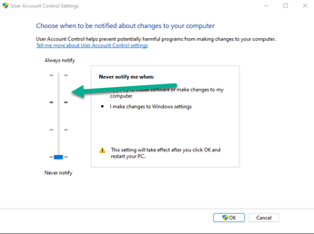

Reboot the device and continue using Windows 11 as you like. I hope I could demonstrate how easy it is to deploy Windows 11 or any other Windows OS into a VM within just a few minutes.

If you want to learn more about AutomatedLab I suggest to check out the following sites:

- https://automatedlab.org/en/latest/
- https://github.com/AutomatedLab/AutomatedLab
- https://sysmansquad.com/2020/06/15/getting-started-with-automatedlab/

Enjoy Windows 11!
