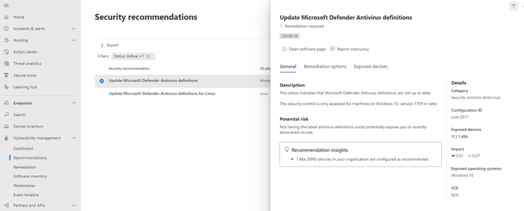
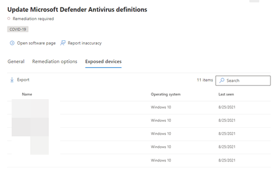
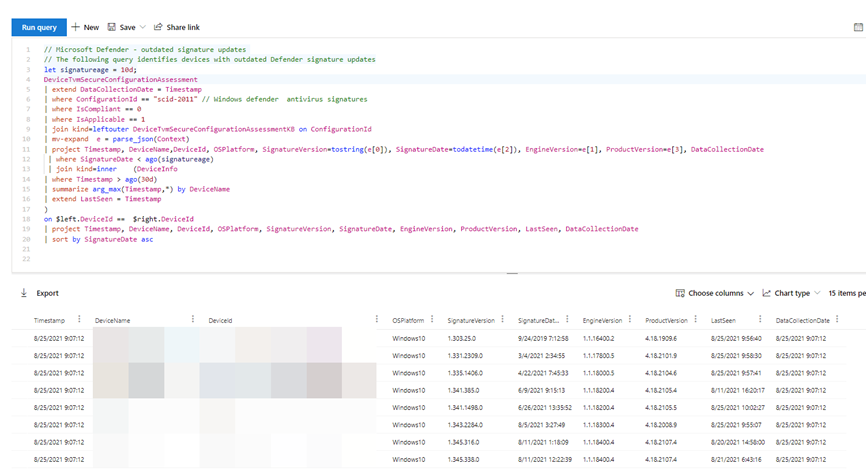
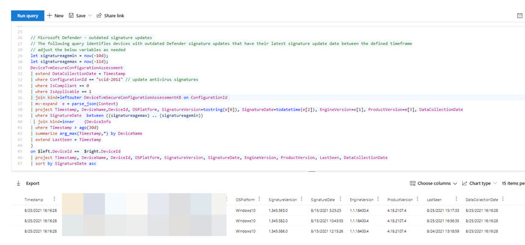

In an ideal world all of our devices are fully patched and the Microsoft Defender antivirus agent has the latest definition updates installed. Unfortunately reality is often different. When using Microsoft Endpoint Manager we can find devices with outdated definition updates through the Microsoft Endpoint Manager portal as shown in the example below.

Now in my opinion it must be the IT infrastructure operations team's responsibility to ensure that devices get their patches installed and Defender gets its platform and definition updates. But sometimes the reason for devices not getting updates is because the platform used to manage the deployment of these updates might have an issue, be on the backend or client side.

The good news is that if you have Microsoft Defender for Endpoint deployed we can monitor the health of Microsoft Defender (and more) also through the information collected by Microsoft Defender for Endpoint. We can easily identify devices with outdated Defender definition updates by using the Threat and Vulnerability portal or by using advanced hunting.

When opening the Threat and Vulnerability portal within Microsoft Defender for Endpoint, select the recommendations blade and search for 'Update Microsoft Defender'. You will see the recommendation as shown in the example below.

When selecting the **exposed devices** tab, you get a list of all the devices where definitions are outdated.

Now while you can see the devices, we do not see the date of the currently installed definition update. Are the definitions 2 weeks old, 4 weeks, or did the system never install definition updates at all?

KQL to the rescue! Through advanced hunting we can gather additional information. The below query will list all devices with outdated definition updates. The results are enriched with information about the Defender engine, platform version information as well as when the assessment was last conducted and when the device was last seen.

The following query allows you to search for devices where the last signature update happened within a certain time period.

You can find both advanced hunting queries in my GitHub repository here: [https://github.com/alexverboon/MDATP/blob/master/AdvancedHunting/MDE%20-%20Outdated%20Defender%20Signatures.md](https://github.com/alexverboon/MDATP/blob/master/AdvancedHunting/MDE%20-%20Outdated%20Defender%20Signatures.md)

**Credits!** I would like to thank Jan Geisbauer @janvonkirchheim for the inspiration. Jan shared the [initial KQL query](https://github.com/jangeisbauer/AdvancedHunting/blob/master/AntiVirusReporting) that served as the basis for the further development on this topic.

