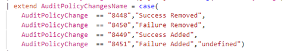
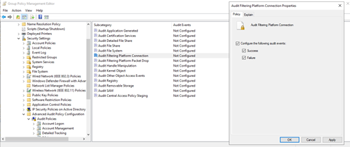
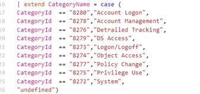
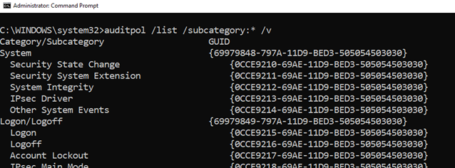
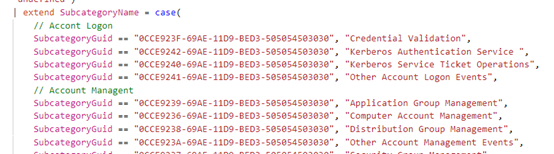
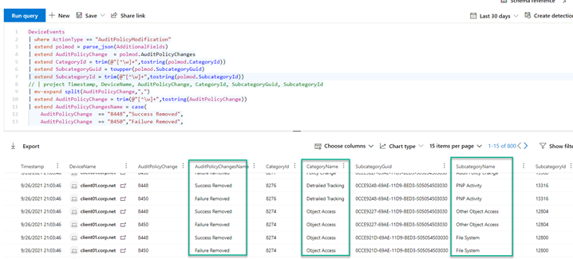
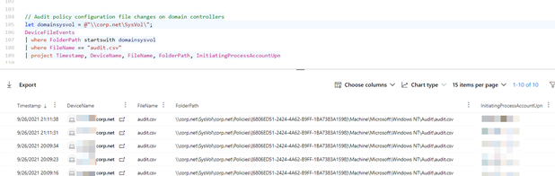
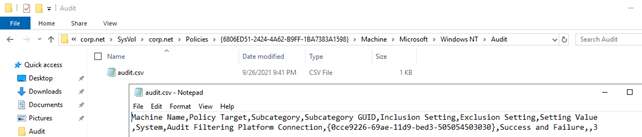
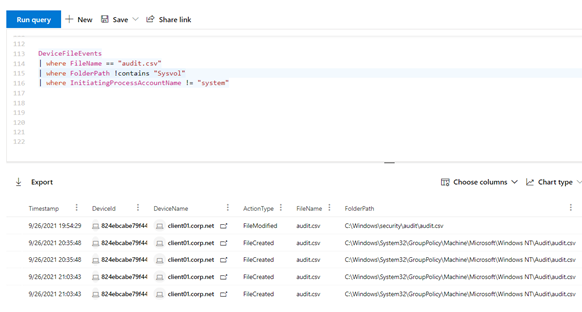

Hello there,

In today's blog post I want to share with you an advanced hunting query to detect audit policy modifications using Microsoft Defender 365 advanced hunting. Following the MITRE ATT&CK framework this would be [T1484.001 Domain Policy Modification: Group Policy Modification](https://attack.mitre.org/techniques/T1484/001/).

Microsoft Defender for Endpoint can help us detect audit policy modifications by running the following query:

Detailed information about the audit policy changes is displayed in the AdditionalFields data. Now all we need to do is to translate these values into human readable data.

**AuditPolicyChanges** – This field describes the changes that were made. Within the query I first removed the % and blanks, then used the following case statements to translate the values.

These relate to when you configure auditing settings as shown in the example below.

**CategoryId** – is the ID of the auditing Category which subcategory was changed. The values are translated as following:

**SubcategoryGuid** - the unique subcategory GUID. A complete list of the GUIDs can be found here: [https://docs.microsoft.com/en-us/openspecs/windows_protocols/ms-gpac/77878370-0712-47cd-997d-b07053429f6d](https://docs.microsoft.com/en-us/openspecs/windows_protocols/ms-gpac/77878370-0712-47cd-997d-b07053429f6d) or you can also run the following command:

Within the query, the values are translated as following:

Great, so now that we have done all the translation work, let's run the query:

Now this query by itself will return a lot of results, what you want to look for are audit policy changes where Success and/or failure is Removed.

Here's another query, assuming that you have also onboarded your domain controllers into Defender for Endpoint, you can use the following advanced hunting query to find audit policy changes, by searching for the audit.csv file where the audit policy settings are stored.

And lastly when can use the following query to look for any changes of the audit.csv file on clients.

I hope you enjoyed this blog post, you can find all the advanced hunting queries here on my GitHub

[https://github.com/alexverboon/MDATP/blob/master/AdvancedHunting/T1484.001%20Group%20Policy%20Modification.md](https://github.com/alexverboon/MDATP/blob/master/AdvancedHunting/T1484.001%20Group%20Policy%20Modification.md)

